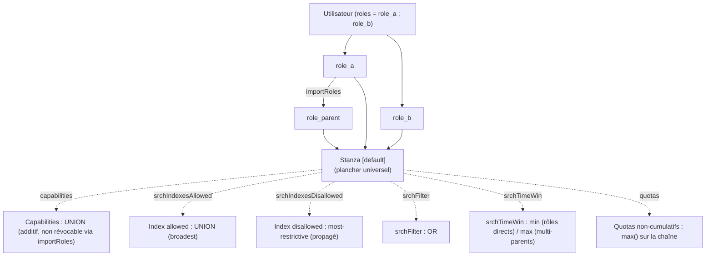
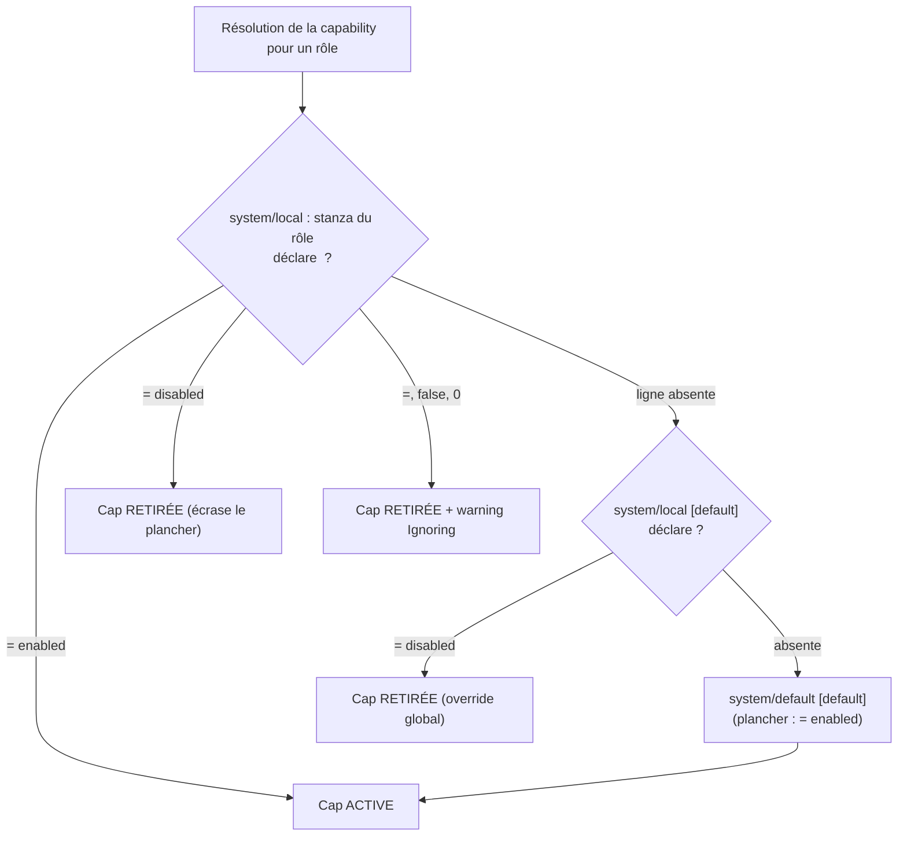

# Splunk RBAC — Cheat-sheet

> **Version** : validé empiriquement sur **Splunk Enterprise 9.4.6**. Les textes
> de la spec `authorize.conf` sont stables 9.1 → 10.x, mais le **comportement de
> la stanza `[default]`** (et de `<cap> = disabled`, §4) est à **re-vérifier sur
> 10.x** avant de s'y fier en production.

## À quoi ça sert

Le contrôle d'accès Splunk (`authorize.conf`) attribue à chaque **rôle** trois
familles de droits : des **capabilities** (verbes d'action), des **restrictions
de données** (`srchIndexes*`, `srchFilter`, `srchTimeWin`) et des **quotas** de
recherche. Un utilisateur porte un ou plusieurs rôles ; un rôle peut en importer
d'autres (`importRoles`). Cette fiche sert à raisonner « least-privilege » : ce
qu'un rôle accorde par défaut, comment les droits se composent par héritage, et
comment **retirer** une capability accordée par le socle sans casser l'instance.

Trois mécanismes composent les droits effectifs d'un utilisateur :

1. **`importRoles`** — héritage transitif et cumulatif entre rôles.
2. **Multi-rôles directs** — un user porte N rôles ; les droits se combinent.
3. **Stanza `[default]`** — un plancher de quotas/limites *et* de quelques
   capabilities, hérité par tout rôle qui ne les redéclare pas (§2).

> **Piège transverse** : la sortie REST distingue les valeurs **locales** des
> valeurs **`imported_*`**. Pour les **capabilities** et les **index**,
> `imported_*` est **effectif**. Pour les **quotas**, `imported_*` est **purement
> informationnel** : l'enforcement réel = valeur **locale** du rôle final (ou le
> défaut `[default]`). Auditer les capabilities via `imported_capabilities`, mais
> les quotas via les valeurs **locales** des rôles assignés.

---

## 1. Rôles built-in

Sur une instance Splunk Enterprise **9.4.x fraîche**, six rôles sont livrés par
le paquet, déclarés dans `$SPLUNK_HOME/etc/system/default/authorize.conf` (jamais
d'override local sur une instance neuve). Chaînes `importRoles` et capabilities
clés observées en lecture REST native :

| Rôle | `importRoles` | Caps locales | Quotas (`srchJobsQuota` / `srchDiskQuota`) | Index (`srchIndexesAllowed`) | Rôle |
|---|---|---|---|---|---|
| `user` | *(aucun)* | 28 (dont `search`, `accelerate_search`, `edit_own_objects`, `schedule_rtsearch`, `run_collect`) | `3` / `100` | `*` (non-internes) | Socle utilisateur : peut chercher. |
| `power` | `user` | 13 (dont `rtsearch`, `schedule_search`, `edit_sourcetypes`) — **pas `search` en local** | `10` / `500` | `*` | Power user : obtient `search` **via** `user`. |
| `admin` | `power` ; `user` | 113 | `50` / `10000` | `*` ; `_*` (internes inclus) | Administration. Importe explicitement les **deux**. |
| `can_delete` | *(aucun)* | 6 (dont `delete_by_keyword`) | `3` / `100` | — | Requis pour la commande SPL `delete`. À assigner ponctuellement. |
| `splunk-system-role` | `admin` | 0 locales (**154** importées via `admin`) | — | — | Rôle système interne. Ne pas assigner à des humains. |
| `splunk_system_upgrader` | *(aucun)* | 12 | — | — | Rôle système (migrations d'upgrade). Ne pas assigner. |

Points qui surprennent souvent :

- **`power` n'a pas `search` en local** : il l'obtient par héritage de `user`
  (`importRoles = user`, écrit en dur dans le paquet). Un user portant seulement
  `power` peut donc chercher.
- **`admin` importe `power` ET `user`** (`importRoles = power;user`).
  Conséquence : `search` lui arrive par deux chemins. Supprimer `user` casse
  quand même `admin` (cf. §5, cascade `DELETE`).
- **`admin` couvre les internes** (`_*`) ; `user`/`power` non (`*` seul →
  non-internes uniquement). Pour qu'un rôle voie `_internal`/`_audit`, lui donner
  `_*` ou nommer l'index explicitement.

```ini
# Forme d'un rôle métier from-scratch (least-privilege) — etc/system/local/authorize.conf
[role_myrole]
# pas d'importRoles : on ne tire aucune cap d'un built-in
search                = enabled
srchIndexesAllowed    = index_app ; index_summary
srchJobsQuota         = 3          # redéclarer : l'héritage n'enforce pas les quotas (§3)
srchDiskQuota         = 100
```

---

## 2. La stanza `[default]` d'`authorize.conf`

`[default]` (pas `[general]` — celle-là est dans `server.conf`) est un **plancher
universel** : tout rôle qui ne redéclare pas un attribut **hérite** la valeur du
`[default]`, y compris un rôle créé **from-scratch** (`importRoles` vide). Ce
plancher est **distinct du rôle `user`** : un rôle qui n'importe pas `user`
reçoit quand même les valeurs du `[default]`.

Contenu réel du `[default]` système en 9.4.6 (lu via `btool`) :

```ini
# $SPLUNK_HOME/etc/system/default/authorize.conf  (NE JAMAIS éditer ce fichier — §4)
[default]
# --- capabilities accordées par le plancher ---
run_collect          = enabled
run_mcollect         = enabled
edit_own_objects     = enabled
list_all_objects     = enabled
schedule_rtsearch    = enabled
# --- scalaires (quotas / limites / filtre) ---
srchJobsQuota             = 3
rtSrchJobsQuota           = 6
srchDiskQuota             = 100
cumulativeSrchJobsQuota   = 50
cumulativeRTSrchJobsQuota = 100
srchFilterSelecting       = true
srchMaxTime               = 100days
# (srchTimeWin n'est PAS dans le natif ; un override l'ajoute)
```

- **Le `[default]` ne porte ni `srchIndexesAllowed`, ni `srchFilter`, ni
  `importRoles`** : ces deux premiers sont déclarés **par rôle** (`[role_user]`,
  `[role_admin]`…). Le plancher ne pose que des quotas/limites **et** les cinq
  capabilities ci-dessus.
- **Conséquence gouvernance** : un rôle « illimité » qu'on croit sans contrainte
  est en réalité plafonné à **3 jobs concurrents** dès qu'on oublie de redéclarer
  `srchJobsQuota`. Et un rôle from-scratch hérite silencieusement de
  `run_collect`, `run_mcollect`, etc. — c'est exactement le sujet de la §4.

> **Piège REST** : les capabilities du plancher n'apparaissent dans la lecture
> REST d'un rôle fraîchement créé **qu'après un restart** de `splunkd` — alors
> que le moteur les applique déjà. Toujours croiser **REST + test fonctionnel +
> restart**, sinon on conclut à tort que le plancher ne s'applique pas.

---

## 3. Héritage par type de droit

Chaque famille de droit se compose selon sa **propre** règle. Synthèse (observée
empiriquement en 9.4.6) :

| Famille | Règle via `importRoles` | Multi-rôles directs sur un user |
|---|---|---|
| **Capabilities** | Union, transitive, cumulative, **non révocable** dans l'enfant | Union |
| **`srchIndexesAllowed` / `Default`** | **Union additive** (le plus large gagne — *broadest*) | Union |
| **`srchIndexesDisallowed`** | Propagé et **autoritatif** : le `disallowed` d'un parent gagne même sur un `allowed` local de l'enfant (*most-restrictive*) | *Most-restrictive* : le `disallowed` d'**un seul** rôle bloque pour tout le user |
| **`srchFilter`** | Combinaison **OR** (le plus large gagne) | **OR** |
| **`srchTimeWin`** | *Broadest* (le moins restrictif gagne) ; `0` = illimité non écrasable, `-1` écrasable | **`min()`** — le **plus restrictif** gagne (asymétrie vs multi-parents) |
| **Quotas non-cumulatifs** (`srchJobsQuota`, `rtSrchJobsQuota`, `srchDiskQuota`) | **Aucune valeur héritée ne s'impose** comme plancher ; `imported_*` informationnel | **`max()`** sur la chaîne (le plus permissif gagne) |
| **Quotas cumulatifs** (`cumulative*SrchJobsQuota`) | **Non hérités** et non appliqués aux users de l'enfant ; requièrent le toggle global `enable_cumulative_quota` | n/a (plafond **collectif** par rôle) |
| **ACL d'objet** (metadata `default.meta`/`local.meta`) | **Héritage actif** : l'ACL est évaluée sur les rôles importés | Union des rôles effectifs (importés inclus) |

Trois invariants à retenir :

1. **Capabilities = additif pur** : on construit par ajout, jamais par
   soustraction *via `importRoles`*. Pour exclure une cap héritée d'un autre
   rôle : **ne pas importer** ce rôle. (Le retrait du plancher `[default]` relève
   d'un autre plan — §4.)
2. **Quotas = pas d'héritage enforceable** : **redéclarer** les quotas dans
   chaque rôle métier final. `imported_*Quota` est trompeur ; en multi-rôles
   c'est le **plus permissif** (`max()`) qui gagne, jamais le plus restrictif.
3. **`srchFilter` = OR** : un `srchFilter = *` (ou absent) sur un rôle **annule**
   les restrictions des autres. Bannir `srchFilter = *` (traité comme littéral) —
   laisser le champ **vide** à la place.



---

## 4. Retirer une capability héritée du plancher `[default]`

> Cœur de la fiche. Un rôle from-scratch hérite les capabilities `enabled` du
> `[default]` (`run_collect`, `run_mcollect`, `edit_own_objects`,
> `list_all_objects`, `schedule_rtsearch`). On veut pouvoir en **retirer** une en
> least-privilege — sans jamais éditer `system/default`.

**Verdict (9.4.6)** : oui, `<cap> = disabled` retire la capability héritée du
plancher — au **niveau rôle** (ciblé) ou en **override `system/local [default]`**
(global). Le retrait est réel et fonctionnel (commande SPL refusée, `FATAL:
insufficient privileges`).

### Pourquoi cela ne « contredit pas la doc »

La documentation officielle énonce que les capabilities sont *« additives, non
révocables »* et que `<cap> = disabled` *« has no effect »*. **Cet énoncé reste
vrai** : il décrit l'**instanciation / héritage de rôle via `importRoles`** — une
cap qu'un rôle tire d'un **autre rôle importé** n'est effectivement pas
révocable, et `= disabled` n'y révoque rien.

Le retrait observé opère sur un **autre plan : la précédence de configuration**
(`system/local` > `system/default`, et stanza spécifique > `[default]`). Une cap
dont la valeur vient du **plancher `[default]`** est une **valeur par défaut
d'attribut**, soumise à cette précédence. **La doc ne couvre pas ce plan** — elle
n'est pas fausse, elle décrit autre chose.

### `= disabled` n'est pas un no-op

Prouvé par deux rôles jumeaux ne différant que de cette ligne :

| Ligne dans la stanza du rôle | `run_collect` effectif | Commande `collect` |
|---|---|---|
| **absente** | **présent** (hérité du plancher `[default]`) | OK |
| `<cap> = disabled` | **absent** | FATAL |

Si `= disabled` était un no-op équivalent à l'omission, les deux lignes
donneraient le même résultat. Elles diffèrent : `= disabled` **écrase activement**
la valeur héritée du plancher. C'est la **précédence d'attribut**, pas
l'instanciation `importRoles` que vise la doc.

### Matrice des syntaxes (9.4.6, rôle from-scratch sans `importRoles`)

| Valeur de la ligne | Warning `… had value '<v>' - only 'enabled' is valid. Ignoring…` | Cap retirée ? | Mécanisme |
|---|---|---|---|
| `= disabled` | **non** (valeur reconnue) | **oui** | retrait actif par précédence |
| `=` (vide) · `= false` · `= 0` | **oui** | **oui** | valeur rejetée *comme activateur* (seul `enabled` active) → cap non activée |
| `= enabled` | non | non (présente) | activation |
| **ligne absente** | non | non (présente) | plancher `[default]` actif |

**Le warning ne signifie PAS « cap conservée ».** Le message
`Capability '<cap>' had value '<v>' - only 'enabled' is valid. Ignoring...`
apparaît sur une **valeur invalide** (vide / `false` / `0`), **pas** sur
`= disabled`. Il signifie « cette *valeur* n'est pas un activateur valide » :
comme seul `enabled` active une capability, la cap finit **retirée quand même**
si aucune autre source ne l'accorde. (En override `[default]`, ce warning est
émis **une fois par rôle**, pas une fois globalement.)

### Recommandation de configuration

- **Pour retirer une cap du plancher : utiliser `<cap> = disabled`** — valeur
  reconnue, silencieuse, intention explicite. **Jamais** la valeur vide (warning
  parasite, ~1× par rôle).
  - **Au niveau rôle** (ciblé, le plus propre, recommandé en least-privilege) :
    déclarer `<cap> = disabled` dans chaque rôle-type concerné.
  - **En override global** `system/local [default]` : retire la cap à tous les
    rôles **sauf** ceux qui la déclarent en propre (cf. ci-dessous).
- **Ne jamais éditer `system/default`** (interdit par Splunk, écrasé à
  l'upgrade) — override en `system/local` uniquement.

### Portée du levier global

`system/local [default] <cap> = disabled` **ne retire pas** la cap aux built-in
`user`/`power` : ils déclarent la cap en propre dans leur **propre** stanza
(`[role_user]`/`[role_power]`), qui prime sur le `[default]` durci. Le levier
global ne mord que sur les caps **purement héritées du plancher**. En
least-privilege où les utilisateurs ne portent **que** des rôles from-scratch
(jamais `user`/`power` directement), cet override les retire partout.

```ini
# Retrait ciblé au niveau rôle — etc/system/local/authorize.conf
[role_myrole]
search        = enabled
run_collect   = disabled      # retire la cap héritée du plancher [default]
run_mcollect  = disabled
```

```ini
# Retrait global — etc/system/local/authorize.conf
[default]
run_collect   = disabled      # retiré partout SAUF rôles le déclarant en propre (user/power)
```



---

## 5. Autres mécaniques fondamentales

- **`POST` REST = SET destructif.** `POST /services/authorization/roles/<role>`
  avec une liste partielle de `capabilities` **écrase** toutes les caps non
  listées (HTTP 200, aucun avertissement). Un POST « pour ajouter une cap » à un
  rôle existant peut le ramener de 28 caps à 2. **Pattern obligatoire : GET →
  merge → POST complet.** Les noms de rôle sont normalisés en **lowercase +
  underscore**.
- **Cascade `DELETE` sur un built-in.** `DELETE /services/authorization/roles/user`
  retourne HTTP 200, sans garde-fou. Conséquence en chaîne : `power` perd son
  `importRoles = user`, `admin` perd les capabilities qui remontaient de `user`
  (dont `search`) → recherches admin en « insufficient permission » jusqu'à
  reconstruction manuelle. Ne jamais supprimer un rôle built-in.
- **`defaultRolesIfMissing` = fallback, pas plancher cumulé.** Ce paramètre
  (`authentication.conf`, SAML) attribue un rôle **uniquement** quand le mapping
  ne renvoie aucun rôle — il ne **s'ajoute pas** aux rôles mappés. Pour un vrai
  « rôle plancher » commun à tous, passer par un groupe IdP *all-users* mappé
  explicitement. **Garde-fou** : ne **jamais** mettre `admin` dans
  `defaultRolesIfMissing` (Splunk utilise temporairement `admin` pour traiter
  l'info de groupe SAML → escalade accidentelle).
- **`enable_cumulative_quota` = interrupteur global.** Les quotas cumulatifs
  (`cumulativeSrchJobsQuota`, `cumulativeRTSrchJobsQuota`) sont **inertes** tant
  que `limits.conf [search] enable_cumulative_quota = true` n'est pas posé. À
  déclarer **uniquement sur le rôle final** assigné (non hérité via
  `importRoles`).

---

## Pièges fréquents

- **Croire qu'un rôle from-scratch est « vierge »** : il hérite le plancher
  `[default]` (5 caps + quotas). Vérifier en REST **après restart** + test
  fonctionnel.
- **Lire le warning `Ignoring` comme « cap conservée »** : faux — la cap est
  retirée (valeur rejetée comme activateur). Utiliser `= disabled` pour éviter le
  warning.
- **Éditer `system/default`** : interdit, écrasé à l'upgrade. Override en
  `system/local`.
- **Compter sur l'héritage pour plafonner un quota** : il n'enforce rien.
  Redéclarer dans chaque rôle final.
- **`POST` REST partiel sur un rôle** : écrase les caps absentes. Toujours GET →
  merge → POST.
- **`srchFilter = *`** : annule tout filtre (OR). Laisser vide.
- **`*` en `srchIndexesAllowed`** : ne couvre **pas** les internes. Utiliser `_*`
  ou nommer (`_internal;_audit`).

## Voir aussi

- [Splunk (administration / CLI)](./splunk-admin.md) — CLI `splunk`, `btool`,
  `_internal`, start/stop.
- [Splunk — concepts & SPL](../splunk/README.md) — architecture, indexers, search
  heads, langage de recherche.
- [Secrets & SSH](./secrets-ssh.md) — récupération de tokens via `op` pour les
  appels REST authentifiés.
