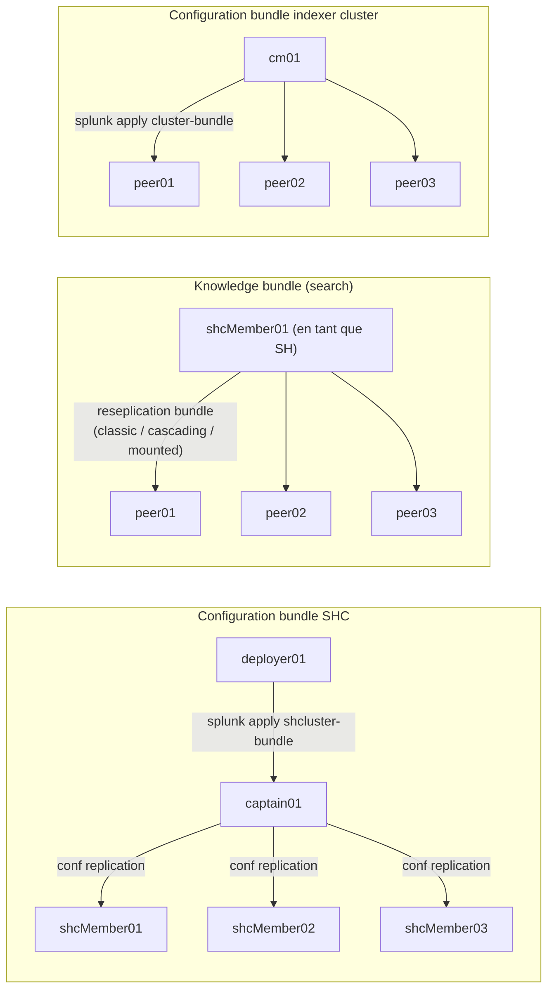

# Chapitre 0 — Foundations : trois bundles, un seul mot

> Trois mécanismes différents portent le mot « bundle » dans Splunk Enterprise. Un admin qui pose un SHC doublé d'un indexer cluster les croise dans la même journée et finit par les confondre. Ce chapitre fixe le lexique opposable utilisé partout dans le reste du livre, attribue à chacun un propriétaire, un déclencheur et un sens de propagation.

## Rappels rapides

- **Search Head Cluster (SHC)** : un cluster de search heads coordonnés par un *captain* élu, avec un *deployer* externe qui leur pousse la configuration commune. Le SHC réplique en interne sa configuration ; le deployer **n'en fait pas partie**, il alimente le captain.
- **Indexer cluster** : un cluster de search peers (indexers) coordonné par un *cluster manager* (terminologie 9.x, anciennement *cluster master*), qui assure la réplication des buckets selon un *replication factor* et un *search factor*.
- **Search peer** : un indexer du point de vue d'un search head distribué. Un peer est à la fois un nœud du cluster d'indexers (vu du CM) et un destinataire de knowledge bundle (vu d'un SH).
- **`_internal`** : index Splunk interne où tous les nœuds écrivent leur propre télémétrie (`splunkd.log`, métriques). C'est l'index de référence pour tout diagnostic bundle.
- **`splunkd.log`** : log applicatif Splunk, écrit sous `$SPLUNK_HOME/var/log/splunk/splunkd.log` et indexé dans `index=_internal sourcetype=splunkd`. Composant en début de ligne (`component=...`), niveau (`log_level=INFO|WARN|ERROR`).
- **Splexicon** : glossaire officiel Splunk. Utile pour les définitions, jamais pour décrire un comportement.

## 1. Trois bundles, trois mécaniques, trois propriétaires

Quand un admin Splunk dit « le bundle », il faut savoir lequel des trois mécanismes suivants il désigne. Ils ne sont pas interchangeables et un seul d'entre eux contient le mot « knowledge ».

### 1.1 Configuration bundle SHC (deployer → membres)

Le **configuration bundle SHC** est l'ensemble de configurations communes que l'admin pousse depuis le *deployer* vers les membres du Search Head Cluster. Il vit physiquement sous `$SPLUNK_HOME/etc/shcluster/apps/` sur le deployer. Quand l'admin lance `splunk apply shcluster-bundle` sur le deployer, ce contenu est validé, packagé, puis envoyé au *captain* en place. Le captain le redistribue à tous les membres via la mécanique de **conf replication** interne au SHC.

- **Propriétaire** : le deployer (`deployer01`).
- **Déclencheur** : commande explicite `splunk apply shcluster-bundle` sur le deployer.
- **Sens** : deployer → captain → membres SHC.
- **But** : maintenir une configuration applicative homogène entre les membres du SHC (apps utilisateurs, savedsearches partagées, lookups, dashboards déployés à l'identique).

C'est le mécanisme décrit dans la page Splunk [PropagateSHCconfigurationchanges](https://docs.splunk.com/Documentation/Splunk/9.4.2/DistSearch/PropagateSHCconfigurationchanges) et détaillé en chap. 01.

### 1.2 Knowledge bundle de search distribuée (search head → search peers)

Le **knowledge bundle** au sens strict — celui qui donne son nom au handbook — est l'ensemble de configurations *de search* qu'un search head envoie à ses *search peers* (indexers) à chaque recherche distribuée. Sans ce bundle, le peer ne sait pas comment résoudre un *knowledge object* référencé par la recherche : il ne connaît ni les lookups, ni les macros, ni les sourcetypes définis côté SH, ni les rôles RBAC ni les filtres `srchFilter` des utilisateurs.

Le SH constitue ce bundle à partir de `etc/apps/`, `etc/users/` et `etc/system/local/`, le filtre via `distsearch.conf` (`replicationAllowlist`, `replicationBlacklist`, `excludeReplicatedLookupSize`), le sérialise dans un fichier `<sh_guid>-<epoch>-<hash>.bundle`, et le pousse vers chaque peer dans `$SPLUNK_HOME/var/run/searchpeers/`.

- **Propriétaire** : chaque search head individuellement. Dans un SHC, chaque membre constitue **son** bundle (les bundles des membres convergent vers le même contenu si la configuration est répliquée, mais ce sont des objets distincts côté peer, repérables par leur GUID source).
- **Déclencheur** : continu et événementiel — toute modification de configuration côté SH déclenche un nouveau cycle de réplication ; à défaut, un cycle périodique selon `[replicationSettings]` de `distsearch.conf`.
- **Sens** : SH → search peers.
- **But** : permettre aux peers d'exécuter la phase *map* d'une recherche distribuée avec exactement les knowledge objects vus côté SH.

C'est le mécanisme décrit dans [Knowledgebundlereplication](https://docs.splunk.com/Documentation/Splunk/9.4.0/DistSearch/Knowledgebundlereplication) et [Whatsearchheadssend](https://docs.splunk.com/Documentation/Splunk/9.4.0/DistSearch/Whatsearchheadssend), détaillé en chap. 02 et 03.

### 1.3 Configuration bundle indexer cluster (cluster manager → peers)

Le **configuration bundle indexer cluster** est l'ensemble de configurations communes que le *cluster manager* pousse vers ses peers (indexers du cluster). Il vit sous `$SPLUNK_HOME/etc/manager-apps/` sur le CM (terminologie 9.x, anciennement `etc/master-apps/`). Quand l'admin lance `splunk apply cluster-bundle` sur le CM, le bundle est validé, propagé en parallèle à chaque peer, et chaque peer applique sa nouvelle configuration — éventuellement après un *rolling restart*.

- **Propriétaire** : le cluster manager (`cm01`).
- **Déclencheur** : commande explicite `splunk apply cluster-bundle` sur le CM.
- **Sens** : CM → peers indexer cluster.
- **But** : maintenir la configuration de stockage et de parsing homogène entre indexers (`indexes.conf`, `props.conf`, `transforms.conf`, certificats, apps techniques).

C'est le mécanisme décrit dans [Updatepeerconfigurations](https://docs.splunk.com/Documentation/Splunk/9.4.0/Indexer/Updatepeerconfigurations) et touché en chap. 01 (pour la distinction avec le bundle SHC) et chap. 06 (boîte à outils).

## 2. Vocabulaire opposable

Les trois mécaniques ci-dessus se confondent oralement parce que Splunk les appelle toutes « bundle » et qu'elles utilisent toutes la commande `splunk apply <quelque-chose>-bundle`. Le handbook impose le vocabulaire suivant et s'y tient.

| Terme handbook | Mécanisme désigné | Synonymes acceptables | Synonymes interdits |
| --- | --- | --- | --- |
| **configuration bundle SHC** | deployer → membres SHC | `bundle SHC`, `apply shcluster-bundle` | `knowledge bundle SHC` (faux ami) |
| **knowledge bundle** (sans qualificatif) | SH → search peers | `bundle de search`, `bundle de recherche distribuée` | `bundle SHC` (faux), `bundle d'apply` |
| **configuration bundle indexer cluster** | CM → peers | `bundle CM`, `cluster bundle`, `apply cluster-bundle` | `knowledge bundle CM` (faux ami) |

Le mot **bundle** seul, dans le reste du handbook, désigne le **knowledge bundle** (mécanisme central du livre) sauf si le contexte impose le contraire. Quand l'ambiguïté est possible (chap. 01, 05, 07, 99), le qualificatif est rappelé explicitement.

Le terme **deployment apps** se rapporte au déploiement de configurations vers des *forwarders* via un *deployment server* — ce mécanisme est explicitement hors scope (cf. `splunk/concepts/deployment-server.md` dans la KB). Ne pas le confondre avec les trois mécanismes ci-dessus, qui visent des nœuds Splunk Enterprise complets (SH ou indexer), pas des forwarders.

## 3. Ce qu'est un bundle sur le filesystem

Côté search peer (indexer), un knowledge bundle reçu d'un SH est une archive nommée `<sh_guid>-<epoch>-<hash>.bundle` stockée sous `$SPLUNK_HOME/var/run/searchpeers/`. Le GUID identifie le SH source (chaque membre du SHC a son propre GUID), l'epoch désigne le moment de constitution, le hash identifie le contenu — deux bundles avec hash différent ont nécessairement un contenu différent.

À l'ouverture, l'archive contient une arborescence de configurations Splunk : les sous-ensembles de `etc/apps/`, `etc/users/`, `etc/system/local/` que le SH a jugé pertinents pour ses peers (filtrés par `replicationAllowlist` / `replicationBlacklist`). Le peer, à la réception d'une recherche, charge le bundle courant correspondant au GUID du SH demandeur et résout les références de la recherche à partir de cette arborescence.

Côté deployer, le configuration bundle SHC en cours de staging vit sous `$SPLUNK_HOME/etc/shcluster/apps/` puis, après staging, sous le chemin défini par `conf_deploy_staging` dans `[shclustering]` de `server.conf` (par défaut `$SPLUNK_HOME/var/run/splunk/deploy`). Côté captain, le bundle reçu transite par la conf replication interne SHC avant d'être appliqué sur le filesystem `etc/apps/` de chaque membre.

Côté cluster manager, le configuration bundle indexer cluster vit sous `$SPLUNK_HOME/etc/manager-apps/` (terminologie 9.x). Il est packagé au moment de l'`apply` et envoyé à chaque peer, qui l'écrit sous `etc/slave-apps/` (terminologie legacy conservée pour la rétrocompatibilité de chemins).

## 4. Carte de chaleur : symptôme → bundle concerné

La table suivante donne l'entrée directe par symptôme observable. Elle est volontairement courte ; le chap. 05 décline chaque symptôme en arbre de diagnostic complet.

| Symptôme | Bundle concerné (en priorité) | Chapitre d'investigation |
| --- | --- | --- |
| `splunk apply shcluster-bundle` échoue ou ne propage pas | Configuration bundle SHC | chap. 01 + chap. 05 (branche A) |
| Un membre SHC affiche une app dans une version différente des autres | Configuration bundle SHC + conf replication interne | chap. 01 + chap. 05 (branche B) |
| Bundle SH → peers dépasse la taille `max_content_length` | Knowledge bundle | chap. 02 + chap. 05 (branche C) |
| Un peer particulier ne reçoit pas le knowledge bundle | Knowledge bundle | chap. 03 + chap. 05 (branche D) |
| Les peers ont des hashes de bundle différents pour le même SH | Knowledge bundle | chap. 03 + chap. 05 (branche E) |
| Recherche bloquée « waiting for bundle replication » | Knowledge bundle | chap. 04 + chap. 05 (branche H) |
| Mounted bundle pas mis à jour côté peer | Knowledge bundle (mode mounted) | chap. 03 + chap. 05 (branche G) |
| `splunk apply cluster-bundle` provoque un restart non souhaité | Configuration bundle indexer cluster | chap. 01 (rappel) + chap. 06 (CLI `validate cluster-bundle`) |
| Configuration d'un peer indexer divergente des autres | Configuration bundle indexer cluster | chap. 06 (CLI `show cluster-bundle-status`) |

## 5. Pourquoi on confond — terminologie évolutive

La confusion entre les trois mécanismes a trois racines historiques que le handbook adresse explicitement.

**Premièrement**, Splunk emploie historiquement le terme `bundle` pour désigner toute archive de configuration poussée d'un nœud à un autre. La doc 9.4 distingue maintenant *knowledge bundle* (chap. 02-03) et *configuration bundle* (deployer ou CM), mais les anciennes pages, blogs, et messages d'erreur produits par les binaires Splunk eux-mêmes utilisent encore le terme générique.

**Deuxièmement**, la terminologie SHC a évolué : `master` est devenu `manager` côté cluster manager indexer, `slave` est devenu `peer`, et les chemins filesystem ont suivi partiellement (`master-apps` → `manager-apps` côté CM, mais `slave-apps` reste côté peer pour rétrocompatibilité). Les composants `splunkd.log` ont conservé l'ancienne nomenclature en partie (`CMMaster`, `CMPeer` sont encore présents en 9.4) — ce n'est pas une erreur, c'est une rétrocompatibilité voulue. Le chap. 06 documente ce qu'on peut grepper.

**Troisièmement**, les options de la commande `splunk apply` se ressemblent : `splunk apply shcluster-bundle` (deployer), `splunk apply cluster-bundle` (CM) et l'absence de commande directe côté SH (la réplication knowledge bundle SH→peers est continue, pas déclenchée par une commande explicite). Un admin pressé écrit `splunk apply <tab>` et choisit la mauvaise sous-commande au moment du diag — c'est l'anti-pattern 5 du chap. 07.

## 6. Carte des trois bundles

#### S1 — Carte des trois bundles : déclencheurs, sens, propriétaires

Trois mécaniques portent le mot bundle. Les lignes verticales représentent le sens de propagation. Les `peer01..03` reçoivent **deux** bundles distincts (un knowledge bundle depuis le SH et un configuration bundle depuis le CM) — c'est normal et c'est la source la plus fréquente de confusion à l'entrée d'un diagnostic. Les membres SHC reçoivent un configuration bundle SHC depuis leur deployer via le captain. Chaque mécanisme a son propriétaire (qui déclenche le push) et sa propre commande `splunk apply` — à part le knowledge bundle SH→peers qui n'a pas de commande explicite, étant continu.

## Pièges typiques

- **Confondre `splunk apply shcluster-bundle` et `splunk apply cluster-bundle`.** La première est exécutée sur le deployer SHC, vise les membres SHC. La seconde est exécutée sur le cluster manager indexer, vise les peers indexer. Lancer la mauvaise sur le mauvais nœud échoue avec un message peu lisible. Cf. chap. 07 anti-pattern 5.
- **Croire qu'un `splunk apply shcluster-bundle` met à jour les knowledge objects vus par les peers.** Faux. Le configuration bundle SHC harmonise les apps **entre membres SHC** ; pour que les peers voient les mêmes lookups/macros, c'est le knowledge bundle SH→peers qui doit avoir convergé après que la conf replication SHC ait propagé l'app à tous les membres. C'est un délai de propagation, pas un seul push.
- **Croire que `etc/manager-apps/` côté CM et `etc/shcluster/apps/` côté deployer sont fonctionnellement équivalents.** Non. Le premier alimente les **peers indexer** (storage / parsing). Le second alimente les **membres SHC** (apps utilisateurs / savedsearches / dashboards). Mettre un `indexes.conf` dans `etc/shcluster/apps/` n'a pas d'effet sur les peers ; mettre un dashboard dans `etc/manager-apps/` n'a pas d'effet sur les SH.
- **Penser que `bundle` dans un message d'erreur désigne forcément le knowledge bundle.** Pas toujours. Un message `bundle replication failed` peut viser le knowledge bundle SH→peers (le plus fréquent) mais aussi la conf replication interne SHC après un apply deployer. Le composant `splunkd.log` permet de trancher : `DistributedBundleReplicationManager` = knowledge bundle SH→peers ; `ConfReplication*` = SHC interne.

## Quand escalader / quand décider

Aucune décision urgente à ce chapitre — il pose le lexique. Le critère à retenir : avant toute demande de support Splunk, avant toute escalade architecturale, avant tout cross-team debug, **nommer le bundle concerné** avec le vocabulaire de la table § 2. Une demande qui dit « le bundle ne passe pas » fait perdre une heure ; une demande qui dit « le knowledge bundle SH → peers reste bloqué à l'étape de push avec ces composants `splunkd.log` » est instruite en quinze minutes.

## Sources

- [Splunk Splexicon — Knowledge bundle](https://docs.splunk.com/Splexicon:Knowledgebundle)
- [Splunk Splexicon — Configuration bundle](https://docs.splunk.com/Splexicon:Configurationbundle)
- [Splunk Splexicon — Search peer replication](https://docs.splunk.com/Splexicon:Searchpeerreplication)
- [Splunk Splexicon — Search peer](https://docs.splunk.com/Splexicon:Searchpeer)
- [Splunk Splexicon — Search head cluster](https://docs.splunk.com/Splexicon:Searchheadcluster)
- [Splunk Splexicon — Deployer](https://docs.splunk.com/Splexicon:Deployer)
- [Splunk Splexicon — Cluster captain](https://docs.splunk.com/Splexicon:Clustercaptain)
- [Splunk Splexicon — Manager node](https://docs.splunk.com/Splexicon:Managernode)
- [Splunk DistSearch 9.4 — Knowledge bundle replication overview](https://docs.splunk.com/Documentation/Splunk/9.4.0/DistSearch/Knowledgebundlereplication)
- [Splunk DistSearch 9.4 — Propagate SHC configuration changes](https://docs.splunk.com/Documentation/Splunk/9.4.2/DistSearch/PropagateSHCconfigurationchanges)
- [Splunk Indexer 9.4 — Update peer configurations](https://docs.splunk.com/Documentation/Splunk/9.4.0/Indexer/Updatepeerconfigurations)
