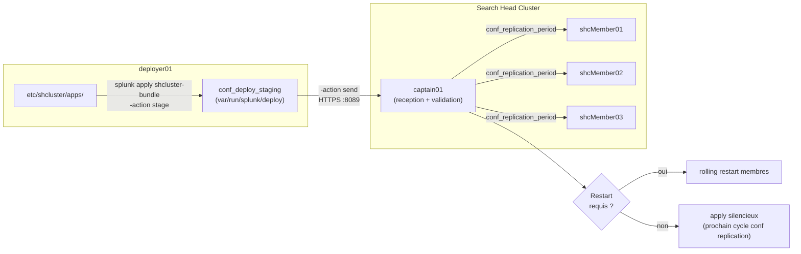

# Chapitre 1 — Constitution du configuration bundle SHC côté deployer

> Quand l'admin tape `splunk apply shcluster-bundle` sur le deployer, il déclenche une mécanique en trois étages : staging, validation, envoi au captain, puis conf replication interne aux membres SHC. Ce chapitre décrit cette mécanique étape par étape, les options de la commande, les paramètres de `[shclustering]` qui pilotent la cadence interne, et les pièges qui font qu'un apply « semble » réussir sans propager. Il n'aborde pas le knowledge bundle SH → peers : c'est l'objet des chap. 02 et 03.

## Rappels rapides

- Le **deployer** est un nœud Splunk **externe** au SHC ; il n'est pas un search head et ne participe ni au quorum ni aux recherches.
- Le **captain** est élu parmi les membres du SHC ; c'est lui qui reçoit le bundle du deployer et qui le propage aux autres membres via la conf replication interne.
- La **conf replication** interne SHC réplique en permanence les modifications de configuration entre membres ; c'est sur elle que repose la propagation post-apply.
- `etc/shcluster/apps/` (sur le deployer) est l'**unique** zone dont le contenu sera packagé et envoyé. Tout ce qui est placé ailleurs (par exemple `etc/apps/` ou `etc/system/local/` du deployer) n'est pas envoyé.
- Un apply ne déclenche pas automatiquement de restart des membres. Si une stanza envoyée requiert un restart, Splunk le détecte au niveau du captain et déclenche le restart si l'option correspondante est active.

## 1. La zone de staging `etc/shcluster/apps/`

Côté deployer, tout ce qui doit être propagé aux membres SHC vit sous `$SPLUNK_HOME/etc/shcluster/apps/`. C'est une arborescence d'apps Splunk standard : un sous-dossier par app, chaque sous-dossier contenant un `default/`, éventuellement un `local/`, et un `metadata/`. Le deployer ne lit aucune autre zone pour le bundle.

```bash
# Sur le deployer
ls $SPLUNK_HOME/etc/shcluster/apps/
# -> my_company_app/ soc_app/ ...
```

Quelques règles dont la transgression mène droit aux pièges du chap. 07 :

- **`local/` est valide dans `etc/shcluster/apps/`** mais sa sémantique change : il sera fusionné côté membres SHC dans le `local/` de l'app correspondante. À utiliser pour des overrides qui doivent être centralisés et homogènes. Le mettre pour des overrides spécifiques à un membre est un anti-pattern.
- Les **lookups** placées sous `<app>/lookups/` sont copiées telles quelles aux membres ; les très gros fichiers `.csv` gonflent inutilement le bundle (cf. piège 1 ci-dessous, et anti-pattern lookup chap. 07).
- Les **dashboards** (`local/data/ui/views/`) sont propagés. Les permissions associées dans `metadata/local.meta` aussi.
- Les **scripts** sous `<app>/bin/` sont propagés mais ne sont pas exécutés par le deployer — ils seront exécutés sur les membres.

## 2. La commande `splunk apply shcluster-bundle`

La commande de propagation se lance **sur le deployer**, jamais sur un membre SHC. Sa forme minimale :

```bash
splunk apply shcluster-bundle \
  -target https://captain01.example.com:8089 \
  -auth admin:<password> \
  --answer-yes
```

Le paramètre `-target` désigne explicitement l'URI de management du captain. Si le captain change pendant la vie du SHC (élection automatique), il faut le redécouvrir avant l'apply : `splunk show shcluster-status` sur un membre quelconque retourne le captain en cours.

### Options principales

| Option | Effet | Quand l'utiliser |
| --- | --- | --- |
| `-action stage` | Construit le bundle dans `conf_deploy_staging` mais **n'envoie pas** au captain. | Diag : vérifier que le packaging réussit sans rien propager. |
| `-action send` | Envoie un bundle déjà stagé. | Rare en pratique : on enchaîne stage + send via l'apply par défaut. |
| `-preserve-lookups true|false` | Garde les lookups existants côté membres (true) ou écrase avec ceux du bundle (false, défaut). | Quand des lookups locaux sont alimentés par les scripts membres et ne doivent pas être écrasés. |
| `-push-default-app-conf true|false` | Pousse le contenu de `default/` des apps en plus de `local/`. | Quand on veut forcer la reprise des `default/` après un upgrade Splunk qui les modifie. |
| `--answer-yes` | Saute la confirmation interactive. | Toujours en script. |

L'option `-action` accepte donc `stage`, `send` et — par défaut, sans option — l'enchaînement des deux. Le comportement le plus utile en diag est `-action stage` : il valide la construction du bundle sans rien propager. Une erreur à ce stade indique un problème de contenu (`etc/shcluster/apps/` mal formé, app invalide), pas un problème réseau ou captain.

### Que se passe-t-il à l'envoi

À l'envoi, le deployer crée une archive du contenu de `etc/shcluster/apps/`, ouvre une connexion REST vers le port mgmt du captain (par défaut `8089`), et y pousse le bundle. Le captain reçoit, valide, stocke dans son propre `conf_deploy_repository`, et déclenche la **conf replication interne SHC** vers les autres membres.

Côté deployer, la sortie de l'apply ressemble à :

```text
Sending applied bundle to captain (captain01.example.com:8089)
Successfully applied cluster bundle to captain.
Bundle apply status check is in progress on the captain.
```

Le message « Successfully applied cluster bundle to captain » signifie uniquement que le captain **a reçu et accepté** le bundle. Il ne dit rien sur la propagation effective aux membres : pour ça, il faut interroger explicitement le captain (cf. § 5).

## 3. Réception côté captain et conf replication interne

Une fois le bundle reçu par le captain, c'est la **conf replication interne SHC** qui prend le relais. Cette mécanique est continue : elle ne fonctionne pas en push synchrone après chaque apply, elle fonctionne en cycles courts cadencés par la stanza `[shclustering]` de `server.conf`. Le bundle reçu est donc *intégré* dans la prochaine itération de conf replication, et chaque membre récupère les modifications au cours de cette itération.

### Stanza `[shclustering]` de `server.conf`

Les paramètres pertinents pour la propagation post-apply :

```ini
[shclustering]
pass4SymmKey = <secret>
conf_replication_period = 5
conf_replication_max_pull_count = 1000
conf_replication_max_push_count = 100
conf_deploy_repository = $SPLUNK_HOME/etc/shcluster
conf_deploy_staging = $SPLUNK_HOME/var/run/splunk/deploy
```

- `conf_replication_period` : intervalle en secondes entre deux itérations de conf replication interne SHC (5 s par défaut). Diminuer accélère la propagation mais charge le réseau interne SHC ; à ne toucher qu'avec une mesure de baseline.
- `conf_replication_max_pull_count` : nombre maximal d'objets à tirer par itération côté membre. Si la propagation accuse du retard chronique, c'est le premier paramètre à examiner.
- `conf_replication_max_push_count` : symétrique côté captain.
- `conf_deploy_repository` : où le captain stocke le bundle reçu localement.
- `conf_deploy_staging` : où le deployer stage le bundle en construction (avant envoi).

L'effet pratique : un apply termine côté deployer en quelques secondes, le captain l'accepte en moins d'une seconde, mais la propagation aux 2 ou 3 membres restants prend de l'ordre de `conf_replication_period × <nombre d'itérations>`, soit typiquement entre 5 et 30 secondes pour un bundle de taille raisonnable.

### Restart logic

Quand le bundle reçu introduit des modifications qui exigent un restart Splunk (changement de stanza `[indexes]` côté SH — rare ici par construction, mais aussi certaines modifs de `web.conf`, `inputs.conf` de scripts, etc.), Splunk **détecte le besoin** et peut déclencher un restart roulant des membres. Le comportement par défaut en 9.4 est de signaler le restart nécessaire dans la sortie de l'apply ; l'admin est invité à confirmer.

L'option `-push-default-app-conf` augmente la probabilité de toucher des stanzas qui demandent un restart (en réécrivant les `default/`). Lancée par mégarde, elle peut donc déclencher un rolling restart non anticipé du SHC entier.

## 4. Constitution et propagation : vue d'ensemble

#### S2 — Constitution du configuration bundle SHC, du deployer aux membres



Le deployer ne pousse jamais directement aux membres : il s'arrête au captain. C'est la conf replication interne SHC, cadencée par `conf_replication_period`, qui distribue ensuite aux autres membres. Le besoin de restart est évalué côté captain à partir du contenu du bundle ; quand il est déclenché, c'est un rolling restart (un membre à la fois) pour préserver la disponibilité.

## 5. Vérifier la propagation effective

Le fait que `splunk apply shcluster-bundle` retourne `Successfully applied cluster bundle to captain` ne suffit pas. La vérification se fait en deux temps : côté deployer (état du dernier push) et côté captain (état de propagation aux membres).

### Côté deployer

```bash
# Sur le deployer
splunk show shcluster-bundle-status -auth admin:<password>
```

La sortie donne notamment le `last_apply_time`, le `bundle_id` actuel, l'état (`success` ou autre). Si l'état n'est pas `success`, la cause est dans la trace courante du deployer (`splunkd.log` côté deployer, composant `BundleReplicator` ou équivalent — cf. chap. 06).

### Côté captain et membres

```bash
# Sur le captain (ou n'importe quel membre — Splunk redirige vers le captain)
splunk list shcluster-bundle-status -auth admin:<password>
splunk show shcluster-status -auth admin:<password>
splunk list shcluster-member-info -auth admin:<password>
```

`splunk list shcluster-bundle-status` côté captain affiche la progression de la propagation aux membres : chaque membre y figure avec son `bundle_id` courant. Si tous les membres affichent le même `bundle_id` que celui retourné par `splunk show shcluster-bundle-status` côté deployer, la propagation est complète. Sinon, le ou les membres en retard sont identifiables.

### Endpoints REST équivalents

Pour scripter ou intégrer ces vérifications dans une supervision :

```bash
curl -k -u admin:<password> \
  "https://captain01.example.com:8089/services/shcluster/captain/info"

curl -k -u admin:<password> \
  "https://captain01.example.com:8089/services/shcluster/captain/members"

curl -k -u admin:<password> \
  "https://shcMember01.example.com:8089/services/shcluster/member/info"
```

Les trois retournent des objets XML / JSON exploitables (avec `?output_mode=json`). Détail des champs et exemples : chap. 06 § 2.

## 6. Lecture d'un cycle dans `splunkd.log`

Le composant le plus parlant pour la conf replication interne SHC est `ConfReplicationThread` (à confirmer par grep réel sur 9.4 ; cf. chap. 06 § 3 — observé empiriquement, non documenté dans une page Splunk individuelle). Sur le captain, on observe au moment d'un cycle :

```text
2026-06-18 10:00:00.123 +0000 INFO  ConfReplicationThread - conf replication cycle starting members=3
2026-06-18 10:00:00.456 +0000 INFO  ConfReplicationThread - pushed 12 objects to shcMember02
2026-06-18 10:00:00.789 +0000 INFO  ConfReplicationThread - cycle complete duration_ms=666
```

Les `pushed N objects` indiquent les objets effectivement transmis pendant le cycle. Une absence prolongée de cycle (plus de 2-3 fois `conf_replication_period` sans ligne) signale une conf replication bloquée — cause typique : surcharge du captain, ou file de modifications saturée.

## Pièges typiques

- **Mettre des configurations hors `etc/shcluster/apps/`.** Le deployer ne lit **que** cette zone. Un `local/savedsearches.conf` dans `etc/apps/<app>/` côté deployer n'est jamais propagé. Vérifier à chaque apply que les éditions ont été faites dans `etc/shcluster/apps/<app>/`. C'est la cause numéro un d'apply « qui ne fait rien ».
- **Versionner ou injecter `local/` dans le bundle SHC.** L'arborescence `local/` est destinée à des overrides ; la versionner systématiquement à côté de `default/` produit des conflits silencieux entre les `local/` distribués par le bundle et les `local/` créés/modifiés directement sur un membre. Convention : `default/` dans `etc/shcluster/apps/<app>/`, et n'utiliser `local/` que pour des overrides explicitement centralisés et idempotents.
- **Restart en cascade non attendu après `-push-default-app-conf`.** Cette option réécrit les `default/` des apps cibles côté membres. Si une stanza réécrite touche `inputs.conf`, `web.conf` ou un `indexes.conf` (atypique côté SH mais possible dans certaines apps), un rolling restart est déclenché. Toujours faire un `-action stage` au préalable et inspecter le contenu du staging avant d'envoyer avec cette option.
- **`preserve-lookups` malcompris.** `preserve-lookups true` conserve les lookups **déjà présents côté membres** ; `preserve-lookups false` (défaut) les écrase par ceux du bundle. Si l'admin pense qu'il « préserve » ses lookups en passant `true` mais ne réalise pas qu'il **désactive** la propagation des nouveaux lookups depuis le deployer, il bloque silencieusement la mise à jour. Documenter le choix dans le script d'apply.
- **Apply lancé pendant une élection de captain.** Si le captain est en cours de réélection au moment de l'apply, la commande échoue avec un message « no captain found » ou similaire. Re-jouer l'apply après stabilisation (`splunk show shcluster-status` doit retourner un captain stable depuis quelques minutes).
- **Croire que `splunk apply shcluster-bundle` met à jour le knowledge bundle SH→peers.** Faux. Il met à jour la config commune des membres SHC ; à partir de là, chaque membre, en tant que SH, doit régénérer son knowledge bundle pour ses peers. Le délai entre apply deployer et fraîcheur du knowledge bundle côté peer cumule donc deux propagations. C'est la cause numéro un de « j'ai poussé une lookup, elle n'arrive pas chez le peer ».

## Quand escalader / quand décider

- **Échec d'apply qui ne reproduit pas.** Une erreur intermittente lors de `splunk apply shcluster-bundle` qui ne se reproduit pas après ré-essai, captain stable, réseau OK : tenir un journal des occurrences (date, état du SHC, taille du bundle) et ouvrir un demande Splunk Support après 3 occurrences distinctes sur 7 jours. Ne pas multiplier les apply.
- **Conf replication chroniquement en retard.** Un membre qui ne converge pas avec le captain après un délai > 10 × `conf_replication_period` (typiquement > 50 s pour défaut) après plusieurs cycles consécutifs indique un problème structurel : disque saturé sur le membre, RBAC qui bloque la lecture du repo, ou bug 9.4 connu (vérifier les release notes Splunk). Si la cause n'est pas évidente sur le membre, escalade Splunk Support.
- **Décision de refactorer un bundle trop gros.** Au-delà de 200 Mo de contenu dans `etc/shcluster/apps/`, les apply commencent à prendre du temps et la conf replication interne souffre. Refactorer en sortant les lookups massives (passer par un dispatch de lookup, ou un index dédié), en supprimant les apps mortes, en consolidant les apps morcelées. Ne pas augmenter `conf_replication_max_*` à l'aveugle pour compenser.

## Sources

- [Splunk DistSearch 9.4 — Propagate SHC configuration changes](https://docs.splunk.com/Documentation/Splunk/9.4.2/DistSearch/PropagateSHCconfigurationchanges)
- [Splunk DistSearch 9.4 — SHC architecture](https://docs.splunk.com/Documentation/Splunk/9.4.2/DistSearch/SHCarchitecture)
- [Splunk DistSearch 9.4 — View SHC status](https://docs.splunk.com/Documentation/Splunk/9.4.2/DistSearch/ViewSHCstatus)
- [Splunk DistSearch 9.4 — How conf replication works in SHC](https://docs.splunk.com/Documentation/Splunk/9.4.1/DistSearch/HowconfrepoworksinSHC)
- [Splunk Admin 9.4 — server.conf (stanza `[shclustering]`)](https://docs.splunk.com/Documentation/Splunk/9.4.2/Admin/Serverconf)
- [Splunk Indexer 9.4 — Update peer configurations (pour le contraste cluster-bundle)](https://docs.splunk.com/Documentation/Splunk/9.4.0/Indexer/Updatepeerconfigurations)
- [Splunk Indexer 9.4 — Restart the cluster](https://docs.splunk.com/Documentation/Splunk/9.4.2/Indexer/Restartthecluster)
- [Splunk REST API 9.4 — Cluster endpoints](https://docs.splunk.com/Documentation/Splunk/9.4.0/RESTREF/RESTcluster)
