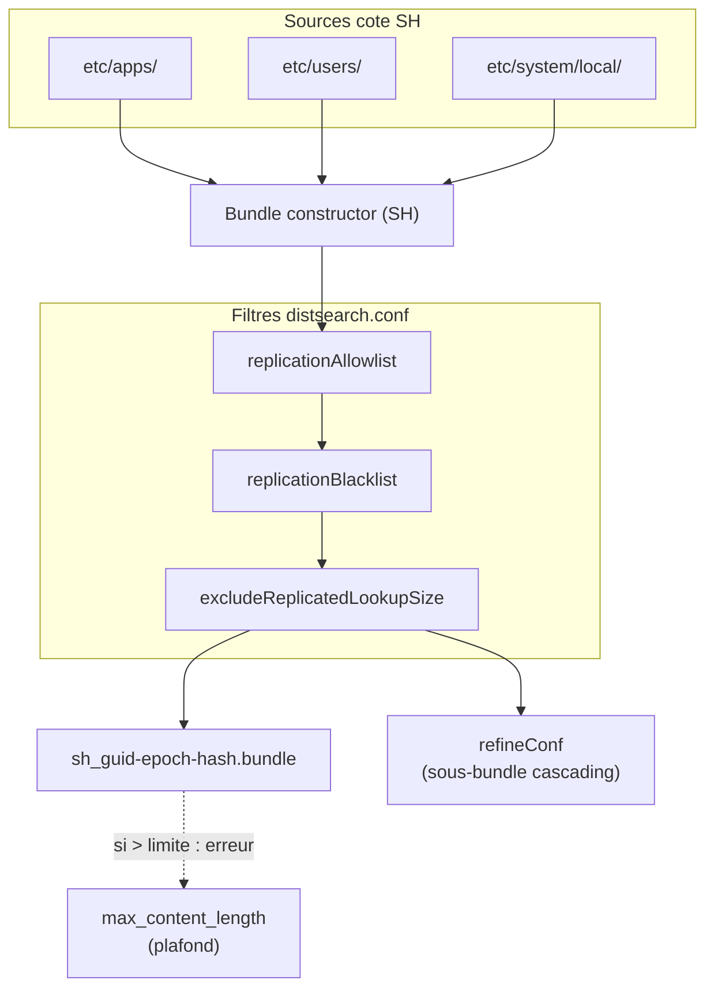

# Chapitre 2 — Constitution du knowledge bundle côté search head

> Quand un search head exécute une recherche distribuée, ses peers doivent connaître les knowledge objects que la recherche référence : lookups, macros, sourcetypes définis côté SH, rôles RBAC, filtres `srchFilter`. Le SH leur envoie cet ensemble sous forme d'un *knowledge bundle*. Ce chapitre décrit comment ce bundle est constitué : son contenu réel, son nom de fichier, la décision *full vs delta*, et les stanzas de `distsearch.conf` qui en contrôlent la taille et le filtrage. La propagation effective vers les peers est l'objet du chap. 03.

## Rappels rapides

- Un **knowledge bundle** est constitué et envoyé par **chaque search head individuellement** ; dans un SHC, chaque membre constitue son propre bundle, qui devrait converger en contenu si la conf replication a propagé les apps mais qui reste un objet distinct côté peer.
- Le bundle contient un sous-ensemble de `etc/apps/`, `etc/users/`, `etc/system/local/` filtré par `distsearch.conf` ; il ne contient pas tout `etc/` et n'a pas vocation à le faire.
- Le bundle a un nom de fichier de la forme `<sh_guid>-<epoch>-<hash>.bundle` ; le hash dépend du contenu. **Deux bundles de hash différent = deux contenus différents**, c'est l'invariant principal du diagnostic (chap. 03 et 05).
- Splunk choisit seul entre un envoi *full* (bundle complet) et un *delta* (différentiel par rapport au bundle précédent). L'admin n'a pas de levier pour forcer l'un ou l'autre — il peut influer indirectement via la taille du bundle et la fréquence des modifications.
- Le `refineConf` est un sous-bundle réduit utilisé dans le contexte de la réplication *cascading* (chap. 03) ; il représente l'ensemble minimal que les peers de niveau 2 doivent recevoir.

## 1. Contenu réel d'un knowledge bundle

La page Splunk [Whatsearchheadssend](https://docs.splunk.com/Documentation/Splunk/9.4.0/DistSearch/Whatsearchheadssend) liste précisément ce qu'un search head emballe pour ses peers. En synthèse opérationnelle :

- **`etc/apps/<app>/`** : pour chaque app, sous-ensemble pertinent — typiquement `local/`, `default/`, `lookups/`, `metadata/`. Les `bin/`, `appserver/`, `static/`, `mrsparkle/` sont exclus par défaut (l'UI n'est pas la responsabilité du peer).
- **`etc/users/<user>/`** : tout ce qui est susceptible d'apparaître dans une recherche : `local/savedsearches.conf`, `local/macros.conf`, `local/eventtypes.conf`, `local/tags.conf`, `local/transforms.conf`, lookups privées si présentes.
- **`etc/system/local/`** : configurations système locales pertinentes (`authorize.conf` pour les rôles utilisés à l'évaluation `srchFilter`, `props.conf`, `transforms.conf`, etc.).
- **`etc/system/default/`** : explicitement **non** inclus — il est identique d'un nœud à l'autre par construction (lié au binaire).

Les exclusions par défaut sont substantielles : la doc Splunk parle de l'ordre de grandeur de 200 Mo à 2 Go pour un déploiement raisonnable, parfois plus en environnement riche.

### Ce qui sort du bundle : `replicationBlacklist`

`distsearch.conf` permet d'exclure explicitement certains chemins du bundle via une stanza `[replicationBlacklist]` :

```ini
[replicationBlacklist]
no_huge_csv = .../etc/apps/<app>/lookups/very_big.csv
no_tmp = .../etc/apps/*/tmp/*
```

La clé est un nom libre, la valeur est un pattern relatif à `$SPLUNK_HOME/`. Splunk recommande d'utiliser cette stanza plutôt que d'augmenter la taille max — c'est l'angle de la page [Limittheknowledgebundlesize](https://docs.splunk.com/Documentation/Splunk/9.4.0/DistSearch/Limittheknowledgebundlesize).

### Ce qui rentre explicitement : `replicationAllowlist`

Inversement, `[replicationAllowlist]` (terminologie 9.4 — alias historique `replicationWhitelist`) permet de cibler explicitement les chemins qu'on **veut** voir dans le bundle. C'est utile en environnement où la blacklist serait trop énumérative.

```ini
[replicationAllowlist]
my_app_lookups = .../etc/apps/my_company_app/lookups/...
```

Allowlist et blacklist coexistent : la blacklist a la priorité sur l'allowlist quand un même chemin est matché par les deux. C'est une dérogation utile : on inclut tout un dossier en allowlist, on excise un sous-dossier ou un fichier par blacklist.

> Note terminologique : Splunk 9.4 utilise `allowlist` / `denylist` (forme actuelle) dans les nouvelles pages tout en conservant `whitelist` / `blacklist` (anciennes pages, alias rétrocompatibles dans les fichiers `.conf`). Les deux formes fonctionnent. Le handbook utilise la forme actuelle dans la prose et accepte les deux dans les exemples.

## 2. Le nom de fichier `<sh_guid>-<epoch>-<hash>.bundle`

Côté peer, chaque knowledge bundle reçu est stocké sous `$SPLUNK_HOME/var/run/searchpeers/` avec un nom de la forme :

```text
00000000-0000-0000-0000-000000000001-1718711234-aaaaaaaa.bundle
```

Trois champs séparés par tirets :

- **`<sh_guid>`** : le GUID du search head source. Dans un SHC, chaque membre a son propre GUID — il est donc normal qu'un peer ait plusieurs bundles côte à côte (un par membre SHC). Le GUID est lisible côté SH dans `etc/instance.cfg` et côté peer dans le nom du fichier.
- **`<epoch>`** : timestamp Unix de la constitution du bundle. Utile pour identifier la fraîcheur.
- **`<hash>`** : empreinte du contenu (typiquement un hash tronqué). C'est le champ critique du diagnostic : deux bundles avec hash différent ont nécessairement un contenu différent ; deux bundles avec hash identique ont le même contenu (en pratique — collisions astronomiquement improbables).

**Conséquence opérationnelle** : si deux peers affichent un hash différent pour le même `<sh_guid>` au même instant, la réplication est divergente et c'est un symptôme du chap. 05 branche E. Si tous les peers affichent le même hash que celui que le SH déclare avoir poussé, le bundle est en cohérence.

## 3. Hashing et décision *full vs delta*

À chaque cycle de constitution, le SH calcule le contenu du nouveau bundle, le compare au précédent, et choisit l'un des deux modes :

- **Full** : le bundle complet est sérialisé et envoyé.
- **Delta** : un différentiel par rapport au bundle précédent est calculé et envoyé.

La décision est interne. Splunk choisit *delta* tant que le différentiel reste « petit » par rapport au bundle complet ; au-delà d'un seuil (non documenté publiquement par Splunk, observé empiriquement de l'ordre du quart du bundle), Splunk repasse en *full*.

L'admin n'a pas de levier direct pour forcer l'un ou l'autre. Trois leviers indirects existent :

1. **Limiter la taille du bundle** via `replicationBlacklist` et lookups externalisées : le full reste raisonnable, le delta couvre plus souvent les modifications réelles.
2. **Espacer les modifications de configuration** côté SH (ou côté SHC via apply deployer) : moins de cycles delta, chaque cycle delta plus représentatif.
3. **Surveiller les cycles via `splunkd.log`** (chap. 06 § 3) pour détecter une chaîne anormale de full successifs : symptôme d'un bundle qui change en permanence (anti-pattern de configuration côté SH ou bug applicatif).

## 4. Constitution du bundle : assemblage, filtres, sortie

#### S3 — Constitution du knowledge bundle côté search head, sources → filtres → sortie



Le SH assemble son bundle à partir de trois sources. Les filtres réduisent **avant** emballage. Le nom du fichier produit porte un hash : deux bundles avec hash différent ont nécessairement un contenu différent. Le `refineConf` est un sous-ensemble réservé à la cascade (chap. 03). Le plafond `max_content_length` est un garde-fou : si le bundle dépasse, la réplication échoue avec un message explicite, plutôt que de pousser un bundle géant au prix du débit.

## 5. La stanza `[replicationSettings]` de `distsearch.conf`

C'est la stanza centrale qui pilote la taille, la concurrence et les timeouts de la réplication knowledge bundle. À connaître par cœur pour un admin SHC qui diagnostique.

```ini
[replicationSettings]
max_content_length = 2147483648
max_memory_per_batch_mb = 100
replicationThreads = auto
connectionTimeout = 60
sendRcvTimeout = 60
excludeReplicatedLookupSize = 100
allowSkipReplication = false
```

| Paramètre | Effet | Quand l'ajuster |
| --- | --- | --- |
| `max_content_length` | Taille maximale (octets) d'un bundle. 2 Gio par défaut. | Très rarement à augmenter — la bonne réponse est presque toujours de réduire le bundle via blacklist (cf. piège 1). |
| `max_memory_per_batch_mb` | Mémoire allouée par batch de réplication. | À monter si les logs montrent des erreurs OOM lors du push (`splunkd.log`). |
| `replicationThreads` | Nombre de threads parallèles utilisés pour pousser vers les peers. `auto` par défaut (dépend du nombre de cœurs). | À fixer manuellement si l'auto-tuning produit trop de concurrence en environnement contraint. |
| `connectionTimeout` | Timeout d'ouverture de connexion vers un peer. | À monter si réseau lent ou peer surchargé — diagnostiquer la cause avant de masquer. |
| `sendRcvTimeout` | Timeout des phases send/recv. | À monter pour des bundles très gros sur lien lent — mais reduce-then-fix. |
| `excludeReplicatedLookupSize` | Taille (Mo) au-delà de laquelle une lookup est exclue du bundle. `100` par défaut. | À adapter en fonction de la taille des lookups métier. |
| `allowSkipReplication` | Si `true`, la recherche peut continuer en sautant les peers dont la réplication a échoué. Défaut `false`. | À activer **seulement** avec compréhension claire du compromis (cf. chap. 04 § 3). |

### `[replicationAllowlist]` / `[replicationBlacklist]`

Déjà décrites au § 1. À retenir : la blacklist a précédence sur l'allowlist quand un chemin matche les deux ; les noms de clés sont libres mais doivent être uniques dans la stanza.

```ini
[replicationBlacklist]
exclude_static = .../etc/apps/*/static/...
exclude_appserver = .../etc/apps/*/appserver/...
exclude_huge_csv = .../etc/apps/<app>/lookups/historical_dump.csv

[replicationAllowlist]
include_lookups = .../etc/apps/*/lookups/...
```

## 6. La stanza `[distributedSearch]` de `distsearch.conf`

C'est la stanza qui déclare **vers qui** le SH va pousser ses bundles et exécuter les recherches.

```ini
[distributedSearch]
servers = https://peer01.example.com:8089,https://peer02.example.com:8089,https://peer03.example.com:8089
shareBundles = true
skipOurselves = false
removedTimedOutServers = false
```

- `servers` : liste de peers à interroger. Dans un déploiement avec indexer cluster, **ne pas** maintenir cette liste manuellement — la connexion au CM via `[clustering]` la résout automatiquement (cf. [Configuredistributedsearch](https://docs.splunk.com/Documentation/Splunk/9.4.0/DistSearch/Configuredistributedsearch)).
- `shareBundles = true` : le SH partage ses bundles avec ses peers (mode normal). `false` désactive l'envoi du bundle — utile en cas particulier (cf. chap. 07 anti-pattern « shareBundles=false dans un SHC »), à éviter sauf cas explicite.
- `skipOurselves = false` : si le SH est aussi un peer (configuration inhabituelle, non recommandée), il s'interroge lui-même quand `false`. Toujours laisser à false en SHC + indexer cluster séparés.
- `removedTimedOutServers` : si `true`, les serveurs ayant échoué sont retirés silencieusement de la liste. À éviter — masque les incidents.

### Stanzas de mounted bundles (cas particulier)

Pour le mode *mounted* (chap. 03), des stanzas dédiées entrent en jeu :

```ini
# Cote SH
[mounted_bundle_settings]
mounted_root = /shared/splunk_bundles/

# Cote peer (server.conf)
[searchhead:00000000-0000-0000-0000-000000000001]
mounted_root = /shared/splunk_bundles/
```

Ces stanzas seront décrites en détail au chap. 03 § 4 ; mention ici uniquement pour le cadrage.

## 7. Outils d'investigation côté SH

L'admin a deux outils principaux pour interroger l'état de la réplication knowledge bundle depuis le SH, avant de regarder côté peer.

### CLI

```bash
# Sur le SH (ou n'importe quel membre SHC en tant que SH)
splunk show distributed-peers -auth admin:<password>
splunk list distributed-peer -auth admin:<password>
```

`splunk show distributed-peers` retourne la liste des peers connus, leur état (`up`, `down`, `quarantined`), et — selon la version 9.4 — le hash du bundle qu'ils déclarent avoir reçu. La forme exacte des sous-commandes `splunk list distributed-*` est à vérifier avec `splunk help distributed` sur l'instance.

### REST

```bash
curl -k -u admin:<password> \
  "https://shcMember01.example.com:8089/services/search/distributed/peers?output_mode=json"
```

L'endpoint retourne, pour chaque peer, son état complet : URI, statut, dernière interaction, hash du bundle courant côté SH selon le SH (utile à comparer avec ce que le peer rapporte de son côté).

### SPL `index=_internal`

Le composant `DistributedBundleReplicationManager` est le composant de référence documenté pour la réplication knowledge bundle (page [Troubleshootknowledgebundlereplication](https://docs.splunk.com/Documentation/Splunk/9.4.0/DistSearch/Troubleshootknowledgebundlereplication)). Toute SPL d'investigation passe par lui :

```spl
index=_internal sourcetype=splunkd component=DistributedBundleReplicationManager
  earliest=-1h@m latest=now
| stats latest(_time) as last_seen by host, log_level, message
| sort - last_seen
```

Détails complets et autres SPL dans le chap. 06 § 4.

## Pièges typiques

- **Lookups massives qui font exploser le bundle.** Un fichier de référence de 500 Mo placé sous `etc/apps/<app>/lookups/` est embarqué dans chaque bundle envoyé à chaque peer, à chaque cycle (en delta tant que possible, en full sinon). Solution : externaliser la lookup en index dédié interrogé par `lookup` ou par jointure, ou utiliser `excludeReplicatedLookupSize` pour l'exclure systématiquement (mais alors la recherche qui en a besoin doit la trouver autrement côté peer — voie de garage).
- **`replicationBlacklist` mal scopée.** Patterns trop larges qui excluent du contenu nécessaire (par exemple toutes les lookups d'une app par mégarde). Symptôme : recherches qui fonctionnent en local sur le SH mais retournent vides ou en erreur quand distribuées. Tester chaque blacklist avec un apply à blanc et une recherche distribuée témoin avant industrialisation.
- **`shareBundles=false` sur un membre SHC.** Désactive le push knowledge bundle depuis ce membre. Sauf cas explicite (SH dédié à une tâche locale, ce qui est inhabituel dans un SHC), c'est une configuration qui fait que les recherches du membre n'ont pas accès aux peers correctement — manifestation : recherches du membre vides ou tronquées alors que les autres membres fonctionnent. Vérifier dans `distsearch.conf` que `shareBundles=true` est l'état effectif sur tous les membres.
- **Augmenter `max_content_length` au lieu de réduire le bundle.** Tentation classique face à une erreur « bundle exceeds max content length » : passer la limite de 2 Gio à 4 Gio. Faux gain : le bundle s'engorge sur le lien, la réplication prend plus longtemps, les recherches attendent. Toujours commencer par réduire (blacklist, externaliser les lookups).
- **`allowSkipReplication=true` activé sans comprendre le compromis.** L'option fait passer la recherche en mode best-effort : un peer dont le bundle n'a pas été répliqué est sauté silencieusement. Conséquence : résultats partiels sans avertissement explicite. Acceptable seulement dans des contextes où la complétude n'est pas critique (dashboards d'aperçu) et jamais en alerting.

## Quand escalader / quand décider

- **Bundle qui dépasse durablement 1 Gio.** Au-delà de cette taille, le coût opérationnel devient sensible (cycles de constitution, push réseau, mémoire). Si la réduction par blacklist n'est pas possible (toutes les lookups sont nécessaires), considérer une refonte d'architecture : externalisation en KV Store, lookup en index, ou base de référence partagée hors Splunk. Décision architecte, pas configuration.
- **Chaîne de fulls consécutifs.** Si `splunkd.log` montre une dizaine de bundles full sans delta, c'est qu'une modification systémique régénère trop de contenu à chaque cycle (par exemple un script qui réécrit une lookup par minute). Identifier la source de modification et la stabiliser ; à défaut, considérer que le bundle est inadapté au cas d'usage et refactorer.
- **Hash divergent persistant entre peers pour le même SH.** Si après 5-10 minutes les peers ne convergent pas vers le même hash, ce n'est pas un retard ; c'est une réplication brisée. Symptôme du chap. 05 branche E. Si la cause n'est pas réseau ni mounted lag, ouvrir un demande Splunk Support avec `splunk diag` côté SH et côté peers divergents.

## Sources

- [Splunk DistSearch 9.4 — Knowledge bundle replication overview](https://docs.splunk.com/Documentation/Splunk/9.4.0/DistSearch/Knowledgebundlereplication)
- [Splunk DistSearch 9.4 — What search heads send](https://docs.splunk.com/Documentation/Splunk/9.4.0/DistSearch/Whatsearchheadssend)
- [Splunk DistSearch 9.4 — Classic knowledge bundle replication](https://docs.splunk.com/Documentation/Splunk/9.4.1/DistSearch/Classicknowledgebundlereplication)
- [Splunk DistSearch 9.4 — Limit the knowledge bundle size](https://docs.splunk.com/Documentation/Splunk/9.4.0/DistSearch/Limittheknowledgebundlesize)
- [Splunk DistSearch 9.4 — Configure distributed search](https://docs.splunk.com/Documentation/Splunk/9.4.0/DistSearch/Configuredistributedsearch)
- [Splunk DistSearch 9.4 — Troubleshoot knowledge bundle replication](https://docs.splunk.com/Documentation/Splunk/9.4.0/DistSearch/Troubleshootknowledgebundlereplication)
- [Splunk Admin 9.4 — distsearch.conf spec](https://docs.splunk.com/Documentation/Splunk/9.4.0/Admin/Distsearchconf)
- [Splunk Splexicon — Knowledge bundle](https://docs.splunk.com/Splexicon:Knowledgebundle)
- [Splunk Splexicon — Search peer replication](https://docs.splunk.com/Splexicon:Searchpeerreplication)
