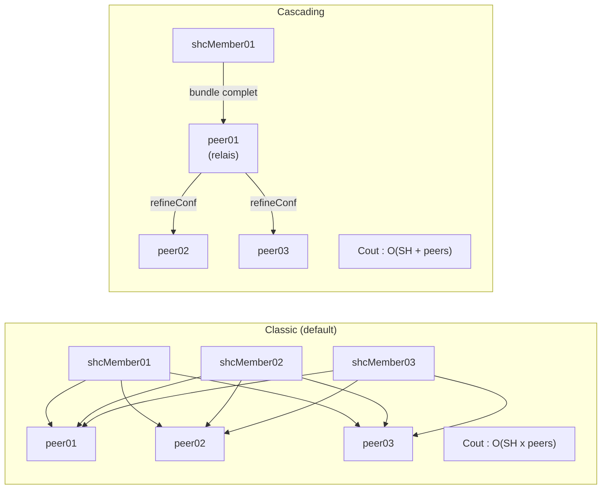
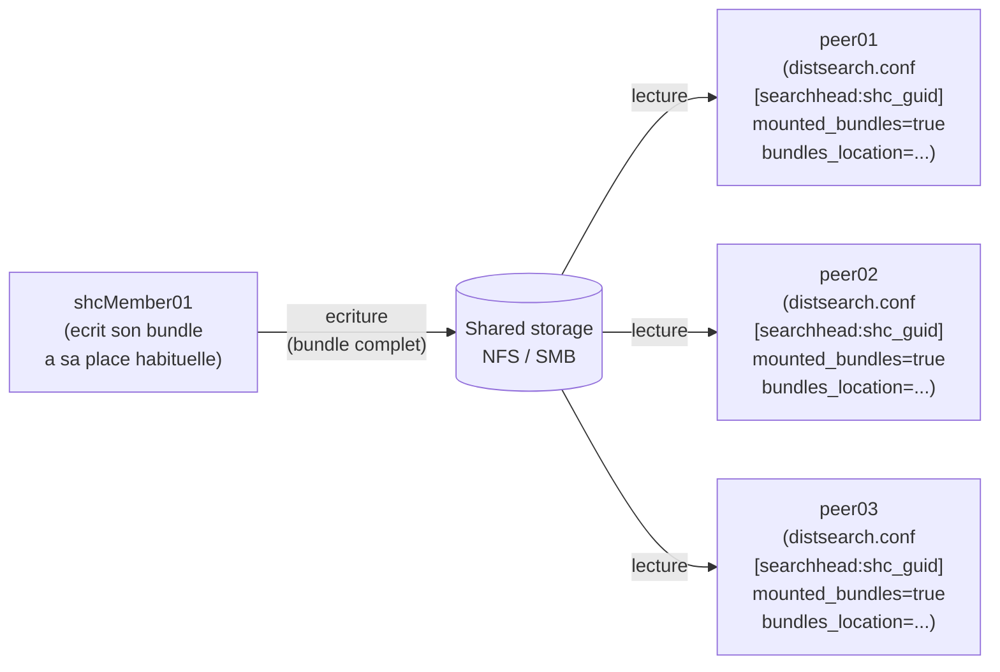

# Chapitre 3 — Réplication vers les search peers

> Le knowledge bundle constitué côté search head doit ensuite atteindre chaque search peer. Trois modes de réplication coexistent en Splunk 9.4 — *classic* (par défaut), *cascading* (recommandé à l'échelle) et *mounted* (stockage partagé). Ce chapitre les décrit dans cet ordre, donne le critère de bascule, détaille l'arborescence côté peer (`var/run/searchpeers/`), traite les échecs partiels (peer KO, hash divergent, NFS qui décroche), et conclut sur les options de comportement (`allowSkipReplication`).

## Rappels rapides

- En réplication **classique** (défaut), chaque SH pousse son bundle directement à chaque peer ; le coût est en O(SH × peers).
- En réplication **cascading**, Splunk recommande la bascule à partir d'environ 15-20 peers ; un peer relais re-distribue à un sous-ensemble suivant et le SH ne pousse qu'une fois.
- En réplication **mounted**, le bundle vit sur un stockage partagé (NFS / SMB) ; les peers le lisent au lieu de le recevoir par push.
- Côté peer, les bundles reçus vivent sous `$SPLUNK_HOME/var/run/searchpeers/<sh_guid>-<epoch>-<hash>.bundle`. Splunk en conserve quelques-uns récents et fait le ménage des plus anciens.
- Un échec de réplication vers un peer particulier ne bloque pas l'ensemble par défaut (cf. `allowSkipReplication=false` qui *bloque* la recherche jusqu'à ce que tous les peers soient à jour, vs. `allowSkipReplication=true` qui laisse continuer en best-effort).

## 1. Réplication classique (mode par défaut)

C'est le mode actif sans configuration particulière. Chaque search head pousse son bundle vers chaque peer du `serverList` (résolu via le CM quand `[clustering]` est configuré). Dans un SHC à 3 membres et un indexer cluster à 10 peers, cela représente jusqu'à 30 push parallèles à chaque cycle de réplication — ce n'est pas un problème à cette échelle mais ça l'est à plus grande.

Le push est un transfert HTTPS vers le port de réplication du peer (par défaut le port mgmt `8089`, ou un port dédié selon `[replicationSettings]` côté peer si configuré). Le contenu est compressé.

```text
2026-06-18 10:00:00.123 +0000 INFO  DistributedBundleReplicationManager - peer=peer01 push complete bundle=00000000-0000-0000-0000-000000000001-1718711234-aaaaaaaa.bundle bytes=234567
```

### Coût et seuil de bascule

Le coût opérationnel de la réplication classique est principalement le **réseau** (bande passante consommée par les push parallèles) et la **mémoire** côté SH (chaque push entretient un buffer). En notation grossière :

- 3 SH × 10 peers = 30 push par cycle.
- 3 SH × 30 peers = 90 push par cycle — déjà sensible.
- 3 SH × 60 peers = 180 push par cycle — l'admin sent la réplication ralentir.

Splunk pose le seuil indicatif à environ 15-20 peers ([Cascadingknowledgebundlereplication](https://docs.splunk.com/Documentation/Splunk/9.4.1/DistSearch/Cascadingknowledgebundlereplication)). En dessous, le mode classique reste rationnel ; au-dessus, examiner cascading.

## 2. Réplication cascading

En mode cascading, le SH ne pousse plus son bundle à tous les peers. Il pousse à un **peer relais** (ou à un petit ensemble de peers relais) qui re-distribue ensuite à un sous-ensemble suivant. La topologie ressemble à un arbre dont le SH est la racine.

Le `refineConf` (chap. 02 § 1) joue ici son rôle : c'est le sous-bundle minimal que le peer relais a besoin de retransmettre. Le SH envoie le bundle complet au peer relais ; le peer relais transmet le `refineConf` au sous-ensemble suivant, qui s'en sert pour résoudre les recherches sans avoir besoin du bundle complet.

### Quand activer

- Plus de 15-20 peers — seuil Splunk indicatif.
- Réplication classique perceptiblement lente ou consommatrice de bande passante.
- Profil de modification de bundle plutôt rare (chaque cascade coûte un cycle ; trop de cascades par minute annule le gain).

### Comment ça change la topologie

Côté SH, la configuration se fait dans `distsearch.conf` ; côté peers, certains nœuds prennent le rôle de relais. La topologie est calculée par Splunk en fonction du nombre de peers et de la configuration de cascading. À cet égard, ce n'est pas une topologie « configurée à la main » : c'est un mode activé.

#### S4 — Réplication classique vs cascading : coût et topologie



À gauche, le coût explose en SH × peers : recommandation Splunk de basculer en cascading au-delà de ~15-20 peers. À droite, un peer désigné relaie le `refineConf` au sous-ensemble suivant ; le SH ne pousse qu'une fois, le peer relais propage en aval. Le compromis : un peer relais devient un point chaud, et son indisponibilité bloque la propagation pour les peers en aval (cf. chap. 05 branche E2).

## 3. Réplication mounted (stockage partagé)

En mode mounted, le bundle ne transite plus par le réseau Splunk : le SH l'écrit sur un stockage partagé (NFS ou SMB), et les peers le lisent depuis ce même stockage. Le SH n'envoie plus rien aux peers — il les notifie simplement qu'un nouveau bundle est disponible à tel chemin partagé.

### Stanzas de configuration

La configuration est portée **côté peer**, dans `$SPLUNK_HOME/etc/system/local/distsearch.conf` (cf. [Mountedknowledgebundlereplication](https://docs.splunk.com/Documentation/Splunk/9.4.0/DistSearch/Mountedknowledgebundlereplication)) : une stanza `[searchhead:<searchhead-splunk-server-name>]` par SH source, avec les attributs `mounted_bundles=true` et `bundles_location=<path>` où `<path>` est le **mountpoint côté search peer** (pas côté SH).

```ini
# Sur chaque peer : distsearch.conf, une stanza par SH source
[searchhead:00000000-0000-0000-0000-000000000001]
mounted_bundles = true
bundles_location = /opt/shared_bundles/00000000-0000-0000-0000-000000000001
```

**Cas SHC** : la doc Splunk précise que si le search peer est connecté à un SHC, le nom dans la stanza `[searchhead:<name>]` doit être **le GUID du cluster**, pas le server name d'un membre individuel. Une seule stanza couvre alors l'ensemble du SHC, pas une par membre. Côté SH, aucune stanza dédiée n'est requise : le SH continue d'écrire son bundle normalement, et c'est le peer qui choisit de le lire depuis le partage plutôt que de l'attendre par push grâce à la stanza ci-dessus.

**Permissions** : les peers doivent avoir un accès **lecture seule** aux sous-répertoires du bundle pour éviter les conflits de verrou de fichier.

### Quand c'est la bonne réponse

- **Beaucoup de peers** (au-delà de ~30-50), où la bande passante de réplication devient un coût mesurable.
- **Bundle gros** (au-delà de plusieurs centaines de Mo) qui multiplierait le coût de chaque push.
- **NFS de qualité disponible** — performance, disponibilité, intégrité. Le mounted n'est pas une option à activer sur un NFS bricolé.

### Compromis

Le mounted déplace la résilience du bundle vers le stockage partagé : si le NFS tombe, plus aucun peer ne peut lire le bundle, et toutes les recherches distribuées qui se basent sur des knowledge objects spécifiques échouent ou attendent indéfiniment. La haute disponibilité du NFS devient une dépendance opérationnelle critique du SHC, ce qui n'était pas le cas en classic/cascading. Cf. chap. 05 branche G (mounted obsolète) et piège « NFS qui décroche en mounted » du chap. 07.

#### S5 — Réplication mounted : SH écrit, peers lisent depuis le stockage partagé



Le SH n'envoie plus le bundle par push : il écrit une fois sur le stockage partagé. La configuration est portée **côté peer** uniquement, via une stanza `[searchhead:<name>]` (avec `<name>` = GUID du SHC quand le SH source est un cluster) qui active `mounted_bundles=true` et pointe `bundles_location` vers le mountpoint côté peer. Les peers lisent depuis ce stockage à la demande. Trade-off : la résilience du bundle dépend désormais de la résilience du NFS ; un lag d'écriture côté NFS, un cache local périmé sur un peer, ou un fail-over de partage sont autant de causes de désynchronisation invisibles au push direct.

## 4. Sur disque côté peer : `var/run/searchpeers/`

Côté peer, les bundles reçus ou montés vivent sous `$SPLUNK_HOME/var/run/searchpeers/`. Un peer dans un SHC reçoit un bundle par membre source (un par GUID), donc dans un SHC à 3 membres l'arborescence ressemble à :

```text
$SPLUNK_HOME/var/run/searchpeers/
├── 00000000-0000-0000-0000-000000000001-1718711234-aaaaaaaa.bundle
├── 00000000-0000-0000-0000-000000000001-1718712345-bbbbbbbb.bundle
├── 00000000-0000-0000-0000-000000000002-1718711234-cccccccc.bundle
└── 00000000-0000-0000-0000-000000000003-1718711234-dddddddd.bundle
```

Splunk conserve un nombre limité de bundles par GUID source (typiquement les 2-3 plus récents) et fait le ménage automatiquement. Le ménage n'est jamais à déclencher manuellement par un `rm` : Splunk gère le cycle de vie et un fichier supprimé en plein cycle de recherche peut faire échouer un map.

### Rotation et ménage

La rotation est gérée par Splunk en fonction de l'arrivée des nouveaux bundles ; un nouveau bundle reçu provoque le ménage des plus anciens du même GUID. L'admin n'a pas de levier direct ici ; le seul cas où il intervient est le cas pathologique d'un disque saturé (à investiguer côté infrastructure, pas côté Splunk).

## 5. Échecs partiels

Un peer KO ne bloque pas la réplication des autres : chaque push est indépendant. Le comportement de la recherche face à un peer non-répliqué dépend de `allowSkipReplication` :

- **`allowSkipReplication=false` (défaut)**. La recherche attend que tous les peers aient le bundle (ou abandonne après timeout). Conséquence : un peer durablement en retard bloque toutes les recherches distribuées sur le SH. C'est la sécurité maximale (complétude) mais c'est aussi la source numéro un de symptôme « recherche bloquée en attente bundle » (chap. 05 branche H).
- **`allowSkipReplication=true`**. La recherche démarre sur les peers à jour et **ignore** le peer en retard. Résultats partiels sans avertissement explicite. Acceptable seulement dans des contextes où la complétude n'est pas critique ; risqué pour de l'alerting et de la conformité.

Le bon choix dépend du cas d'usage :

| Cas | Recommandation |
| --- | --- |
| Recherches d'alerting / SOC | `allowSkipReplication=false`. Mieux vaut une alerte qui rate son créneau que des résultats partiels muets. |
| Dashboards de monitoring d'aperçu | `allowSkipReplication=true` acceptable, avec mention explicite dans la doc du dashboard. |
| Compliance / reporting régulier | `allowSkipReplication=false`. La traçabilité est non négociable. |
| Recherches exploratoires ad hoc | Au cas par cas — `allowSkipReplication=false` reste le défaut sain. |

### Symptômes d'un échec partiel

- **`splunkd.log` côté SH** : lignes `DistributedBundleReplicationManager` avec `log_level=WARN` ou `ERROR`, mentionnant le peer en cause.
- **`splunkd.log` côté peer** : messages de réception en erreur, ou pas de message du tout si le peer n'est pas joignable.
- **REST `/services/search/distributed/peers`** : le peer en cause est en état dégradé (`status=down` ou `quarantined`).
- **REST `/services/search/distributed/bundle/replication/cycles`** (cf. [Troubleshootknowledgebundlereplication](https://docs.splunk.com/Documentation/Splunk/9.4.0/DistSearch/Troubleshootknowledgebundlereplication)) : l'historique des cycles montre l'échec.

## 6. Hash divergent — la signature du chap. 05 branche E

Le hash dans le nom de fichier `<sh_guid>-<epoch>-<hash>.bundle` est l'invariant clé du diagnostic. Trois cas :

- **Tous les peers ont le même hash pour le même `<sh_guid>`** : cohérent. La réplication a convergé.
- **Un peer a un hash plus ancien** : retard. Soit la propagation est en cours (attendre 1-2 cycles), soit elle est bloquée (cause à chercher : push échoué, cascading bloqué, mounted lag).
- **Deux peers ont des hashes différents pour le même SH au même moment** : divergence pathologique. La cause la plus fréquente est une propagation partielle (un peer a reçu le nouveau, l'autre a échoué silencieusement) ou — en mounted — un cache local péri-mé.

Le diagnostic se mène en croisant l'hash côté SH (`splunk show distributed-peers` ou REST `/services/search/distributed/peers`) avec l'hash côté peer (lecture du nom de fichier dans `var/run/searchpeers/` ou REST sur le peer). Détail des commandes dans le chap. 06.

## 7. Pointeurs : SmartStore et indexer cluster

**SmartStore** modifie la mécanique des buckets indexer (stockage object storage S3) mais ne touche pas à la mécanique du knowledge bundle SH → peers. L'arborescence `var/run/searchpeers/` continue de fonctionner identiquement. SmartStore est mentionné ici uniquement pour dissiper le doute : si vous activez SmartStore et que votre knowledge bundle ne propage plus, ce n'est pas SmartStore qui en est la cause.

**Configuration bundle indexer cluster** (CM → peers) est une mécanique distincte du knowledge bundle, cf. chap. 00 § 1.3 et chap. 06 § 1 (CLI `splunk apply cluster-bundle`). Le configuration bundle indexer cluster n'utilise pas `var/run/searchpeers/` mais `etc/slave-apps/` côté peer ; ne pas chercher un knowledge bundle dans `etc/slave-apps/`, il n'y est pas.

## Pièges typiques

- **NFS qui décroche en mounted.** Le SH a écrit le bundle, les peers ne peuvent plus le lire — pour quelques secondes ou minutes. Toutes les recherches qui débutent pendant la fenêtre échouent ou attendent. Le NFS doit avoir un SLA aussi exigeant que celui des indexers ; si le NFS est un partage best-effort dans l'infra, ne pas activer mounted.
- **Hash divergent silencieux.** Sans monitoring explicite (saved search qui croise le hash SH-déclaré et le hash peer-effectif), une divergence persistante peut passer inaperçue plusieurs jours. Symptôme côté utilisateurs : recherches qui ne retournent pas la même chose selon le SH membre utilisé. Mettre une saved search programmée (cf. chap. 06 SPL § 4).
- **Peer absent du `serverList` après ajout indexer.** Si le SH est configuré en `[distributedSearch] servers=...` en dur (non recommandé en indexer cluster, mais existant en migration historique), ajouter un nouvel indexer n'est pas pris en compte automatiquement. Symptôme : les recherches ne montrent pas les données nouvelles. La bonne configuration en présence d'un cluster manager est `[clustering] manager_uri=...` côté SH, qui résout `serverList` dynamiquement.
- **Montée de version asymétrique entre SH et peer.** Un SH en 9.4.2 qui pousse un bundle à un peer en 9.4.0 fonctionne en général (rétrocompatibilité), mais une stanza dépendante d'une version peut produire des erreurs au map sur le peer. Aligner SH et peer à la même version mineure 9.x ; en migration, faire d'abord les peers puis les SH (les peers tolèrent les bundles 9.x antérieurs ; l'inverse est moins garanti).
- **Cascade qui s'effondre sur défaillance du relais.** En cascading, si le peer relais désigné tombe, les peers en aval ne reçoivent plus rien jusqu'à ce que Splunk recalcule la topologie (quelques minutes). Surveillance dédiée à monter sur les peers en rôle relais — leur disponibilité affecte plus que la leur seule.

## Quand escalader / quand décider

- **Décision classic → cascading.** Au-delà de 20 peers, l'admin doit instruire la décision : mesurer la bande passante de réplication actuelle, la fréquence des cycles, la taille du bundle. Si le push représente plus de quelques pour-cent du débit réseau ou si les cycles s'allongent perceptiblement, basculer. Pas avant — chaque mode a son coût opérationnel propre.
- **Décision cascading → mounted.** Plus tard sur la courbe (50+ peers, bundle > 500 Mo, NFS de qualité disponible et opéré par une équipe qui l'engage en SLA). C'est une décision architecte qui engage l'infra storage du datacenter, pas une décision de configuration.
- **Échec persistant d'un peer particulier.** Si un peer reste durablement en erreur de réplication après vérification réseau, vérification `pass4SymmKey`, et redémarrage du peer : ouvrir un demande Splunk Support avec `splunk diag` côté SH et côté peer. Avant ce point, ne pas multiplier les `rm` dans `var/run/searchpeers/` côté peer — c'est cosmétique et masque la cause.

## Sources

- [Splunk DistSearch 9.4 — Classic knowledge bundle replication](https://docs.splunk.com/Documentation/Splunk/9.4.1/DistSearch/Classicknowledgebundlereplication)
- [Splunk DistSearch 9.4 — Cascading knowledge bundle replication](https://docs.splunk.com/Documentation/Splunk/9.4.1/DistSearch/Cascadingknowledgebundlereplication)
- [Splunk DistSearch 9.4 — Mounted knowledge bundle replication](https://docs.splunk.com/Documentation/Splunk/9.4.0/DistSearch/Mountedknowledgebundlereplication)
- [Splunk DistSearch 9.4 — Troubleshoot knowledge bundle replication](https://docs.splunk.com/Documentation/Splunk/9.4.0/DistSearch/Troubleshootknowledgebundlereplication)
- [Splunk Admin 9.4 — distsearch.conf (stanzas `[mounted_bundle_settings]`, `[replicationSettings]`)](https://docs.splunk.com/Documentation/Splunk/9.4.0/Admin/Distsearchconf)
- [Splunk DistSearch 9.4 — Configure distributed search](https://docs.splunk.com/Documentation/Splunk/9.4.0/DistSearch/Configuredistributedsearch)
- [Splunk REST API 9.4 — Distributed search endpoints](https://docs.splunk.com/Documentation/Splunk/9.4.0/RESTREF/RESTprolog)
