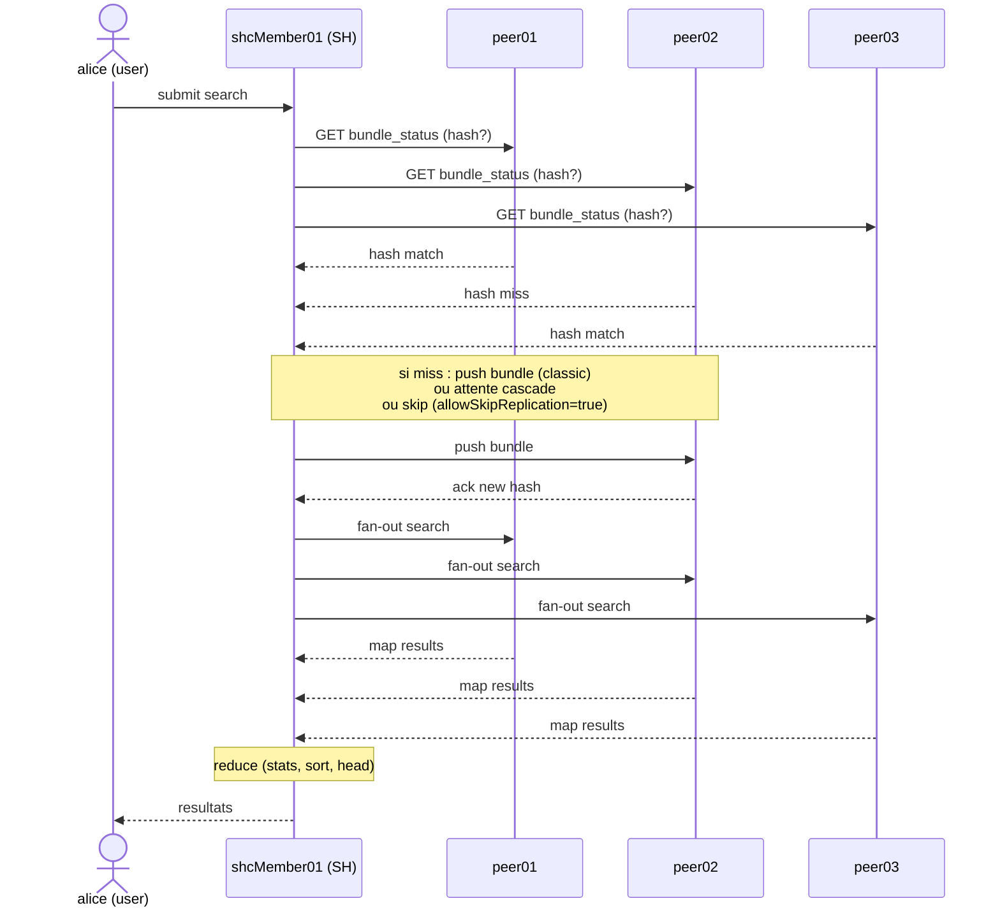

# Chapitre 4 — Séquence d'une recherche distribuée

> Une recherche tapée par un utilisateur dans un SHC traverse trois étapes : vérification que les peers ont le bon knowledge bundle, fan-out de la recherche, agrégation des résultats. Ce chapitre pose la séquence temporelle bout en bout. Le but n'est pas d'expliquer la SPL ni l'algèbre map/reduce mais de fournir le repère qui permet de **localiser** où une recherche bloque quand le bundle déconne : si elle bloque avant le fan-out, c'est un problème bundle ; si elle bloque après, c'est un problème de map ou de reduce, pas de bundle.

## Rappels rapides

- Toute recherche distribuée comporte un **fan-out** vers les peers, un **map** sur chaque peer, un **reduce** sur le SH.
- Avant le fan-out, le SH vérifie que chaque peer a le bundle au hash courant. Si non, soit il attend, soit il pousse, soit (selon `allowSkipReplication`) il skip.
- Une recherche scheduled tourne sur le membre captain s'il s'agit d'une saved search de scheduler clusterisé. Si le captain change pendant l'exécution, la recherche peut être relancée par le nouveau captain.
- Le SH agrège les résultats au fur et à mesure de leur arrivée (`stats`, `timechart` côté reduce). Une lenteur de reduce sur le SH n'est pas une lenteur de bundle.

## 1. Phase 1 — vérification de bundle ready

À la soumission d'une recherche, le SH n'envoie pas immédiatement la commande SPL aux peers. Il vérifie d'abord, peer par peer, que chacun possède le bundle au hash courant côté SH. Cette vérification est rapide (quelques millisecondes en réseau LAN normal) parce qu'elle ne transporte que des métadonnées (le hash courant, pas le contenu).

Trois résultats possibles par peer :

- **Match.** Le hash côté peer correspond au hash côté SH. Le peer est prêt ; le SH continue.
- **Miss avec push possible.** Le hash diffère mais le SH peut pousser le bundle (mode classic / cascading) ou écrire sur le stockage partagé (mode mounted). Le SH déclenche la propagation et attend que le peer acquitte le nouveau hash.
- **Miss sans push possible / timeout.** Le peer ne répond pas, ou la propagation échoue, ou le timeout `connectionTimeout` / `sendRcvTimeout` est dépassé. Le comportement bascule selon `allowSkipReplication` : `false` → la recherche échoue ou attend ; `true` → le peer est skipped silencieusement et la recherche continue avec les autres.

C'est l'étape critique pour le diagnostic. Une recherche bloquée à cette étape est une recherche qui n'a **pas commencé** à interroger les données ; le symptôme côté UI est « waiting for bundle replication » ou un loader figé sans avancement du compteur d'événements.

## 2. Phase 2 — fan-out

Une fois la vérification de bundle ready terminée pour tous les peers concernés (ou la décision de skip prise), le SH envoie la commande SPL à chaque peer en parallèle. Le fan-out est un appel REST simultané vers chaque peer du `serverList` actif, contenant la SPL et le contexte de recherche (utilisateur, app, time range).

Le fan-out est rapide : la commande SPL est petite. Le délai entre le clic de l'utilisateur et le démarrage effectif du map sur les peers est typiquement de quelques centaines de millisecondes en LAN.

## 3. Phase 3 — map sur les peers

Sur chaque peer, la SPL est exécutée localement contre les buckets de données présents. Pour résoudre les références à des knowledge objects (lookups, macros, eventtypes, tags, autorisations RBAC), le peer charge le bundle correspondant au GUID du SH demandeur depuis `var/run/searchpeers/<sh_guid>-<epoch>-<hash>.bundle`.

Si le bundle référencé n'existe plus sur le peer (cas pathologique : ménage déclenché en plein cycle), le peer renvoie une erreur immédiate au SH. Ce cas est rare et symptomatique d'un problème de cycle de vie côté peer (cf. chap. 03 § 4 « rotation et ménage »).

Le map produit un flux d'événements ou un flux d'agrégats partiels que le peer renvoie au SH au fur et à mesure. Le map est généralement la phase la plus longue d'une recherche (proportionnelle au volume de données interrogé) ; une lenteur ici n'est pas un problème de bundle.

## 4. Phase 4 — reduce sur le SH

Le SH consomme les flux retournés par les peers, applique les commandes SPL non-streaming (stats finale, sort, dedup, head, etc.) et produit le résultat final. Pour une recherche de type `stats count by sourcetype`, le reduce est une simple agrégation des comptes partiels reçus de chaque peer ; pour une recherche par événement (`| head 1000`), c'est une consolidation et un tri.

Le reduce est limité par les ressources du SH : CPU et mémoire. Une lenteur ici est une lenteur de SH (notamment sur le membre captain en cas de saved search clusterisée), pas une lenteur de bundle.

## 5. Vue temporelle complète

#### S6 — Séquence d'une recherche distribuée : vérification → fan-out → map → reduce

Avant tout fan-out, le SH vérifie que chaque peer a le bon hash. Une recherche bloquée aux étapes 1-3 est un problème de bundle (vérification ou push) ; une recherche bloquée aux étapes 4-5 est un problème de map (lenteur des peers, requête lourde) ; une recherche bloquée à l'étape 6-7 est un problème de reduce (SH surchargé, requête mal écrite). Le repère temporel est essentiel pour ne pas chercher dans le mauvais endroit.

## 6. Cas particulier : « bundle pas encore propagé »

Quand le SH constate au moment de la recherche que le bundle n'est pas encore à jour sur un peer (par exemple une lookup vient d'être modifiée par un apply deployer qui n'a pas encore atteint le peer via le knowledge bundle de search), trois comportements coexistent :

- **`allowSkipReplication=false` (défaut)** + bundle en cours de push : le SH attend. La recherche affiche « waiting for bundle replication » et démarre dès que le peer a acquitté. C'est le comportement sûr mais bloquant.
- **`allowSkipReplication=false` + push impossible** (peer down, réseau coupé) : le SH abandonne après timeout (`connectionTimeout`). La recherche échoue avec un message « failed to replicate bundle to peer X ».
- **`allowSkipReplication=true`** : le peer est skipped silencieusement, la recherche démarre sur les autres. Pas d'avertissement explicite à l'utilisateur, juste un peer en moins dans le périmètre. Recherche en résultats partiels.

Le repère pour l'admin : ouvrir `splunkd.log` côté SH au moment de la recherche bloquée, grepper sur `DistributedBundleReplicationManager` ; une ligne en `log_level=WARN` avec un nom de peer indique le cas 2 ou 3, une ligne `INFO` avec `bundle replicating` indique le cas 1.

## 7. Cas particulier : recherche scheduled et perte de captain

Une saved search clusterisée (`dispatchAs=owner` côté SHC) est exécutée par le **captain** courant à l'horaire prévu. Si le captain est perdu en plein milieu de l'exécution (panne, redémarrage, election), trois trajectoires :

- La recherche en cours d'exécution sur l'ex-captain est interrompue. Le nouveau captain, une fois élu (typiquement quelques secondes à une minute), peut décider de relancer la recherche ou de la sauter selon `schedule_priority` et la configuration SHC.
- Côté UI / résultat : un slot manqué ou un résultat dupliqué peut apparaître selon le moment exact de la perte. À documenter dans le runbook SHC.
- Côté `splunkd.log` : les composants `SHCSchedulerDelegator` ou similaires (cf. chap. 06 § 3, observés empiriquement) tracent la décision.

Ce cas n'est pas un problème bundle au sens strict mais un cas de continuité de service SHC. Il est mentionné ici parce qu'il se manifeste comme « recherche scheduled qui n'a pas produit » et est souvent confondu en première analyse avec un échec de bundle.

## Pièges typiques

- **Recherche qui « part vite » mais reduce sur SH en surcharge.** Le SH affiche des résultats partiels qui n'avancent plus. Symptôme : map terminé côté peers (vérifiable via REST sur chaque peer), reduce qui n'avance pas. Causes : SPL non-streaming massive (`| sort - _time` sur des millions d'événements), `stats` sur trop de groupes, lookup côté SH après la phase distribuée. Solution : déplacer ce qui peut l'être dans la phase distribuée (utiliser `tstats` quand possible, filtrer avant `stats`, limiter avec `head` côté distribué).
- **Peer skipped silencieusement.** Avec `allowSkipReplication=true`, la recherche démarre sans le peer en erreur. Les résultats sont partiels, l'UI ne distingue pas. Un dashboard d'alerting peut produire un faux négatif. Surveillance dédiée à ajouter (alerte sur `splunkd.log` `DistributedBundleReplicationManager` `log_level=WARN/ERROR` quand `allowSkipReplication=true` est actif).
- **Captain perdu pendant une recherche scheduled.** L'utilisateur voit une saved search qui n'a pas produit ou qui a produit deux fois pour le même créneau. Cause : élection en plein milieu. À distinguer d'un échec de bundle : `splunkd.log` `SHCScheduler*` montre la décision côté nouveau captain. Pas de remède réactif, prévention par stabilité d'infra.
- **Confondre attente bundle et attente de map lent.** Une recherche bloquée sur un peer peut être à l'étape 3 (push bundle en cours) ou à l'étape 4 (map en cours, juste lent). Distinction : `splunkd.log` côté peer. Si on voit des entrées récentes `SearchOperator*` ou similaire (sur le peer), c'est du map ; si on ne voit rien et que `var/run/searchpeers/` n'a pas le bundle attendu, c'est encore au stade bundle.

## Quand escalader / quand décider

- **Recherche distribuée durablement plus lente qu'attendu.** Avant d'incriminer le bundle ou le réseau, mesurer la répartition vérification/fan-out/map/reduce avec le job inspector Splunk (`Job → Inspect job`). Si vérification + fan-out > 10 % du temps total, examiner la santé bundle (chap. 05). Sinon, regarder map (peers) ou reduce (SH).
- **Décision `allowSkipReplication`.** À documenter au niveau de l'app ou du contexte de la saved search. Ne pas activer `true` globalement par confort — l'absence d'avertissement est un risque réel pour l'alerting et le compliance. Si activé, ajouter une saved search de surveillance qui détecte les skips.
- **Captain instable.** Si le captain change plus d'une fois par jour en l'absence d'incident infra, c'est un problème SHC structurel (réseau interne, ressources). Ne pas tenter de stabiliser par ajustement de timeouts — investiguer la cause.

## Sources

- [Splunk DistSearch 9.4 — Knowledge bundle replication](https://docs.splunk.com/Documentation/Splunk/9.4.0/DistSearch/Knowledgebundlereplication)
- [Splunk DistSearch 9.4 — Troubleshoot knowledge bundle replication](https://docs.splunk.com/Documentation/Splunk/9.4.0/DistSearch/Troubleshootknowledgebundlereplication)
- [Splunk DistSearch 9.4 — SHC architecture (élection captain, scheduler clusterisé)](https://docs.splunk.com/Documentation/Splunk/9.4.2/DistSearch/SHCarchitecture)
- [Splunk Admin 9.4 — distsearch.conf (`[replicationSettings] allowSkipReplication`)](https://docs.splunk.com/Documentation/Splunk/9.4.0/Admin/Distsearchconf)
