# Chapitre 5 — Troubleshooting : arbre de diagnostic

> Ce chapitre est le point d'entrée du handbook face à un incident bundle. On entre par **symptôme observable** — message d'erreur, comportement de recherche, état de propagation — et on descend l'arbre jusqu'à la feuille qui correspond. Chaque feuille fournit le symptôme précis, les hypothèses ordonnées par probabilité, les commandes d'investigation (renvoyées au chap. 06), l'action corrective générique et le critère d'escalade Splunk Support. Le chapitre se termine par les métriques de santé bundle à monitorer en routine pour faire de la prévention.

## Rappels rapides

- **Avant tout diag**, identifier de quel bundle on parle (cf. chap. 00 § 2) : configuration bundle SHC ? knowledge bundle SH → peers ? configuration bundle indexer cluster ?
- L'arbre couvre principalement le **knowledge bundle SH → peers** et le **configuration bundle SHC** ; le configuration bundle indexer cluster est rappelé en branche I avec pointeur vers la doc Splunk.
- Les commandes d'investigation citées sont **toutes** détaillées au chap. 06. Les liens internes ci-dessous vous y mènent directement.
- L'arbre n'est pas exclusif : un incident réel peut combiner plusieurs feuilles (par exemple bundle trop gros + peer en retard). Traiter chaque feuille indépendamment dans l'ordre des hypothèses, puis recroiser.

## 1. Comment entrer dans l'arbre

L'entrée se fait par le symptôme observable. Quatre points d'entrée fréquents :

1. **Message dans l'UI / la sortie CLI** : « waiting for bundle replication », « failed to replicate bundle », « bundle exceeds max content length », « cannot find captain », etc.
2. **Comportement de recherche** : recherche bloquée, résultats partiels, données absentes sur certains peers.
3. **Comportement de membre SHC** : un membre affiche une app dans une version différente des autres, ou ne reçoit pas une lookup poussée la veille.
4. **Monitoring** : alerte sur composant `DistributedBundleReplicationManager`, métrique de hash divergent.

Pour chacun, la table « carte de chaleur » du chap. 00 § 4 oriente vers la branche principale. Si la branche n'est pas évidente, partir de la racine (§ 2 ci-dessous) et descendre.

## 2. L'arbre complet (rendu Mermaid)

#### S7 — Arbre de diagnostic bundle : entrer par symptôme, descendre vers feuille

```mermaid
flowchart TB
    Start([Symptome bundle observe]) --> Q1{Quelle mecanique ?}
    Q1 -->|"apply shcluster-bundle"| A[A. SHC bundle apply KO]
    Q1 -->|Membre SHC divergent| B[B. Bundle SHC recu mais divergent]
    Q1 -->|Bundle SH peers trop gros| C[C. Taille max depassee]
    Q1 -->|Peer sans bundle| D[D. Peer ne recoit pas]
    Q1 -->|Hash divergent peers| E[E. Hash divergent]
    Q1 -->|RF SHC| F[F. RF non respecte SHC]
    Q1 -->|Mounted obsolete| G[G. Mounted bundle stale]
    Q1 -->|Recherche bloquee| H[H. Recherche en attente bundle]
    Q1 -->|Cluster bundle CM| I[I. Indexer cluster bundle]

    A --> A1[A1. deployer down]
    A --> A2[A2. captain perdu]
    A --> A3[A3. validation KO]

    B --> B1[B1. conf_replication sature]
    B --> B2[B2. restart manquant]

    C --> C1[C1. lookups massives]
    C --> C2[C2. apps avec data]
    C --> C3[C3. blacklist absente]

    D --> D1[D1. peer hors serverList]
    D --> D2[D2. reseau / port]
    D --> D3[D3. pass4SymmKey]
    D --> D4[D4. timeout court]

    E --> E1[E1. propagation partielle]
    E --> E2[E2. cascading bloque]
    E --> E3[E3. mounted lag]

    F --> F1[F1. membres lt RF]
    F --> F2[F2. conf_replication_max trop bas]

    G --> G1[G1. NFS lag]
    G --> G2[G2. cache peer]

    H --> H1[H1. peer lent ack]
    H --> H2[H2. push en cours]
    H --> H3[H3. peer KO + timeout repete]

    I --> I0[Voir Splunk Configurationbundleissues]
```

L'arbre se descend en partant du symptôme. À chaque branche, l'identification se fait via le chap. 06 (commandes d'investigation). Les sections suivantes (§ 3 à § 11) détaillent chaque feuille.

## 3. Branche A — `splunk apply shcluster-bundle` échoue ou ne propage pas

Symptôme générique : la commande renvoie une erreur, ou se termine en succès apparent mais aucun membre ne reflète le contenu attendu après plusieurs minutes.

### A1 — Deployer indisponible

- **Symptôme.** `splunk apply shcluster-bundle` échoue côté deployer avec un message réseau (`connection refused`, `timeout`), ou la commande ne démarre pas du tout. Tentative de connexion à `https://<deployer>:8089` qui échoue. Disque plein sur le deployer (`var/run/splunk/deploy` saturé).
- **Hypothèses ordonnées.** (1) Processus splunkd du deployer arrêté. (2) Disque saturé sur le partitions de `$SPLUNK_HOME`. (3) Port 8089 filtré par firewall.
- **Investigation.** Sur le deployer : `splunk status`, `df -h $SPLUNK_HOME/var/run`, `ss -tlnp | grep 8089`. Cf. chap. 06 § 1.
- **Action.** Redémarrer splunkd, libérer de l'espace, réouvrir le port. Si récurrent, surveiller via une saved search côté `_internal` sur la santé du deployer.
- **Escalade.** Si le processus crashe au démarrage et `splunkd.log` du deployer montre une stack trace : demande Splunk Support.

### A2 — Captain perdu

- **Symptôme.** `splunk apply shcluster-bundle` retourne un message « no captain found » ou « cannot determine captain ». Les membres ne s'accordent pas sur qui est captain.
- **Hypothèses ordonnées.** (1) Élection en cours (transitoire, 30s à 2min). (2) Quorum SHC perdu (moins de la majorité de membres up). (3) Réseau partitionné entre membres SHC.
- **Investigation.** Sur un membre : `splunk show shcluster-status`. Côté `splunkd.log`, composants `SHCMaster`, `RaftConsensus` (terminologie variable selon version). Cf. chap. 06 § 1 et § 3.
- **Action.** Attendre la fin de l'élection. Si quorum perdu, ramener les membres absents (redémarrer, restaurer le réseau). Ne pas relancer l'apply pendant l'élection.
- **Escalade.** Captain réélu plus d'une fois par jour sans cause infra identifiée : demande Splunk Support avec `splunk diag` des membres.

### A3 — Validation refusée

- **Symptôme.** `splunk apply shcluster-bundle` retourne un message de validation : conf invalide, app manquante de fichier requis, version mismatch entre deployer et membres.
- **Hypothèses ordonnées.** (1) Stanza `.conf` malformée dans `etc/shcluster/apps/`. (2) App dépendante d'une autre absente du bundle. (3) Version Splunk deployer ≠ version membres au-delà du tolérable (typiquement plus d'une mineure d'écart).
- **Investigation.** `splunk apply shcluster-bundle -action stage` pour reproduire la validation sans envoyer. `splunk btool check` sur les apps suspectes. Cf. chap. 06 § 1.
- **Action.** Corriger la conf, reposer les dépendances, aligner les versions.
- **Escalade.** Si la validation refuse une conf valide selon `btool` : demande Splunk Support.

## 4. Branche B — Bundle SHC propagé mais membre divergent

Symptôme générique : `splunk apply shcluster-bundle` retourne succès, mais un ou plusieurs membres SHC ne reflètent pas le contenu attendu après plusieurs minutes.

### B1 — Conf replication bloquée

- **Symptôme.** `splunk list shcluster-bundle-status` côté captain montre un ou plusieurs membres en `bundle_id` antérieur. Pas de progression au fil des minutes.
- **Hypothèses ordonnées.** (1) `conf_replication_max_pull_count` ou `conf_replication_max_push_count` trop bas pour le volume. (2) Conf replication thread saturé (charge sur captain). (3) Membre cible saturé en disque ou en CPU.
- **Investigation.** `splunkd.log` captain et membre : composant `ConfReplicationThread` (observé empiriquement, cf. chap. 06 § 3). Métriques `_internal` sur le débit de conf replication.
- **Action.** Vérifier la santé infra du membre. Ajuster les `conf_replication_max_*` si volume légitime. Si charge captain, considérer un upscale du membre captain.
- **Escalade.** Si conf replication reste bloquée sans cause infra identifiée après 30 min : demande Splunk Support.

### B2 — Restart non déclenché alors qu'attendu

- **Symptôme.** Le bundle a été propagé, le hash convergé, mais le comportement attendu (par exemple un nouveau `inputs.conf` actif) n'apparaît pas — parce qu'il aurait fallu un restart Splunk pour le prendre en compte.
- **Hypothèses ordonnées.** (1) La stanza modifiée requiert un restart non automatique. (2) L'apply a été lancé sans `-push-default-app-conf` alors qu'il fallait. (3) Restart suppressed par un override admin.
- **Investigation.** Sortie de l'apply (champ « restart required »), `splunkd.log` captain au moment de l'apply. Cf. chap. 06 § 3.
- **Action.** Déclencher manuellement le rolling restart : `splunk rolling-restart shcluster-members`.
- **Escalade.** Rarement nécessaire — c'est une action d'admin.

## 5. Branche C — Knowledge bundle SH → peers : taille max dépassée

Symptôme générique : `splunkd.log` côté SH montre des messages `bundle exceeds max content length` ou la réplication échoue avec un code lié à la taille.

### C1 — Lookups massives non scopées

- **Symptôme.** Un ou plusieurs fichiers `.csv` sous `etc/apps/<app>/lookups/` font plusieurs centaines de Mo. Le bundle grossit à chaque modification de la lookup.
- **Hypothèses ordonnées.** (1) Lookup générée par un script (par exemple un dump SQL) sans rotation ni filtrage. (2) Lookup historique cumulative jamais purgée. (3) Lookup partagée entre apps, dupliquée.
- **Investigation.** `du -sh $SPLUNK_HOME/etc/apps/*/lookups/*.csv | sort -h` côté SH. Cf. chap. 06 § 1.
- **Action.** Externaliser en index dédié interrogé par `lookup` distribué, ou exclure via `replicationBlacklist`, ou réduire via `excludeReplicatedLookupSize`.
- **Escalade.** Aucune — c'est de la design.

### C2 — Apps avec data embarquée

- **Symptôme.** Une app contient des `.csv`, `.json`, `.db` historiques embarqués sous `<app>/lookups/` ou `<app>/static/`. Le bundle grossit à chaque déploiement de l'app.
- **Hypothèses ordonnées.** (1) Pratique de package incorrecte (l'app embarque des données opérationnelles). (2) Static UI assets oubliés. (3) Build dump d'un outil tiers (par exemple `node_modules`).
- **Investigation.** `du -sh $SPLUNK_HOME/etc/apps/<app>/*` côté SH ; arborescence app.
- **Action.** Repackager l'app en sortant les data ; ajouter `static/` et autres à `replicationBlacklist`.
- **Escalade.** Aucune — c'est de la design.

### C3 — `replicationBlacklist` absente ou mal scopée

- **Symptôme.** Le bundle dépasse la limite alors que les apps semblent raisonnables. Pas de blacklist visible dans `distsearch.conf`.
- **Hypothèses ordonnées.** (1) Aucune blacklist configurée du tout (apps avec `static/`, `appserver/` propagés inutilement). (2) Blacklist trop étroite (par exemple `static/img/` mais pas `static/`).
- **Investigation.** Lire `distsearch.conf` actuel. Cf. chap. 02 § 1 pour la forme attendue.
- **Action.** Mettre en place une blacklist conservative : exclure `static/`, `appserver/`, `mrsparkle/`, `bin/`, `tmp/` des apps non-pertinentes pour les peers.
- **Escalade.** Aucune.

## 6. Branche D — Peer ne reçoit pas le knowledge bundle

Symptôme générique : un peer particulier reste avec un hash ancien (ou n'a aucun bundle dans `var/run/searchpeers/` pour un SH donné). Les autres peers reçoivent normalement.

### D1 — Peer absent du `serverList`

- **Symptôme.** Le peer n'est pas listé dans `splunk show distributed-peers` côté SH. Il est pourtant up et joignable.
- **Hypothèses ordonnées.** (1) `[clustering] manager_uri` côté SH non configuré (le SH ne découvre pas les nouveaux peers via le CM). (2) `[distributedSearch] servers=` en dur sans le nouveau peer. (3) Peer pas encore enrôlé côté CM.
- **Investigation.** `splunk show cluster-manager-status` côté CM. `splunk show distributed-peers` côté SH. Cf. chap. 06 § 1 et § 2.
- **Action.** Configurer `[clustering] manager_uri` côté SH (recommandé), ou ajouter explicitement le peer dans `servers=` (sous-optimal). Vérifier que le peer est enrôlé côté CM.
- **Escalade.** Aucune.

### D2 — Réseau / port filtré

- **Symptôme.** Le peer est dans la liste mais reste à un hash ancien. `splunkd.log` côté SH montre des erreurs `connection refused` ou `timeout` sur ce peer en particulier.
- **Hypothèses ordonnées.** (1) Port 8089 (ou port replication dédié) filtré entre SH et peer. (2) Règle iptables / firewall récente non documentée. (3) MTU mismatch en VLAN segmenté.
- **Investigation.** `nc -zv <peer> 8089` côté SH. `splunkd.log` composant `DistributedBundleReplicationManager`. Cf. chap. 06 § 3.
- **Action.** Réouvrir le port, mettre en cohérence le segment réseau.
- **Escalade.** Réseau, pas Splunk.

### D3 — `pass4SymmKey` divergent

- **Symptôme.** Le peer est joignable et le port est ouvert, mais le SH ne parvient pas à s'authentifier auprès du peer. `splunkd.log` montre des messages `authentication failed` ou `invalid pass4SymmKey`.
- **Hypothèses ordonnées.** (1) Rotation de `pass4SymmKey` côté CM ou peer non répercutée côté SH. (2) Stanza `[clustering]` ou `[general]` divergente. (3) Hash de la clé corrompu par copy-paste.
- **Investigation.** `splunk btool clustering list` côté SH et côté peer. Cf. chap. 06 § 1.
- **Action.** Aligner `pass4SymmKey` sur tous les nœuds. Restart obligatoire après modification.
- **Escalade.** Aucune.

### D4 — Timeout court + bundle gros

- **Symptôme.** Le push démarre mais échoue à mi-parcours. `splunkd.log` montre `sendRcvTimeout` ou `connectionTimeout` dépassé sur ce peer en particulier (lien plus lent que les autres).
- **Hypothèses ordonnées.** (1) Lien WAN entre SH et peer (peer en site distant). (2) Peer surchargé en I/O au moment du push. (3) `sendRcvTimeout` trop bas par rapport à la taille du bundle.
- **Investigation.** Mesurer la bande passante effective SH → peer (`iperf3`). Calculer le temps théorique pour la taille du bundle. Cf. chap. 06 § 3.
- **Action.** Augmenter `sendRcvTimeout` raisonnablement, ou réduire le bundle, ou — en cas de WAN — basculer en mounted avec un partage local au site du peer.
- **Escalade.** Aucune.

## 7. Branche E — Hash divergent entre peers

Symptôme générique : deux peers (ou plus) ont des hashes différents pour le même SH source au même instant.

### E1 — Propagation partielle

- **Symptôme.** Hash divergent qui se résorbe en quelques minutes. C'est un retard transitoire, pas une pathologie.
- **Hypothèses ordonnées.** (1) Cycle de propagation en cours (normal). (2) Un peer momentanément lent (charge transitoire).
- **Investigation.** Attendre 1-2 cycles. Recheck.
- **Action.** Aucune.
- **Escalade.** Aucune.

### E2 — Cascading bloqué

- **Symptôme.** En mode cascading, un sous-ensemble de peers reste à un hash ancien alors que le peer relais a le nouveau hash.
- **Hypothèses ordonnées.** (1) Peer relais surchargé. (2) Peer relais en état dégradé (sans être down). (3) Topologie cascading mal recalculée par Splunk après un changement de membres.
- **Investigation.** `splunk show distributed-peers` côté SH et côté chaque peer du sous-ensemble. `splunkd.log` `DistributedBundleReplicationManager` sur le peer relais.
- **Action.** Vérifier la santé infra du peer relais. Si nécessaire, ré-élire un autre relais (par redémarrage cohérent).
- **Escalade.** Si cascade reste bloquée plus de 15 min : demande Splunk Support.

### E3 — Mounted lag

- **Symptôme.** En mode mounted, un peer lit un bundle obsolète depuis le partage alors que le SH a écrit le nouveau.
- **Hypothèses ordonnées.** (1) NFS lag d'écriture (write barrier non flushée). (2) Cache local du peer pas invalidé. (3) Partage monté en lecture seule par accident.
- **Investigation.** Côté peer : `ls -la /shared/splunk_bundles/` (vérifier la date du bundle), comparer avec ce que le SH déclare. Cf. chap. 06 § 1.
- **Action.** Forcer un refresh côté peer (au pire : restart Splunk du peer). Investiguer la santé NFS. Mounted nécessite un partage robuste.
- **Escalade.** NFS, pas Splunk — sauf si NFS sain et lag persiste.

## 8. Branche F — RF non respecté côté SHC

Symptôme générique : la réplication interne SHC ne maintient pas le replication factor déclaré. `splunk show shcluster-status` montre `replication_factor` non atteint.

### F1 — Membres < RF

- **Symptôme.** Le SHC a moins de membres up que le RF demandé (par exemple RF=3 avec 2 membres up).
- **Hypothèses ordonnées.** (1) Un membre est down. (2) Le SHC a été redimensionné à la baisse sans ajuster le RF. (3) Bug 9.4 connu (rare, à vérifier release notes).
- **Investigation.** `splunk show shcluster-status`. Cf. chap. 06 § 1.
- **Action.** Ramener le membre absent, ou ajuster le RF si la baisse est volontaire.
- **Escalade.** Aucune.

### F2 — `conf_replication_max_*` trop bas pour le débit

- **Symptôme.** RF déclaré atteint mais la conf replication accuse un retard chronique sur le volume produit. Membres divergents par paquets.
- **Hypothèses ordonnées.** (1) `conf_replication_max_pull_count` trop bas. (2) Volume de modifications anormalement élevé (apps qui réécrivent en permanence).
- **Investigation.** Lire les valeurs courantes. Mesurer le débit de modifications.
- **Action.** Augmenter `conf_replication_max_pull_count` et `conf_replication_max_push_count` graduellement. Surveiller.
- **Escalade.** Si la cause est applicative (apps qui se mettent à jour en boucle), c'est un bug applicatif à traiter en amont.

## 9. Branche G — Mounted bundle obsolète

Symptôme générique : en mounted, les peers lisent un bundle qui n'est plus à jour.

### G1 — NFS lag

- **Symptôme.** Le SH a écrit le bundle (timestamp récent visible côté SH), mais côté peer le `ls` montre encore l'ancien.
- **Hypothèses ordonnées.** (1) Write barrier NFS non flushée. (2) Synchronous mount option absente. (3) Replication NFS interne (réplication NetApp / DRBD) qui retarde.
- **Investigation.** `ls -la /shared/splunk_bundles/` des deux côtés.
- **Action.** Vérifier les options de mount NFS. Considérer `sync` plutôt que `async` pour les écritures bundle.
- **Escalade.** NFS, pas Splunk.

### G2 — Cache local peer

- **Symptôme.** Le partage est synchro mais le peer continue à utiliser un bundle ancien (visible par hash dans `var/run/searchpeers/`).
- **Hypothèses ordonnées.** (1) Cache Splunk côté peer non invalidé. (2) Bug 9.4 d'invalidation cache (vérifier release notes).
- **Investigation.** Restart du peer (force la relecture).
- **Action.** Si récurrent, monter une alerte sur la fraîcheur du hash côté peer.
- **Escalade.** Si bug 9.4 reproductible : demande Splunk Support.

## 10. Branche H — Recherche bloquée en attente bundle

Symptôme générique : recherche soumise, UI affiche « waiting for bundle replication ». Pas d'avancement du compteur d'événements.

### H1 — Peer lent ack hash

- **Symptôme.** Un peer met longtemps à acquitter le hash (vérification de bundle ready prend > 1s).
- **Hypothèses ordonnées.** (1) Peer surchargé. (2) Réseau dégradé.
- **Investigation.** `splunkd.log` côté SH au moment de la recherche. `splunk show distributed-peers` (état du peer).
- **Action.** Investiguer la santé du peer.
- **Escalade.** Aucune.

### H2 — Push en cours (gros bundle + lien lent)

- **Symptôme.** Le SH pousse activement le bundle au peer ; la recherche attend la fin du push. Délai proportionnel à taille / débit.
- **Hypothèses ordonnées.** (1) Bundle gros + lien lent. (2) Plusieurs SH poussent en même temps au même peer (concurrence). (3) Cycle de push qui se prolonge.
- **Investigation.** `splunkd.log` `DistributedBundleReplicationManager` `INFO` avec `push complete` (chercher la dernière ligne récente).
- **Action.** Réduire le bundle (cf. branche C) ou augmenter le débit réseau, ou basculer en mounted.
- **Escalade.** Aucune.

### H3 — Peer KO + cycles de push qui expirent (timeout `connectionTimeout` / `sendRcvTimeout`)

- **Symptôme.** Un peer est durablement KO ou injoignable. `splunkd.log` côté SH accumule des `WARN DistributedBundleReplicationManager - bundle replication to N peer(s) took too long`. La réplication étant asynchrone (doc Splunk 9.4), **les recherches ne sont pas bloquées** : le peer reste interrogé mais répond avec son bundle précédemment reçu (knowledge potentiellement obsolète). Si le peer est complètement injoignable au niveau TCP, il finit en `status=down` côté `/services/search/distributed/peers` et les recherches s'exécutent sans lui (résultats partiels effectifs, distincts d'un simple bundle obsolète).
- **Hypothèses ordonnées.** (1) Peer crashé ou arrêté. (2) Peer quarantined par le CM mais encore présent dans `serverList` côté SH. (3) Filtrage réseau récent (ACL pfSense, firewall hôte). (4) Saturation transitoire qui fait expirer `sendRcvTimeout` sur des bundles volumineux.
- **Investigation.** `splunk show distributed-peers` (état). `splunk show cluster-manager-peers` côté CM. `index=_internal sourcetype=splunkd component=DistributedBundleReplicationManager` sur la fenêtre concernée pour identifier le peer en cause et la nature de l'échec (timeout connexion vs. timeout send/recv).
- **Action.** Ramener le peer ou le sortir du `serverList`. Si la cause est un `sendRcvTimeout` sur bundle volumineux + lien lent, augmenter `sendRcvTimeout` est un palliatif — la vraie cure reste la réduction du bundle (chap. 03 § 1, denylist) ou la bascule en cascading/mounted.
- **Escalade.** Si le peer crashe au démarrage : demande Splunk Support avec `splunk diag` du peer.

## 11. Branche I — Indexer cluster bundle (rappel hors scope principal)

Symptôme générique : `splunk apply cluster-bundle` côté CM échoue, ou un peer indexer ne reflète pas la configuration attendue.

Le configuration bundle indexer cluster n'est pas l'objet central du handbook (cf. chap. 00 § 1.3). Pour l'investigation détaillée, se reporter à la page Splunk officielle [Configurationbundleissues](https://docs.splunk.com/Documentation/Splunk/9.4.0/Indexer/Configurationbundleissues) qui couvre les cas typiques : validation `splunk validate cluster-bundle`, restart prédit / non prédit, conflits de version, propagation partielle aux peers.

Outils pertinents (chap. 06 § 1) :

- `splunk apply cluster-bundle --answer-yes`
- `splunk validate cluster-bundle --check-restart`
- `splunk show cluster-bundle-status`

## 12. Métriques de santé bundle à monitorer en routine

Avant toute panne, monter ces métriques en saved searches programmées avec seuils :

- **Hash convergence rate.** Pourcentage de peers à hash égal au hash courant SH-déclaré sur la fenêtre dernière heure. Cible : 100 % stable. Alerte si < 95 % plus de 10 min.
- **Bundle size trend.** Taille du bundle en sortie de constitution. Alerte si dépassement de 80 % de `maxBundleSize` (côté SH, en MB) ou croissance > 20 % en 24h.
- **Replication cycle duration.** Durée moyenne d'un cycle de push. Alerte si > 2× baseline sur 1h.
- **Failed cycles count.** Compte des cycles en erreur sur 1h. Alerte si > 0.
- **`splunkd.log` `DistributedBundleReplicationManager` WARN/ERROR rate.** Compte par heure. Alerte si > 5/h.
- **Captain stability (SHC).** Nombre d'élections sur 24h. Alerte si > 2 sans cause infra connue.

SPL exemples dans le chap. 06 § 4. Cible : prévenir avant que les utilisateurs voient « waiting for bundle ».

## Pièges typiques

- **Confondre attente bundle et attente map.** L'UI affiche « waiting » sans distinguer. La distinction se fait par `splunkd.log` (cf. chap. 04 § 1 et § 3).
- **Diagnostiquer une cause unique pour un symptôme multifactoriel.** Un bundle qui dépasse + un peer en retard se présentent ensemble. Traiter chaque cause indépendamment.
- **Conclure à un bug Splunk trop vite.** Tous les symptômes décrits ici ont une cause locale identifiable. Avant demande Support, descendre l'arbre complètement.

## Quand escalader / quand décider

- **Escalade Splunk Support.** Critères factuels : symptôme persistant > 30 min après actions correctives de l'arbre ; symptôme non couvert par l'arbre ; symptôme reproductible avec `splunk diag` à joindre.
- **Escalade architecture.** Bundle qui frôle structurellement les limites (taille, nombre de peers, débit réseau) : décision de bascule de mode (classic → cascading → mounted).
- **Escalade infra.** NFS instable, captain instable malgré stabilité applicative, réseau intermittent : c'est infra, pas Splunk.

## Sources

- [Splunk DistSearch 9.4 — Troubleshoot knowledge bundle replication](https://docs.splunk.com/Documentation/Splunk/9.4.0/DistSearch/Troubleshootknowledgebundlereplication)
- [Splunk Indexer 9.4 — Configuration bundle issues](https://docs.splunk.com/Documentation/Splunk/9.4.0/Indexer/Configurationbundleissues)
- [Splunk DistSearch 9.4 — View SHC status](https://docs.splunk.com/Documentation/Splunk/9.4.2/DistSearch/ViewSHCstatus)
- [Splunk DistSearch 9.4 — SHC architecture](https://docs.splunk.com/Documentation/Splunk/9.4.2/DistSearch/SHCarchitecture)
- [Splunk Admin 9.4 — distsearch.conf](https://docs.splunk.com/Documentation/Splunk/9.4.0/Admin/Distsearchconf)
- [Splunk Admin 9.4 — server.conf (`[shclustering]`)](https://docs.splunk.com/Documentation/Splunk/9.4.2/Admin/Serverconf)
