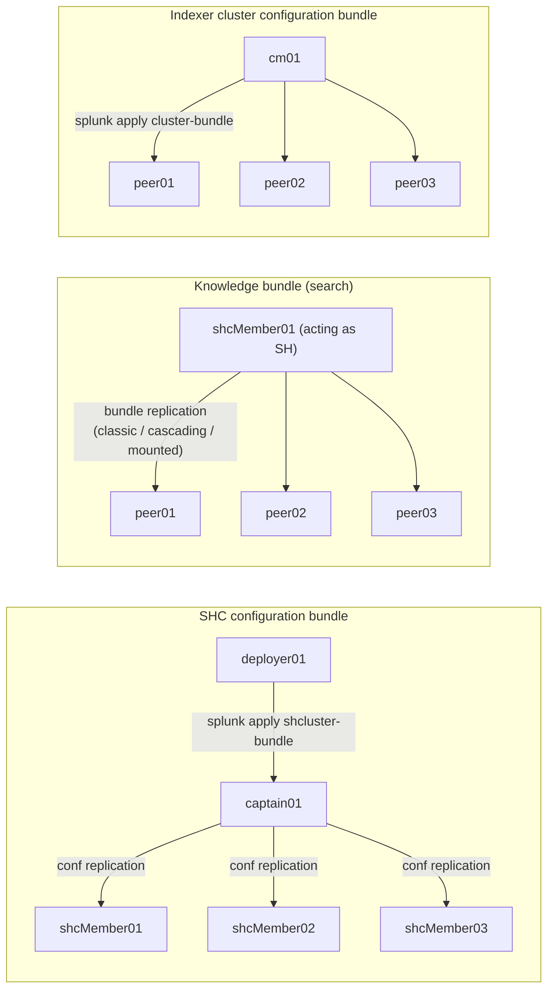

# Chapter 0 — Foundations: three bundles, one word

> Three different mechanisms carry the word "bundle" in Splunk Enterprise. An admin who runs an SHC paired with an indexer cluster runs into all three in the same day and ends up confusing them. This chapter pins down the defensible lexicon used throughout the rest of the book, and assigns each one an owner, a trigger, and a direction of propagation.

## Quick refresher

- **Search Head Cluster (SHC)**: a cluster of search heads coordinated by an elected *captain*, with an external *deployer* that pushes common configuration to them. The SHC replicates its configuration internally; the deployer is **not part of it**, it feeds the captain.
- **Indexer cluster**: a cluster of search peers (indexers) coordinated by a *cluster manager* (9.x terminology, formerly *cluster master*), which handles bucket replication according to a *replication factor* and a *search factor*.
- **Search peer**: an indexer from the point of view of a distributed search head. A peer is both a node of the indexer cluster (as seen by the CM) and a recipient of a knowledge bundle (as seen by an SH).
- **`_internal`**: Splunk internal index where every node writes its own telemetry (`splunkd.log`, metrics). It is the reference index for any bundle diagnosis.
- **`splunkd.log`**: Splunk application log, written under `$SPLUNK_HOME/var/log/splunk/splunkd.log` and indexed in `index=_internal sourcetype=splunkd`. Component at the start of the line (`component=...`), level (`log_level=INFO|WARN|ERROR`).
- **Splexicon**: the official Splunk glossary. Useful for definitions, never to describe behavior.

## 1. Three bundles, three mechanics, three owners

When a Splunk admin says "the bundle," you need to know which of the three mechanisms below they are talking about. They are not interchangeable, and only one of them contains the word "knowledge."

### 1.1 SHC configuration bundle (deployer → members)

The **SHC configuration bundle** is the set of common configurations that the admin pushes from the *deployer* to the members of the Search Head Cluster. It lives physically under `$SPLUNK_HOME/etc/shcluster/apps/` on the deployer. When the admin runs `splunk apply shcluster-bundle` on the deployer, the content is validated, packaged, then sent to the current *captain*. The captain redistributes it to all members through the **internal conf replication** mechanism of the SHC.

- **Owner**: the deployer (`deployer01`).
- **Trigger**: explicit command `splunk apply shcluster-bundle` on the deployer.
- **Direction**: deployer → captain → SHC members.
- **Purpose**: keep an application configuration homogeneous between SHC members (user apps, shared savedsearches, lookups, dashboards deployed identically).

This is the mechanism described in the Splunk page [PropagateSHCconfigurationchanges](https://docs.splunk.com/Documentation/Splunk/9.4.2/DistSearch/PropagateSHCconfigurationchanges) and detailed in chapter 01.

### 1.2 Distributed-search knowledge bundle (search head → search peers)

The **knowledge bundle** in the strict sense — the one the handbook is named after — is the set of *search* configurations that a search head sends to its *search peers* (indexers) on every distributed search. Without this bundle, the peer does not know how to resolve a *knowledge object* referenced by the search: it knows neither the lookups, nor the macros, nor the sourcetypes defined on the SH side, nor the RBAC roles nor the `srchFilter` filters of users.

The SH builds this bundle from `etc/apps/`, `etc/users/` and `etc/system/local/`, filters it through `distsearch.conf` (`replicationAllowlist`, `replicationBlacklist`, `excludeReplicatedLookupSize`), serializes it into a `<sh_guid>-<epoch>-<hash>.bundle` file, and pushes it to each peer in `$SPLUNK_HOME/var/run/searchpeers/`.

- **Owner**: each search head individually. Inside an SHC, each member builds **its** bundle (the members' bundles converge to the same content if the configuration is replicated, but they are distinct objects on the peer side, recognizable by their source GUID).
- **Trigger**: continuous and event-driven — any configuration change on the SH side triggers a new replication cycle; failing that, a periodic cycle per `[replicationSettings]` in `distsearch.conf`.
- **Direction**: SH → search peers.
- **Purpose**: allow the peers to execute the *map* phase of a distributed search with exactly the knowledge objects seen on the SH side.

This is the mechanism described in [Knowledgebundlereplication](https://docs.splunk.com/Documentation/Splunk/9.4.0/DistSearch/Knowledgebundlereplication) and [Whatsearchheadssend](https://docs.splunk.com/Documentation/Splunk/9.4.0/DistSearch/Whatsearchheadssend), detailed in chapters 02 and 03.

### 1.3 Indexer cluster configuration bundle (cluster manager → peers)

The **indexer cluster configuration bundle** is the set of common configurations that the *cluster manager* pushes to its peers (indexers of the cluster). It lives under `$SPLUNK_HOME/etc/manager-apps/` on the CM (9.x terminology, formerly `etc/master-apps/`). When the admin runs `splunk apply cluster-bundle` on the CM, the bundle is validated, propagated in parallel to each peer, and each peer applies its new configuration — possibly after a *rolling restart*.

- **Owner**: the cluster manager (`cm01`).
- **Trigger**: explicit command `splunk apply cluster-bundle` on the CM.
- **Direction**: CM → indexer cluster peers.
- **Purpose**: keep storage and parsing configuration homogeneous between indexers (`indexes.conf`, `props.conf`, `transforms.conf`, certificates, technical apps).

This is the mechanism described in [Updatepeerconfigurations](https://docs.splunk.com/Documentation/Splunk/9.4.0/Indexer/Updatepeerconfigurations) and touched on in chapter 01 (for the contrast with the SHC bundle) and chapter 06 (toolbox).

## 2. Defensible vocabulary

The three mechanics above get confused in conversation because Splunk calls them all "bundle" and they all use a `splunk apply <something>-bundle` command. The handbook enforces the following vocabulary and sticks to it.

| Handbook term | Mechanism designated | Acceptable synonyms | Forbidden synonyms |
| --- | --- | --- | --- |
| **SHC configuration bundle** | deployer → SHC members | `SHC bundle`, `apply shcluster-bundle` | `SHC knowledge bundle` (false friend) |
| **knowledge bundle** (with no qualifier) | SH → search peers | `search bundle`, `distributed-search bundle` | `SHC bundle` (wrong), `apply bundle` |
| **indexer cluster configuration bundle** | CM → peers | `CM bundle`, `cluster bundle`, `apply cluster-bundle` | `CM knowledge bundle` (false friend) |

The word **bundle** on its own, in the rest of the handbook, refers to the **knowledge bundle** (the central mechanism of the book) unless context dictates otherwise. When ambiguity is possible (chapters 01, 05, 07, 99), the qualifier is repeated explicitly.

The term **deployment apps** refers to deploying configurations to *forwarders* via a *deployment server* — this mechanism is explicitly out of scope (see `splunk/concepts/deployment-server.md` in the KB). Do not confuse it with the three mechanisms above, which target full Splunk Enterprise nodes (SH or indexer), not forwarders.

## 3. What a bundle is on the filesystem

On the search peer (indexer) side, a knowledge bundle received from an SH is an archive named `<sh_guid>-<epoch>-<hash>.bundle` stored under `$SPLUNK_HOME/var/run/searchpeers/`. The GUID identifies the source SH (each member of the SHC has its own GUID), the epoch marks the moment of constitution, the hash identifies the content — two bundles with different hashes necessarily have different content.

On opening, the archive contains a tree of Splunk configurations: the subsets of `etc/apps/`, `etc/users/`, `etc/system/local/` that the SH considered relevant for its peers (filtered by `replicationAllowlist` / `replicationBlacklist`). The peer, on receiving a search, loads the current bundle matching the requesting SH's GUID and resolves the search's references from this tree.

On the deployer side, the SHC configuration bundle in staging lives under `$SPLUNK_HOME/etc/shcluster/apps/`, then, after staging, under the path defined by `conf_deploy_staging` in `[shclustering]` of `server.conf` (default `$SPLUNK_HOME/var/run/splunk/deploy`). On the captain side, the received bundle transits through the SHC internal conf replication before being applied on the `etc/apps/` filesystem of each member.

On the cluster manager side, the indexer cluster configuration bundle lives under `$SPLUNK_HOME/etc/manager-apps/` (9.x terminology). It is packaged at `apply` time and sent to each peer, which writes it under `etc/slave-apps/` (legacy terminology kept for path backward compatibility).

## 4. Heatmap: symptom → bundle concerned

The table below provides direct entry by observable symptom. It is deliberately short; chapter 05 expands each symptom into a full decision tree.

| Symptom | Bundle concerned (priority) | Investigation chapter |
| --- | --- | --- |
| `splunk apply shcluster-bundle` fails or does not propagate | SHC configuration bundle | ch. 01 + ch. 05 (branch A) |
| One SHC member shows an app at a different version than the others | SHC configuration bundle + internal conf replication | ch. 01 + ch. 05 (branch B) |
| SH → peers bundle exceeds `maxBundleSize` (SH side) or `max_content_length` (peer side) | Knowledge bundle | ch. 02 + ch. 05 (branch C) |
| One particular peer does not receive the knowledge bundle | Knowledge bundle | ch. 03 + ch. 05 (branch D) |
| Peers have different bundle hashes for the same SH | Knowledge bundle | ch. 03 + ch. 05 (branch E) |
| Search stuck "waiting for bundle replication" | Knowledge bundle | ch. 04 + ch. 05 (branch H) |
| Mounted bundle not refreshed on the peer side | Knowledge bundle (mounted mode) | ch. 03 + ch. 05 (branch G) |
| `splunk apply cluster-bundle` triggers an unwanted restart | Indexer cluster configuration bundle | ch. 01 (reminder) + ch. 06 (CLI `validate cluster-bundle`) |
| Configuration of an indexer peer diverges from the others | Indexer cluster configuration bundle | ch. 06 (CLI `show cluster-bundle-status`) |

## 5. Why we get confused — evolving terminology

The confusion between the three mechanisms has three historical roots that the handbook addresses explicitly.

**First**, Splunk has historically used the term `bundle` to refer to any configuration archive pushed from one node to another. The 9.4 docs now distinguish *knowledge bundle* (ch. 02-03) and *configuration bundle* (deployer or CM), but older pages, blog posts, and error messages produced by the Splunk binaries themselves still use the generic term.

**Second**, SHC terminology has evolved: `master` became `manager` on the indexer cluster manager side, `slave` became `peer`, and filesystem paths partially followed (`master-apps` → `manager-apps` on the CM side, but `slave-apps` remains on the peer side for backward compatibility). The `splunkd.log` components have partly kept the old nomenclature (`CMMaster`, `CMPeer` are still present in 9.4) — this is not an error, it is intentional backward compatibility. Chapter 06 documents what you can grep for.

**Third**, the options of the `splunk apply` command look alike: `splunk apply shcluster-bundle` (deployer), `splunk apply cluster-bundle` (CM) and the absence of a direct command on the SH side (the SH→peers knowledge bundle replication is continuous, not triggered by an explicit command). A rushed admin types `splunk apply <tab>` and picks the wrong subcommand mid-diagnosis — this is anti-pattern 5 in chapter 07.

## 6. Map of the three bundles

#### S1 — Map of the three bundles: triggers, direction, owners

Three mechanics share the word bundle. The vertical lines represent the direction of propagation. The `peer01..03` receive **two** distinct bundles (a knowledge bundle from the SH and a configuration bundle from the CM) — this is normal and is the most frequent source of confusion at the entry of a diagnosis. The SHC members receive an SHC configuration bundle from their deployer via the captain. Each mechanism has its owner (who triggers the push) and its own `splunk apply` command — apart from the SH→peers knowledge bundle, which has no explicit command, being continuous.

## Typical pitfalls

- **Confusing `splunk apply shcluster-bundle` and `splunk apply cluster-bundle`.** The first is run on the SHC deployer, targets SHC members. The second is run on the indexer cluster manager, targets indexer peers. Running the wrong one on the wrong node fails with a not-very-readable message. See ch. 07 anti-pattern 5.
- **Believing that `splunk apply shcluster-bundle` updates the knowledge objects seen by the peers.** False. The SHC configuration bundle harmonizes apps **between SHC members**; for the peers to see the same lookups/macros, the SH→peers knowledge bundle must have converged after the SHC conf replication has propagated the app to all members. It is a propagation delay, not a single push.
- **Believing that `etc/manager-apps/` on the CM and `etc/shcluster/apps/` on the deployer are functionally equivalent.** They are not. The first feeds **indexer peers** (storage / parsing). The second feeds **SHC members** (user apps / savedsearches / dashboards). Putting an `indexes.conf` in `etc/shcluster/apps/` has no effect on the peers; putting a dashboard in `etc/manager-apps/` has no effect on the SHs.
- **Thinking that `bundle` in an error message necessarily refers to the knowledge bundle.** Not always. A `bundle replication failed` message can target the SH→peers knowledge bundle (the most frequent case) but also the SHC internal conf replication after a deployer apply. The `splunkd.log` component lets you decide: `DistributedBundleReplicationManager` = SH→peers knowledge bundle; `ConfReplication*` = SHC internal.

## When to escalate / when to decide

No urgent decision in this chapter — it lays down the lexicon. The criterion to remember: before any Splunk Support request, before any architectural escalation, before any cross-team debug, **name the bundle concerned** with the vocabulary from the table in §2. A request that says "the bundle is not going through" wastes an hour; a request that says "the SH → peers knowledge bundle stays stuck at the push stage with these `splunkd.log` components" gets handled in fifteen minutes.

## Sources

- [Splunk Splexicon — Knowledge bundle](https://docs.splunk.com/Splexicon:Knowledgebundle)
- [Splunk Splexicon — Configuration bundle](https://docs.splunk.com/Splexicon:Configurationbundle)
- [Splunk Splexicon — Search peer replication](https://docs.splunk.com/Splexicon:Searchpeerreplication)
- [Splunk Splexicon — Search peer](https://docs.splunk.com/Splexicon:Searchpeer)
- [Splunk Splexicon — Search head cluster](https://docs.splunk.com/Splexicon:Searchheadcluster)
- [Splunk Splexicon — Deployer](https://docs.splunk.com/Splexicon:Deployer)
- [Splunk Splexicon — Cluster captain](https://docs.splunk.com/Splexicon:Clustercaptain)
- [Splunk Splexicon — Manager node](https://docs.splunk.com/Splexicon:Managernode)
- [Splunk DistSearch 9.4 — Knowledge bundle replication overview](https://docs.splunk.com/Documentation/Splunk/9.4.0/DistSearch/Knowledgebundlereplication)
- [Splunk DistSearch 9.4 — Propagate SHC configuration changes](https://docs.splunk.com/Documentation/Splunk/9.4.2/DistSearch/PropagateSHCconfigurationchanges)
- [Splunk Indexer 9.4 — Update peer configurations](https://docs.splunk.com/Documentation/Splunk/9.4.0/Indexer/Updatepeerconfigurations)
