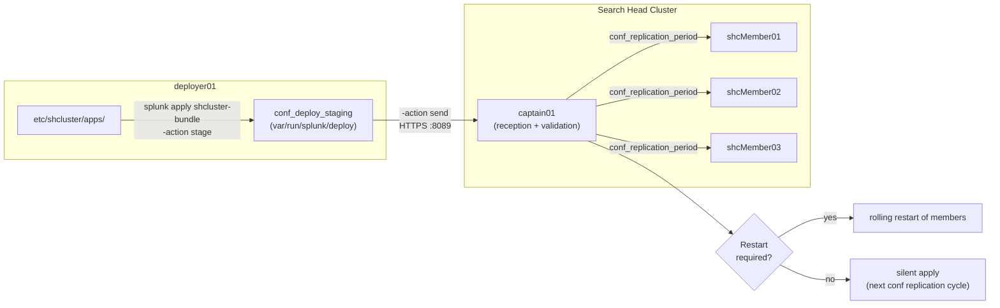

# Chapter 1 — SHC configuration bundle constitution on the deployer

> When the admin types `splunk apply shcluster-bundle` on the deployer, they trigger a three-stage mechanic: staging, validation, send to the captain, then internal conf replication to the SHC members. This chapter walks through the mechanic step by step, the command's options, the `[shclustering]` parameters that drive the internal cadence, and the pitfalls that make an apply "appear" to succeed without propagating. It does not address the SH → peers knowledge bundle: that is the subject of chapters 02 and 03.

## Quick refresher

- The **deployer** is a Splunk node **external** to the SHC; it is not a search head and takes part neither in the quorum nor in searches.
- The **captain** is elected among the SHC members; it is the one that receives the bundle from the deployer and propagates it to the other members through internal conf replication.
- The SHC internal **conf replication** continuously replicates configuration changes between members; the post-apply propagation rests on it.
- `etc/shcluster/apps/` (on the deployer) is the **only** area whose content will be packaged and sent. Anything placed elsewhere (for example `etc/apps/` or `etc/system/local/` on the deployer) is not sent.
- An apply does not automatically trigger a member restart. If a sent stanza requires a restart, Splunk detects it on the captain side and triggers the restart if the corresponding option is active.

## 1. The `etc/shcluster/apps/` staging area

On the deployer, everything that must be propagated to the SHC members lives under `$SPLUNK_HOME/etc/shcluster/apps/`. It is a standard Splunk apps tree: one subfolder per app, each subfolder containing a `default/`, optionally a `local/`, and a `metadata/`. The deployer reads no other area for the bundle.

```bash
# On the deployer
ls $SPLUNK_HOME/etc/shcluster/apps/
# -> my_company_app/ soc_app/ ...
```

A few rules whose violation leads straight to the pitfalls of chapter 07:

- **`local/` is valid inside `etc/shcluster/apps/`** but its semantics change: it will be merged on the SHC members into the `local/` of the corresponding app. To be used for overrides that must be centralized and homogeneous. Putting it there for member-specific overrides is an anti-pattern.
- **Lookups** placed under `<app>/lookups/` are copied as-is to the members; very large `.csv` files inflate the bundle uselessly (see pitfall 1 below, and the lookup anti-pattern in ch. 07).
- **Dashboards** (`local/data/ui/views/`) are propagated. The associated permissions in `metadata/local.meta` are too.
- **Scripts** under `<app>/bin/` are propagated but are not executed by the deployer — they will be executed on the members.

## 2. The `splunk apply shcluster-bundle` command

The propagation command is run **on the deployer**, never on an SHC member. Its minimal form:

```bash
splunk apply shcluster-bundle \
  -target https://captain01.example.com:8089 \
  -auth admin:<password> \
  --answer-yes
```

The `-target` parameter explicitly designates the captain's management URI. If the captain changes during the life of the SHC (automatic election), you have to rediscover it before the apply: `splunk show shcluster-status` on any member returns the current captain.

### Main options

| Option | Effect | When to use |
| --- | --- | --- |
| `-action stage` | Builds the bundle in `conf_deploy_staging` but **does not send** to the captain. | Diag: check that packaging succeeds without propagating anything. |
| `-action send` | Sends an already-staged bundle. | Rare in practice: you chain stage + send through the default apply. |
| `-preserve-lookups true|false` | Keeps existing lookups on the members (true) or overwrites them with those of the bundle (false, default). | When local lookups are fed by member scripts and must not be overwritten. |
| `-push-default-app-conf true|false` | Pushes the content of the apps' `default/` in addition to `local/`. | When you want to force re-pickup of the `default/` after a Splunk upgrade that modifies them. |
| `--answer-yes` | Skips the interactive confirmation. | Always in scripts. |

The `-action` option therefore accepts `stage`, `send` and — by default, with no option — the chaining of the two. The most useful behavior during diagnosis is `-action stage`: it validates the bundle build without propagating anything. An error at this stage indicates a content problem (`etc/shcluster/apps/` malformed, invalid app), not a network or captain problem.

### What happens at send time

At send time, the deployer creates an archive of the content of `etc/shcluster/apps/`, opens a REST connection to the captain's mgmt port (default `8089`), and pushes the bundle there. The captain receives, validates, stores in its own `conf_deploy_repository`, and triggers the **SHC internal conf replication** to the other members.

On the deployer side, the apply output looks like:

```text
Sending applied bundle to captain (captain01.example.com:8089)
Successfully applied cluster bundle to captain.
Bundle apply status check is in progress on the captain.
```

The "Successfully applied cluster bundle to captain" message only means the captain **received and accepted** the bundle. It says nothing about effective propagation to the members: for that, you have to query the captain explicitly (see §5).

## 3. Reception on the captain and internal conf replication

Once the bundle has been received by the captain, the **SHC internal conf replication** takes over. This mechanic is continuous: it does not work as a synchronous push after each apply, it works in short cycles paced by the `[shclustering]` stanza of `server.conf`. The received bundle is therefore *integrated* into the next conf replication iteration, and each member picks up the changes during that iteration.

### `[shclustering]` stanza of `server.conf`

The parameters relevant to post-apply propagation:

```ini
[shclustering]
pass4SymmKey = <secret>
conf_replication_period = 5
conf_replication_max_pull_count = 1000
conf_replication_max_push_count = 100
conf_deploy_repository = $SPLUNK_HOME/etc/shcluster
conf_deploy_staging = $SPLUNK_HOME/var/run/splunk/deploy
```

- `conf_replication_period`: interval in seconds between two iterations of the SHC internal conf replication (5 s by default). Lowering it speeds up propagation but loads the SHC internal network; only touch with a baseline measurement.
- `conf_replication_max_pull_count`: maximum number of objects to pull per iteration on the member side. If propagation is chronically late, this is the first parameter to look at.
- `conf_replication_max_push_count`: symmetric on the captain side.
- `conf_deploy_repository`: where the captain stores the received bundle locally.
- `conf_deploy_staging`: where the deployer stages the bundle under construction (before send).

The practical effect: an apply completes on the deployer side in a few seconds, the captain accepts it in less than a second, but propagation to the 2 or 3 remaining members takes on the order of `conf_replication_period × <number of iterations>`, typically between 5 and 30 seconds for a bundle of reasonable size.

### Restart logic

When the received bundle introduces changes that require a Splunk restart (a change to a `[indexes]` stanza on the SH side — rare here by construction, but also certain modifications to `web.conf`, `inputs.conf` for scripts, etc.), Splunk **detects the need** and can trigger a rolling restart of the members. The default behavior in 9.4 is to flag the required restart in the apply output; the admin is asked to confirm.

The `-push-default-app-conf` option increases the chance of touching stanzas that require a restart (by rewriting the `default/`). Launched by mistake, it can therefore trigger an unanticipated rolling restart of the whole SHC.

## 4. Constitution and propagation: overview

#### S2 — SHC configuration bundle constitution, from deployer to members



The deployer never pushes directly to the members: it stops at the captain. It is the SHC internal conf replication, paced by `conf_replication_period`, that then distributes to the other members. The restart need is evaluated on the captain from the bundle content; when triggered, it is a rolling restart (one member at a time) to preserve availability.

## 5. Verifying effective propagation

The fact that `splunk apply shcluster-bundle` returns `Successfully applied cluster bundle to captain` is not enough. Verification happens in two stages: on the deployer side (state of the last push) and on the captain side (state of propagation to the members).

### Deployer side

```bash
# On the deployer
splunk show shcluster-bundle-status -auth admin:<password>
```

The output reports notably the `last_apply_time`, the current `bundle_id`, the state (`success` or other). If the state is not `success`, the cause is in the current deployer trace (`splunkd.log` on the deployer side, component `BundleReplicator` or equivalent — see ch. 06).

### Captain and members side

```bash
# On the captain (or any member — Splunk redirects to the captain)
splunk list shcluster-bundle-status -auth admin:<password>
splunk show shcluster-status -auth admin:<password>
splunk list shcluster-member-info -auth admin:<password>
```

`splunk list shcluster-bundle-status` on the captain side shows the progress of propagation to the members: each member appears with its current `bundle_id`. If all members show the same `bundle_id` as the one returned by `splunk show shcluster-bundle-status` on the deployer side, propagation is complete. Otherwise, the lagging member(s) can be identified.

### Equivalent REST endpoints

To script or integrate these checks into supervision:

```bash
curl -k -u admin:<password> \
  "https://captain01.example.com:8089/services/shcluster/captain/info"

curl -k -u admin:<password> \
  "https://captain01.example.com:8089/services/shcluster/captain/members"

curl -k -u admin:<password> \
  "https://shcMember01.example.com:8089/services/shcluster/member/info"
```

The three return XML / JSON objects that can be processed (with `?output_mode=json`). Field details and examples: ch. 06 §2.

## 6. Reading a cycle in `splunkd.log`

The most talkative component for the SHC internal conf replication is `ConfReplicationThread` (to be confirmed by real grep on 9.4; see ch. 06 §3 — observed empirically, not documented in an individual Splunk page). On the captain, at the time of a cycle, you observe:

```text
2026-06-18 10:00:00.123 +0000 INFO  ConfReplicationThread - conf replication cycle starting members=3
2026-06-18 10:00:00.456 +0000 INFO  ConfReplicationThread - pushed 12 objects to shcMember02
2026-06-18 10:00:00.789 +0000 INFO  ConfReplicationThread - cycle complete duration_ms=666
```

The `pushed N objects` indicate the objects actually transmitted during the cycle. A prolonged absence of a cycle (more than 2-3 times `conf_replication_period` with no line) signals a blocked conf replication — typical cause: captain overload, or saturated change queue.

## Typical pitfalls

- **Putting configurations outside `etc/shcluster/apps/`.** The deployer reads **only** this area. A `local/savedsearches.conf` in `etc/apps/<app>/` on the deployer is never propagated. Verify at every apply that edits have been done in `etc/shcluster/apps/<app>/`. This is the number-one cause of an apply that "does nothing."
- **Versioning or injecting `local/` into the SHC bundle.** The `local/` tree is intended for overrides; systematically versioning it next to `default/` produces silent conflicts between the `local/` distributed by the bundle and the `local/` created/modified directly on a member. Convention: `default/` in `etc/shcluster/apps/<app>/`, and use `local/` only for explicitly centralized and idempotent overrides.
- **Unexpected cascading restart after `-push-default-app-conf`.** This option rewrites the `default/` of the target apps on the members. If a rewritten stanza touches `inputs.conf`, `web.conf` or an `indexes.conf` (atypical on the SH side but possible in some apps), a rolling restart is triggered. Always do a `-action stage` first and inspect the staging content before sending with this option.
- **`preserve-lookups` misunderstood.** `preserve-lookups true` keeps the lookups **already present on the members**; `preserve-lookups false` (default) overwrites them with the bundle ones. If the admin thinks they are "preserving" their lookups by passing `true` but does not realize they are **disabling** the propagation of new lookups from the deployer, they silently block the update. Document the choice in the apply script.
- **Apply run during a captain election.** If the captain is being re-elected at apply time, the command fails with a "no captain found" message or similar. Replay the apply after stabilization (`splunk show shcluster-status` must return a captain that has been stable for a few minutes).
- **Believing that `splunk apply shcluster-bundle` updates the SH→peers knowledge bundle.** False. It updates the common config of SHC members; from there, each member, acting as an SH, has to regenerate its knowledge bundle for its peers. The delay between deployer apply and freshness of the knowledge bundle on the peer side therefore stacks two propagations. This is the number-one cause of "I pushed a lookup, it doesn't show up on the peer."

## When to escalate / when to decide

- **Apply failure that does not reproduce.** An intermittent error during `splunk apply shcluster-bundle` that does not reproduce after a retry, captain stable, network OK: keep a log of occurrences (date, SHC state, bundle size) and open a Splunk Support case after 3 distinct occurrences over 7 days. Do not multiply apply attempts.
- **Chronically late conf replication.** A member that does not converge with the captain after a delay > 10 × `conf_replication_period` (typically > 50 s for default) over several consecutive cycles indicates a structural problem: saturated disk on the member, RBAC blocking repo reads, or a known 9.4 bug (check the Splunk release notes). If the cause is not obvious on the member, escalate to Splunk Support.
- **Decision to refactor a too-large bundle.** Above 200 MB of content in `etc/shcluster/apps/`, applies start taking time and the internal conf replication suffers. Refactor by pulling out massive lookups (move to a lookup dispatch, or a dedicated index), removing dead apps, consolidating fragmented apps. Do not blindly raise `conf_replication_max_*` to compensate.

## Sources

- [Splunk DistSearch 9.4 — Propagate SHC configuration changes](https://docs.splunk.com/Documentation/Splunk/9.4.2/DistSearch/PropagateSHCconfigurationchanges)
- [Splunk DistSearch 9.4 — SHC architecture](https://docs.splunk.com/Documentation/Splunk/9.4.2/DistSearch/SHCarchitecture)
- [Splunk DistSearch 9.4 — View SHC status](https://docs.splunk.com/Documentation/Splunk/9.4.2/DistSearch/ViewSHCstatus)
- [Splunk DistSearch 9.4 — How conf replication works in SHC](https://docs.splunk.com/Documentation/Splunk/9.4.1/DistSearch/HowconfrepoworksinSHC)
- [Splunk Admin 9.4 — server.conf (`[shclustering]` stanza)](https://docs.splunk.com/Documentation/Splunk/9.4.2/Admin/Serverconf)
- [Splunk Indexer 9.4 — Update peer configurations (for the cluster-bundle contrast)](https://docs.splunk.com/Documentation/Splunk/9.4.0/Indexer/Updatepeerconfigurations)
- [Splunk Indexer 9.4 — Restart the cluster](https://docs.splunk.com/Documentation/Splunk/9.4.2/Indexer/Restartthecluster)
- [Splunk REST API 9.4 — Cluster endpoints](https://docs.splunk.com/Documentation/Splunk/9.4.0/RESTREF/RESTcluster)
