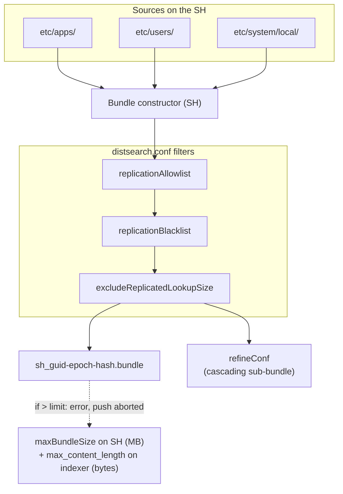

# Chapter 2 — Knowledge bundle constitution on the search head

> When a search head runs a distributed search, its peers must know the knowledge objects the search references: lookups, macros, sourcetypes defined on the SH side, RBAC roles, `srchFilter` filters. The SH sends them this set as a *knowledge bundle*. This chapter describes how the bundle is built: its actual content, its file name, the *full vs delta* decision, and the `distsearch.conf` stanzas that control its size and filtering. The actual propagation to the peers is the subject of chapter 03.

## Quick refresher

- A **knowledge bundle** is built and sent by **each search head individually**; inside an SHC, each member builds its own bundle, which should converge in content if conf replication has propagated the apps but remains a distinct object on the peer side.
- The bundle contains a subset of `etc/apps/`, `etc/users/`, `etc/system/local/` filtered through `distsearch.conf`; it does not contain all of `etc/` and is not meant to.
- The bundle has a file name of the form `<sh_guid>-<epoch>-<hash>.bundle`; the hash depends on the content. **Two bundles with different hashes = two different contents**, this is the main invariant of diagnosis (ch. 03 and 05).
- Splunk alone decides between a *full* send (full bundle) and a *delta* (differential against the previous bundle). The admin has no lever to force one or the other — they can indirectly influence it via bundle size and the frequency of modifications.
- The `refineConf` is a reduced sub-bundle used in the context of *cascading* replication (ch. 03); it represents the minimum set that level-2 peers must receive. *Internal Splunk terminology observed — not publicly documented by Splunk in the public 9.4 pages at the time of writing.*

## 1. Actual content of a knowledge bundle

The Splunk page [Whatsearchheadssend](https://docs.splunk.com/Documentation/Splunk/9.4.0/DistSearch/Whatsearchheadssend) lists precisely what a search head packages for its peers. In operational summary:

- **`etc/apps/<app>/`**: for each app, the relevant subset — typically `local/`, `default/`, `lookups/`, `metadata/`. The `bin/`, `appserver/`, `static/`, `mrsparkle/` are excluded by default (the UI is not the peer's responsibility).
- **`etc/users/<user>/`**: anything that may appear in a search: `local/savedsearches.conf`, `local/macros.conf`, `local/eventtypes.conf`, `local/tags.conf`, `local/transforms.conf`, private lookups if present.
- **`etc/system/local/`**: relevant local system configurations (`authorize.conf` for the roles used at `srchFilter` evaluation, `props.conf`, `transforms.conf`, etc.).
- **`etc/system/default/`**: explicitly **not** included — it is identical from node to node by construction (tied to the binary).

The default exclusions are substantial: the Splunk documentation gives an order of magnitude of 200 MB to 2 GB for a reasonable deployment, sometimes more in a rich environment.

### What goes out of the bundle: `replicationBlacklist`

`distsearch.conf` lets you explicitly exclude certain paths from the bundle through a `[replicationBlacklist]` stanza:

```ini
[replicationBlacklist]
no_huge_csv = .../etc/apps/<app>/lookups/very_big.csv
no_tmp = .../etc/apps/*/tmp/*
```

The key is a free name, the value is a pattern relative to `$SPLUNK_HOME/`. Splunk recommends using this stanza rather than raising the max size — this is the angle of the page [Limittheknowledgebundlesize](https://docs.splunk.com/Documentation/Splunk/9.4.0/DistSearch/Limittheknowledgebundlesize).

### What explicitly comes in: `replicationAllowlist`

Conversely, `[replicationAllowlist]` (9.4 terminology — historical alias `replicationWhitelist`) lets you explicitly target paths you **want** to see in the bundle. This is useful in environments where the blacklist would be too enumerative.

```ini
[replicationAllowlist]
my_app_lookups = .../etc/apps/my_company_app/lookups/...
```

Allowlist and blacklist coexist: the blacklist takes priority over the allowlist when the same path is matched by both. This is a useful escape hatch: you include a whole folder via allowlist, you carve out a subfolder or file through blacklist.

> Terminology note: Splunk 9.4 uses `allowlist` / `denylist` (current form) in the new pages while keeping `whitelist` / `blacklist` (older pages, backward-compatible aliases in the `.conf` files). Both forms work. The handbook uses the current form in prose and accepts both in examples.

## 2. The `<sh_guid>-<epoch>-<hash>.bundle` file name

On the peer, each received knowledge bundle is stored under `$SPLUNK_HOME/var/run/searchpeers/` with a name of the form:

```text
00000000-0000-0000-0000-000000000001-1718711234-aaaaaaaa.bundle
```

Three dash-separated fields:

- **`<sh_guid>`**: the GUID of the source search head. Inside an SHC, each member has its own GUID — it is therefore normal for a peer to have several bundles side by side (one per SHC member). The GUID is readable on the SH side in `etc/instance.cfg` and on the peer side in the file name.
- **`<epoch>`**: Unix timestamp of bundle constitution. Useful to identify freshness.
- **`<hash>`**: content fingerprint (typically a truncated hash). This is the critical field for diagnosis: two bundles with different hashes necessarily have different content; two bundles with the same hash have the same content (in practice — collisions are astronomically improbable).

**Operational consequence**: if two peers show a different hash for the same `<sh_guid>` at the same instant, replication is divergent and this is a symptom of ch. 05 branch E. If all peers show the same hash as the one the SH claims to have pushed, the bundle is consistent.

## 3. Hashing and the *full vs delta* decision

At each constitution cycle, the SH computes the content of the new bundle, compares it to the previous one, and chooses one of two modes:

- **Full**: the complete bundle is serialized and sent.
- **Delta**: a differential against the previous bundle is computed and sent.

The decision is internal. Splunk picks *delta* as long as the differential stays "small" relative to the full bundle; above a threshold (not publicly documented by Splunk, observed empirically around a quarter of the bundle), Splunk switches back to *full*.

The admin has no direct lever to force one or the other. Three indirect levers exist:

1. **Limit the bundle size** via `replicationBlacklist` and externalized lookups: the full stays reasonable, the delta more often covers the actual changes.
2. **Space out configuration changes** on the SH side (or on the SHC side via deployer apply): fewer delta cycles, each delta cycle more representative.
3. **Watch the cycles via `splunkd.log`** (ch. 06 §3) to detect an abnormal chain of successive fulls: symptom of a bundle that changes constantly (configuration anti-pattern on the SH side or application bug).

## 4. Bundle constitution: assembly, filters, output

#### S3 — Knowledge bundle constitution on the search head, sources → filters → output



The SH assembles its bundle from three sources. Filters reduce **before** packaging. The produced file name carries a hash: two bundles with different hashes necessarily have different content. The `refineConf` is a subset reserved for cascading (ch. 03). The effective cap is **double**: `maxBundleSize` (in MB) in `[replicationSettings]` of `distsearch.conf` on the SH bounds the size before push; on the indexer/peer side, `max_content_length` (in bytes) bounds the size the peer accepts to receive. If you raise `maxBundleSize` on the SH side, you must symmetrically raise `max_content_length` on the peers, otherwise the push fails with an explicit message on the peer side (see [Limittheknowledgebundlesize](https://docs.splunk.com/Documentation/Splunk/9.4.1/DistSearch/Limittheknowledgebundlesize)).

## 5. The `[replicationSettings]` stanza of `distsearch.conf`

This is the central stanza that drives size, concurrency and timeouts of knowledge bundle replication. To be known by heart by an SHC admin doing diagnosis.

```ini
[replicationSettings]
maxBundleSize = 2048
max_memory_per_batch_mb = 100
replicationThreads = auto
connectionTimeout = 60
sendRcvTimeout = 60
excludeReplicatedLookupSize = 100
```

| Parameter | Effect | When to adjust |
| --- | --- | --- |
| `maxBundleSize` | Maximum size of a bundle **in megabytes**, on the SH side. If a bundle exceeds this value, replication does not happen and an error message is logged. Maximum 102400 (100 GB). See [Limittheknowledgebundlesize](https://docs.splunk.com/Documentation/Splunk/9.4.1/DistSearch/Limittheknowledgebundlesize). | Very rarely raised — the right answer is almost always to reduce the bundle through `replicationBlacklist` / `replicationDenylist` (see pitfall 1). If you raise it, **symmetrically raise `max_content_length` on the indexer by at least the same amount** (mind the unit: `maxBundleSize` in MB, `max_content_length` in bytes). |
| `max_memory_per_batch_mb` | Memory allocated per replication batch. | Raise if logs show OOM errors during push (`splunkd.log`). |
| `replicationThreads` | Number of parallel threads used to push to peers. `auto` by default (depends on core count). | Set manually if auto-tuning produces too much concurrency in a constrained environment. |
| `connectionTimeout` | Connection-opening timeout to a peer. | Raise if network is slow or peer overloaded — diagnose the cause before masking. |
| `sendRcvTimeout` | Timeout of send/recv phases. | Raise for very large bundles over a slow link — but reduce-then-fix. |
| `excludeReplicatedLookupSize` | Size (MB) above which a lookup is excluded from the bundle. `100` by default. | Adapt to the size of business lookups. |

> **On the indexer/peer side**: `max_content_length` (in `[httpServer]` of the peer's `server.conf`, in **bytes**) bounds the payload size the peer accepts to receive. It is the receive-side counterpart of `maxBundleSize`. The canonical lever for **bundle size** is `maxBundleSize` on the SH side; `max_content_length` on the peer side must be raised symmetrically when you raise `maxBundleSize`, otherwise the push fails with an explicit error on the peer side ("bundle exceeds max content length").

### `[replicationAllowlist]` / `[replicationBlacklist]`

Already described in §1. To remember: the blacklist takes priority over the allowlist when a path matches both; key names are free but must be unique in the stanza.

```ini
[replicationBlacklist]
exclude_static = .../etc/apps/*/static/...
exclude_appserver = .../etc/apps/*/appserver/...
exclude_huge_csv = .../etc/apps/<app>/lookups/historical_dump.csv

[replicationAllowlist]
include_lookups = .../etc/apps/*/lookups/...
```

## 6. The `[distributedSearch]` stanza of `distsearch.conf`

This is the stanza that declares **whom** the SH is going to push its bundles to and run the searches on.

```ini
[distributedSearch]
servers = https://peer01.example.com:8089,https://peer02.example.com:8089,https://peer03.example.com:8089
shareBundles = true
skipOurselves = false
removedTimedOutServers = false
```

- `servers`: list of peers to query. In a deployment with an indexer cluster, **do not** maintain this list manually — the connection to the CM via `[clustering]` resolves it automatically (see [Configuredistributedsearch](https://docs.splunk.com/Documentation/Splunk/9.4.0/DistSearch/Configuredistributedsearch)).
- `shareBundles = true`: the SH shares its bundles with its peers (normal mode). `false` disables sending the bundle — useful in special cases (see ch. 07 anti-pattern "shareBundles=false inside an SHC"), to be avoided unless explicit.
- `skipOurselves = false`: if the SH is also a peer (unusual configuration, not recommended), it queries itself when `false`. Always leave at false in separate SHC + indexer cluster.
- `removedTimedOutServers`: if `true`, failed servers are silently removed from the list. Avoid — masks incidents.

### Mounted bundles stanzas (special case)

For *mounted* mode (ch. 03), configuration is done **on the peer side** in `distsearch.conf` (see [Mountedknowledgebundlereplication](https://docs.splunk.com/Documentation/Splunk/9.4.0/DistSearch/Mountedknowledgebundlereplication)):

```ini
# On the peer (distsearch.conf), one stanza per source SH
[searchhead:<searchhead-splunk-server-name>]
mounted_bundles = true
bundles_location = /opt/shared_bundles/<searchhead-splunk-server-name>
```

`<searchhead-splunk-server-name>` is the Splunk server name of the source SH; **inside an SHC, you use the cluster GUID** (not the server name of an individual member — the Splunk docs are explicit on this point). On the SH side, no dedicated stanza is required to enable the mounted bundle: the SH still writes the bundle in its usual place, and it is the peer that decides to read it via the stanza above rather than wait for it via push. Details and trade-offs in ch. 03 §3.

## 7. Investigation tools on the SH side

The admin has two main tools to query the state of knowledge bundle replication from the SH, before looking on the peer side.

### CLI

```bash
# On the SH (or any SHC member acting as SH)
splunk show distributed-peers -auth admin:<password>
splunk list distributed-peer -auth admin:<password>
```

`splunk show distributed-peers` returns the list of known peers, their state (`up`, `down`, `quarantined`), and — depending on the 9.4 version — the hash of the bundle they declare having received. The exact form of the `splunk list distributed-*` subcommands should be verified with `splunk help distributed` on the instance.

### REST

```bash
curl -k -u admin:<password> \
  "https://shcMember01.example.com:8089/services/search/distributed/peers?output_mode=json"
```

The endpoint returns, for each peer, its complete state: URI, status, last interaction, current bundle hash on the SH side per the SH (useful to compare with what the peer reports on its side).

### SPL `index=_internal`

The `DistributedBundleReplicationManager` component is the documented reference component for knowledge bundle replication (page [Troubleshootknowledgebundlereplication](https://docs.splunk.com/Documentation/Splunk/9.4.0/DistSearch/Troubleshootknowledgebundlereplication)). Every investigation SPL goes through it:

```spl
index=_internal sourcetype=splunkd component=DistributedBundleReplicationManager
  earliest=-1h@m latest=now
| stats latest(_time) as last_seen by host, log_level, message
| sort - last_seen
```

Full details and other SPL in ch. 06 §4.

## Typical pitfalls

- **Massive lookups that blow up the bundle.** A 500 MB reference file placed under `etc/apps/<app>/lookups/` is shipped in every bundle sent to every peer, on every cycle (as delta when possible, as full otherwise). Solution: externalize the lookup as a dedicated index queried via `lookup` or by join, or use `excludeReplicatedLookupSize` to exclude it systematically (but then the search that needs it has to find it some other way on the peer side — dead end).
- **Mis-scoped `replicationBlacklist`.** Patterns too broad that exclude necessary content (for example all lookups of an app by mistake). Symptom: searches that work locally on the SH but return empty or in error when distributed. Test each blacklist with a dry-run apply and a witness distributed search before industrialization.
- **`shareBundles=false` on an SHC member.** Disables knowledge bundle push from this member. Unless explicit (SH dedicated to a local task, which is unusual in an SHC), it is a configuration that makes the member's searches not properly access the peers — manifestation: the member's searches empty or truncated while other members work. Verify in `distsearch.conf` that `shareBundles=true` is the effective state on every member.
- **Raising `maxBundleSize` (on the SH side) or `max_content_length` (on the peer side) instead of reducing the bundle.** Classic temptation in the face of a "bundle exceeds max content length" or "bundle exceeds maxBundleSize" error: bump the limit on the SH (`maxBundleSize` in MB) and on the peer (`max_content_length` in bytes). False win: the bundle clogs the link, replication takes longer, searches wait. Always start by reducing (blacklist/denylist, externalize lookups). If the bump is unavoidable, **both parameters must be raised symmetrically** — raising only one of the two sides produces a silent reception error that is hard to diagnose.
- **Misunderstood `connectionTimeout` / `sendRcvTimeout` timeouts.** These two parameters bound the time a knowledge bundle push to a peer is allowed to take (connection open + transfer). When a push fails or times out, the official Splunk documentation is explicit: *"A search will not be prevented from running just because knowledge replication has not finished. Bundle replication happens asynchronously from search."* The peer keeps serving with its **previous bundle**; it is neither excluded nor quarantined by the replication mechanism. Operational consequence: if a peer accumulates successive push failures, it serves searches with inconsistent knowledge (stale app artifacts, outdated lookups) without any explicit warning to the user. Monitoring is done through `splunkd.log` component `DistributedBundleReplicationManager` (see ch. 04 §4 and ch. 06).

## When to escalate / when to decide

- **Bundle that durably exceeds 1 GiB.** Above this size, the operational cost becomes noticeable (constitution cycles, network push, memory). If reduction via blacklist is not possible (all lookups are needed), consider an architecture overhaul: externalize as a KV Store, lookup as an index, or shared reference base outside Splunk. Architect decision, not configuration.
- **Chain of consecutive fulls.** If `splunkd.log` shows a dozen full bundles with no delta, it means a systemic change regenerates too much content on every cycle (for example a script that rewrites a lookup every minute). Identify the source of change and stabilize it; failing that, consider that the bundle is unsuited to the use case and refactor.
- **Persistent divergent hash between peers for the same SH.** If after 5-10 minutes the peers do not converge to the same hash, this is not a delay; this is a broken replication. Symptom of ch. 05 branch E. If the cause is neither network nor mounted lag, open a Splunk Support case with `splunk diag` on the SH side and on the divergent peers.

## Sources

- [Splunk DistSearch 9.4 — Knowledge bundle replication overview](https://docs.splunk.com/Documentation/Splunk/9.4.0/DistSearch/Knowledgebundlereplication)
- [Splunk DistSearch 9.4 — What search heads send](https://docs.splunk.com/Documentation/Splunk/9.4.0/DistSearch/Whatsearchheadssend)
- [Splunk DistSearch 9.4 — Classic knowledge bundle replication](https://docs.splunk.com/Documentation/Splunk/9.4.1/DistSearch/Classicknowledgebundlereplication)
- [Splunk DistSearch 9.4 — Limit the knowledge bundle size](https://docs.splunk.com/Documentation/Splunk/9.4.0/DistSearch/Limittheknowledgebundlesize)
- [Splunk DistSearch 9.4 — Modify the knowledge bundle (maxBundleSize / max_content_length)](https://docs.splunk.com/Documentation/Splunk/9.4.1/DistSearch/Limittheknowledgebundlesize)
- [Splunk DistSearch 9.4 — Mounted knowledge bundle replication](https://docs.splunk.com/Documentation/Splunk/9.4.0/DistSearch/Mountedknowledgebundlereplication)
- [Splunk DistSearch 9.4 — Configure distributed search](https://docs.splunk.com/Documentation/Splunk/9.4.0/DistSearch/Configuredistributedsearch)
- [Splunk DistSearch 9.4 — Troubleshoot knowledge bundle replication](https://docs.splunk.com/Documentation/Splunk/9.4.0/DistSearch/Troubleshootknowledgebundlereplication)
- [Splunk Admin 9.4 — distsearch.conf spec](https://docs.splunk.com/Documentation/Splunk/9.4.0/Admin/Distsearchconf)
- [Splunk Splexicon — Knowledge bundle](https://docs.splunk.com/Splexicon:Knowledgebundle)
- [Splunk Splexicon — Search peer replication](https://docs.splunk.com/Splexicon:Searchpeerreplication)
