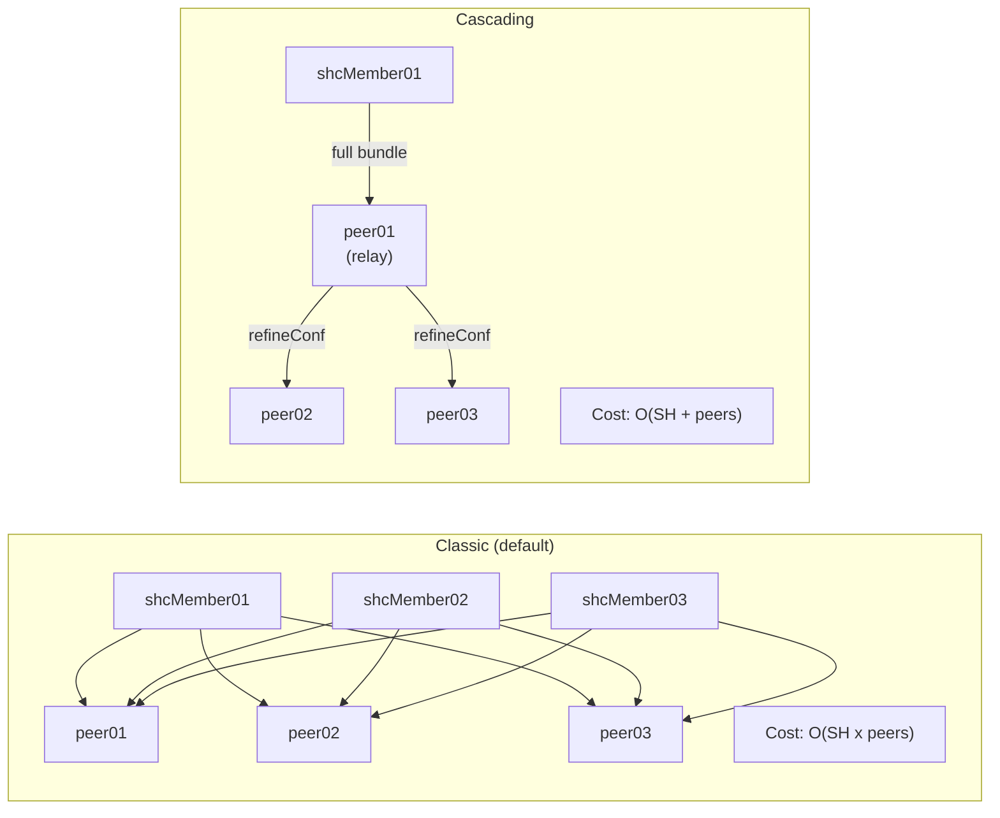
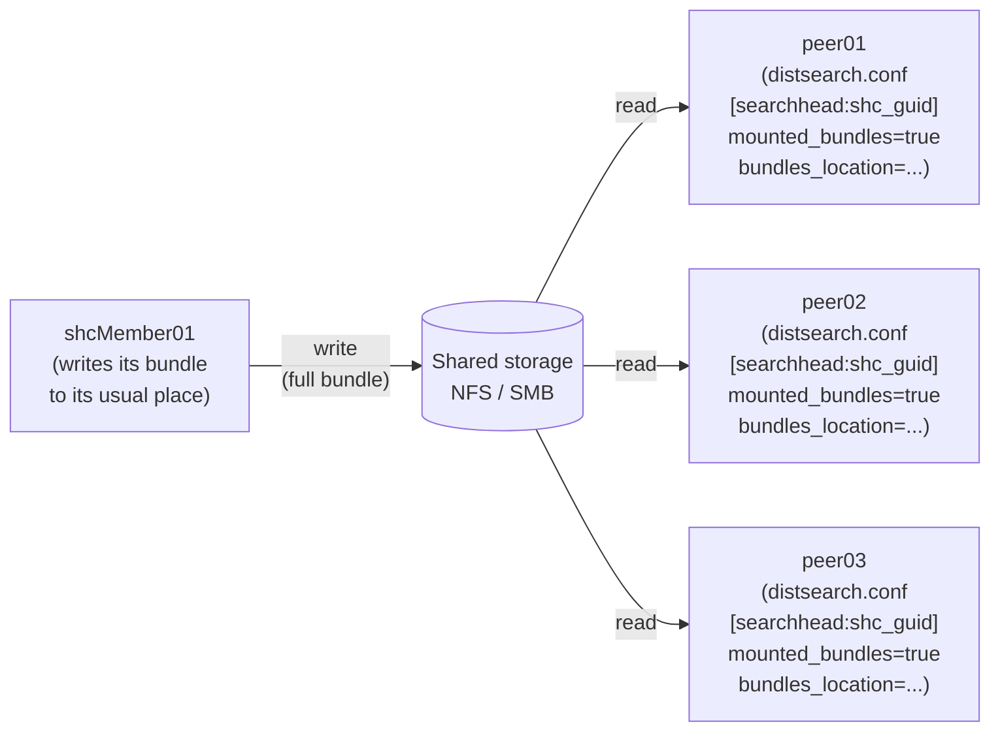

# Chapter 3 — Replication to search peers

> The knowledge bundle built on the search head side must then reach every search peer. Three replication modes coexist in Splunk 9.4 — *classic* (default), *cascading* (recommended at scale) and *mounted* (shared storage). This chapter describes them in that order, gives the switching criterion, details the layout on the peer side (`var/run/searchpeers/`), addresses partial failures (peer down, divergent hash, NFS that drops), and concludes on the behavior options (`allowSkipReplication`).

## Quick refresher

- In **classic** replication (default), each SH pushes its bundle directly to each peer; cost is O(SH × peers).
- In **cascading** replication, Splunk recommends the switch starting around 15-20 peers; a relay peer re-distributes to a following subset and the SH pushes only once.
- In **mounted** replication, the bundle lives on shared storage (NFS / SMB); peers read it instead of receiving it by push.
- On the peer side, received bundles live under `$SPLUNK_HOME/var/run/searchpeers/<sh_guid>-<epoch>-<hash>.bundle`. Splunk keeps a few recent ones and cleans up the older ones.
- A replication failure to a particular peer does not block the rest by default (see `allowSkipReplication=false` which *blocks* the search until all peers are up to date, vs. `allowSkipReplication=true` which lets it continue in best-effort).

## 1. Classic replication (default mode)

This is the mode active with no specific configuration. Each search head pushes its bundle to each peer in the `serverList` (resolved via the CM when `[clustering]` is configured). In a 3-member SHC and a 10-peer indexer cluster, that represents up to 30 parallel pushes per replication cycle — this is not a problem at that scale but becomes one at larger scale.

The push is an HTTPS transfer to the peer's replication port (default the mgmt port `8089`, or a dedicated port per `[replicationSettings]` on the peer side if configured). The content is compressed.

```text
2026-06-18 10:00:00.123 +0000 INFO  DistributedBundleReplicationManager - peer=peer01 push complete bundle=00000000-0000-0000-0000-000000000001-1718711234-aaaaaaaa.bundle bytes=234567
```

### Cost and switching threshold

The operational cost of classic replication is mainly **network** (bandwidth consumed by parallel pushes) and **memory** on the SH side (each push maintains a buffer). In rough notation:

- 3 SH × 10 peers = 30 pushes per cycle.
- 3 SH × 30 peers = 90 pushes per cycle — already noticeable.
- 3 SH × 60 peers = 180 pushes per cycle — the admin feels replication slowing down.

Splunk sets the indicative threshold at around 15-20 peers ([Cascadingknowledgebundlereplication](https://docs.splunk.com/Documentation/Splunk/9.4.1/DistSearch/Cascadingknowledgebundlereplication)). Below, classic mode stays rational; above, examine cascading.

## 2. Cascading replication

In cascading mode, the SH no longer pushes its bundle to every peer. It pushes to a **relay peer** (or to a small set of relay peers) that then re-distributes to a following subset. The topology resembles a tree whose root is the SH.

The `refineConf` (ch. 02 §1) plays its role here: it is the minimal sub-bundle that the relay peer needs to retransmit. The SH sends the complete bundle to the relay peer; the relay peer transmits the `refineConf` to the next subset, which uses it to resolve searches without needing the complete bundle.

### When to enable

- More than 15-20 peers — Splunk's indicative threshold.
- Classic replication perceptibly slow or bandwidth-consuming.
- Bundle modification profile relatively rare (each cascade costs a cycle; too many cascades per minute cancel the gain).

### How it changes topology

On the SH side, configuration happens in `distsearch.conf`; on the peer side, some nodes take on the relay role. The topology is computed by Splunk based on the number of peers and the cascading configuration. In that sense, it is not a "hand-configured" topology: it is a mode being enabled.

#### S4 — Classic vs cascading replication: cost and topology



On the left, cost blows up in SH × peers: Splunk's recommendation to switch to cascading above ~15-20 peers. On the right, a designated peer relays the `refineConf` to the next subset; the SH pushes only once, the relay peer propagates downstream. The trade-off: a relay peer becomes a hot spot, and its unavailability blocks propagation for downstream peers (see ch. 05 branch E2).

## 3. Mounted replication (shared storage)

In mounted mode, the bundle no longer travels through the Splunk network: the SH writes it to shared storage (NFS or SMB), and the peers read it from that same storage. The SH no longer sends anything to the peers — it just notifies them that a new bundle is available at such-and-such shared path.

### Configuration stanzas

Configuration is held **on the peer side**, in `$SPLUNK_HOME/etc/system/local/distsearch.conf` (see [Mountedknowledgebundlereplication](https://docs.splunk.com/Documentation/Splunk/9.4.0/DistSearch/Mountedknowledgebundlereplication)): one `[searchhead:<searchhead-splunk-server-name>]` stanza per source SH, with the attributes `mounted_bundles=true` and `bundles_location=<path>` where `<path>` is the **mountpoint on the search peer side** (not on the SH side).

```ini
# On each peer: distsearch.conf, one stanza per source SH
[searchhead:00000000-0000-0000-0000-000000000001]
mounted_bundles = true
bundles_location = /opt/shared_bundles/00000000-0000-0000-0000-000000000001
```

**SHC case**: the Splunk docs specify that if the search peer is connected to an SHC, the name in the `[searchhead:<name>]` stanza must be **the cluster GUID**, not the server name of an individual member. A single stanza then covers the entire SHC, not one per member. On the SH side, no dedicated stanza is required: the SH continues to write its bundle normally, and it is the peer that chooses to read it from the share rather than wait for it by push thanks to the stanza above.

**Permissions**: the peers must have **read-only** access to the bundle subdirectories to avoid file-lock conflicts.

### When this is the right answer

- **Many peers** (above ~30-50), where replication bandwidth becomes a measurable cost.
- **Large bundle** (above several hundred MB) that would multiply the cost of each push.
- **Quality NFS available** — performance, availability, integrity. Mounted is not an option to enable on a makeshift NFS.

### Trade-offs

Mounted shifts the resilience of the bundle to the shared storage: if the NFS goes down, no peer can read the bundle, and all distributed searches that rely on specific knowledge objects fail or wait indefinitely. NFS high availability becomes a critical operational dependency of the SHC, which was not the case in classic/cascading. See ch. 05 branch G (stale mounted) and the "NFS that drops in mounted" pitfall in ch. 07.

#### S5 — Mounted replication: SH writes, peers read from shared storage



The SH no longer sends the bundle via push: it writes once to the shared storage. Configuration is held **on the peer side** only, via a `[searchhead:<name>]` stanza (with `<name>` = SHC GUID when the source SH is a cluster) that enables `mounted_bundles=true` and points `bundles_location` to the peer-side mountpoint. The peers read from this storage on demand. Trade-off: bundle resilience now depends on NFS resilience; a write lag on the NFS, a stale local cache on a peer, or a share fail-over are all causes of desynchronization invisible to a direct push.

## 4. On disk on the peer side: `var/run/searchpeers/`

On the peer side, received or mounted bundles live under `$SPLUNK_HOME/var/run/searchpeers/`. A peer in an SHC receives one bundle per source member (one per GUID), so in a 3-member SHC the tree looks like:

```text
$SPLUNK_HOME/var/run/searchpeers/
├── 00000000-0000-0000-0000-000000000001-1718711234-aaaaaaaa.bundle
├── 00000000-0000-0000-0000-000000000001-1718712345-bbbbbbbb.bundle
├── 00000000-0000-0000-0000-000000000002-1718711234-cccccccc.bundle
└── 00000000-0000-0000-0000-000000000003-1718711234-dddddddd.bundle
```

Splunk keeps a limited number of bundles per source GUID (typically the 2-3 most recent) and cleans up automatically. The cleanup is never to be triggered manually by an `rm`: Splunk manages the lifecycle and a file removed mid-search can make a map fail.

### Rotation and cleanup

Rotation is managed by Splunk based on the arrival of new bundles; a newly received bundle triggers cleanup of the older ones of the same GUID. The admin has no direct lever here; the only case where they intervene is the pathological case of a saturated disk (to investigate on the infrastructure side, not the Splunk side).

## 5. Partial failures

A down peer does not block replication to the others: each push is independent. The behavior of a search facing a non-replicated peer depends on `allowSkipReplication`:

- **`allowSkipReplication=false` (default)**. The search waits until all peers have the bundle (or gives up after timeout). Consequence: a durably late peer blocks all distributed searches on the SH. This is maximum safety (completeness) but it is also the number-one source of "search stuck waiting for bundle" symptom (ch. 05 branch H).
- **`allowSkipReplication=true`**. The search starts on the up-to-date peers and **ignores** the late peer. Partial results with no explicit warning. Acceptable only in contexts where completeness is not critical; risky for alerting and compliance.

The right choice depends on the use case:

| Case | Recommendation |
| --- | --- |
| Alerting / SOC searches | `allowSkipReplication=false`. Better an alert that misses its slot than silent partial results. |
| Preview monitoring dashboards | `allowSkipReplication=true` acceptable, with explicit mention in the dashboard documentation. |
| Compliance / regular reporting | `allowSkipReplication=false`. Traceability is non-negotiable. |
| Ad-hoc exploratory searches | Case by case — `allowSkipReplication=false` remains the safe default. |

### Symptoms of a partial failure

- **`splunkd.log` on the SH side**: `DistributedBundleReplicationManager` lines with `log_level=WARN` or `ERROR`, mentioning the offending peer.
- **`splunkd.log` on the peer side**: error reception messages, or no message at all if the peer is unreachable.
- **REST `/services/search/distributed/peers`**: the offending peer is in a degraded state (`status=down` or `quarantined`).
- **REST `/services/search/distributed/bundle/replication/cycles`** (see [Troubleshootknowledgebundlereplication](https://docs.splunk.com/Documentation/Splunk/9.4.0/DistSearch/Troubleshootknowledgebundlereplication)): the cycle history shows the failure.

## 6. Divergent hash — the signature of ch. 05 branch E

The hash in the file name `<sh_guid>-<epoch>-<hash>.bundle` is the key invariant of diagnosis. Three cases:

- **All peers have the same hash for the same `<sh_guid>`**: consistent. Replication has converged.
- **One peer has an older hash**: delay. Either propagation is in progress (wait 1-2 cycles), or it is blocked (cause to find: failed push, blocked cascading, mounted lag).
- **Two peers have different hashes for the same SH at the same moment**: pathological divergence. The most frequent cause is partial propagation (one peer received the new one, the other failed silently) or — in mounted — a stale local cache.

Diagnosis is done by cross-referencing the hash on the SH side (`splunk show distributed-peers` or REST `/services/search/distributed/peers`) with the hash on the peer side (reading the file name in `var/run/searchpeers/` or REST on the peer). Command details in ch. 06.

## 7. Pointers: SmartStore and indexer cluster

**SmartStore** changes the indexer bucket mechanics (object storage S3) but does not touch the SH → peers knowledge bundle mechanics. The `var/run/searchpeers/` tree continues to work identically. SmartStore is mentioned here only to dispel doubt: if you enable SmartStore and your knowledge bundle stops propagating, SmartStore is not the cause.

**Indexer cluster configuration bundle** (CM → peers) is a mechanic distinct from the knowledge bundle, see ch. 00 §1.3 and ch. 06 §1 (CLI `splunk apply cluster-bundle`). The indexer cluster configuration bundle does not use `var/run/searchpeers/` but `etc/slave-apps/` on the peer side; do not look for a knowledge bundle in `etc/slave-apps/`, it is not there.

## Typical pitfalls

- **NFS that drops in mounted.** The SH has written the bundle, the peers can no longer read it — for a few seconds or minutes. All searches that start during the window fail or wait. The NFS must have an SLA as demanding as that of the indexers; if the NFS is a best-effort share in the infra, do not enable mounted.
- **Silent divergent hash.** Without explicit monitoring (saved search that cross-references the SH-declared hash and the peer-effective hash), a persistent divergence may go unnoticed for several days. User-side symptom: searches that do not return the same thing depending on the SH member used. Set up a scheduled saved search (see ch. 06 SPL §4).
- **Peer absent from `serverList` after indexer addition.** If the SH is hard-configured `[distributedSearch] servers=...` (not recommended with an indexer cluster, but existing in legacy migrations), adding a new indexer is not picked up automatically. Symptom: searches do not show new data. The right configuration in the presence of a cluster manager is `[clustering] manager_uri=...` on the SH side, which resolves `serverList` dynamically.
- **Asymmetric version upgrade between SH and peer.** An SH on 9.4.2 pushing a bundle to a peer on 9.4.0 usually works (backward compatibility), but a version-dependent stanza can produce errors at map time on the peer. Align SH and peer to the same 9.x minor version; in a migration, do the peers first then the SHs (peers tolerate older 9.x bundles; the reverse is less guaranteed).
- **Cascade that collapses on relay failure.** In cascading, if the designated relay peer goes down, downstream peers no longer receive anything until Splunk recomputes the topology (a few minutes). Dedicated monitoring to set up on peers acting as relays — their availability affects more than just their own.

## When to escalate / when to decide

- **Classic → cascading decision.** Above 20 peers, the admin has to instruct the decision: measure current replication bandwidth, cycle frequency, bundle size. If the push represents more than a few percent of the network throughput or if cycles get perceptibly longer, switch. Not before — each mode has its own operational cost.
- **Cascading → mounted decision.** Later on the curve (50+ peers, bundle > 500 MB, quality NFS available and operated by a team that commits an SLA on it). This is an architect decision that engages the datacenter storage infra, not a configuration decision.
- **Persistent failure of a particular peer.** If a peer stays durably in replication error after network checks, `pass4SymmKey` checks, and peer restart: open a Splunk Support case with `splunk diag` on the SH side and on the peer side. Before that point, do not multiply `rm` in `var/run/searchpeers/` on the peer side — it is cosmetic and hides the cause.

## Sources

- [Splunk DistSearch 9.4 — Classic knowledge bundle replication](https://docs.splunk.com/Documentation/Splunk/9.4.1/DistSearch/Classicknowledgebundlereplication)
- [Splunk DistSearch 9.4 — Cascading knowledge bundle replication](https://docs.splunk.com/Documentation/Splunk/9.4.1/DistSearch/Cascadingknowledgebundlereplication)
- [Splunk DistSearch 9.4 — Mounted knowledge bundle replication](https://docs.splunk.com/Documentation/Splunk/9.4.0/DistSearch/Mountedknowledgebundlereplication)
- [Splunk DistSearch 9.4 — Troubleshoot knowledge bundle replication](https://docs.splunk.com/Documentation/Splunk/9.4.0/DistSearch/Troubleshootknowledgebundlereplication)
- [Splunk Admin 9.4 — distsearch.conf (stanzas `[replicationSettings]`, `[searchhead:<name>]`)](https://docs.splunk.com/Documentation/Splunk/9.4.0/Admin/Distsearchconf)
- [Splunk DistSearch 9.4 — Configure distributed search](https://docs.splunk.com/Documentation/Splunk/9.4.0/DistSearch/Configuredistributedsearch)
- [Splunk REST API 9.4 — Distributed search endpoints](https://docs.splunk.com/Documentation/Splunk/9.4.0/RESTREF/RESTprolog)
