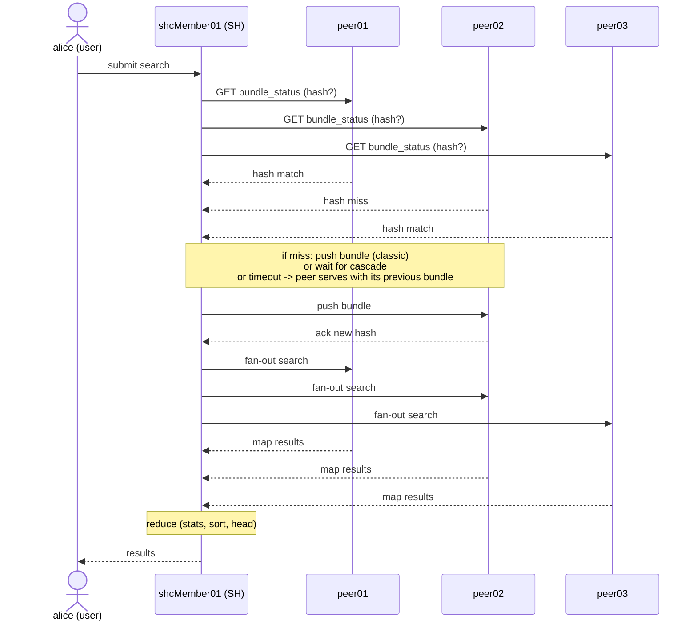

# Chapter 4 — Distributed search sequence

> A search typed by a user in an SHC goes through three stages: checking that the peers have the right knowledge bundle, search fan-out, results aggregation. This chapter lays down the end-to-end timeline. The goal is not to explain SPL or the map/reduce algebra, but to provide the landmark that lets you **locate** where a search blocks when the bundle misbehaves: if it blocks before fan-out, it is a bundle problem; if it blocks after, it is a map or reduce problem, not a bundle problem.

## Quick refresher

- Every distributed search includes a **fan-out** to the peers, a **map** on each peer, a **reduce** on the SH.
- Before fan-out, the SH checks that every peer has the bundle at the current hash. If not, it pushes (classic) or waits (cascading); on failure/timeout, replication being asynchronous, the peer keeps serving with its **previous bundle** rather than being excluded from the search.
- A scheduled search runs on the captain member if it is a clustered saved-search of the scheduler. If the captain changes during execution, the search may be relaunched by the new captain.
- The SH aggregates results as they arrive (`stats`, `timechart` on the reduce side). A reduce slowness on the SH is not a bundle slowness.

## 1. Phase 1 — bundle ready check

On search submission, the SH does not immediately send the SPL command to the peers. It first checks, peer by peer, that each one has the bundle at the current hash on the SH side. This check is fast (a few milliseconds on a normal LAN) because it only carries metadata (the current hash, not the content).

Three possible outcomes per peer:

- **Match.** The hash on the peer matches the hash on the SH. The peer is ready; the SH continues.
- **Miss with push possible.** The hash differs but the SH can push the bundle (classic / cascading mode) or write to the shared storage (mounted mode). The SH triggers propagation and waits for the peer to acknowledge the new hash.
- **Miss with no push possible / timeout.** The peer does not respond, or propagation fails, or the `connectionTimeout` (default 60 s) / `sendRcvTimeout` (default 60 s) is exceeded. The Splunk 9.4 documentation is explicit: *"A search will not be prevented from running just because knowledge replication has not finished. Bundle replication happens asynchronously from search."* The peer therefore keeps serving the search with its **previously received bundle** (recent SH changes are simply not yet effective on that peer). The failed replication cycle is traced in `splunkd.log` (`WARN DistributedBundleReplicationManager - bundle replication to N peer(s) took too long`) but the search UI does not issue a user-facing warning.

This is the critical step for diagnosis. A search blocked at this step is a search that has **not started** querying the data; the UI symptom is "waiting for bundle replication" or a frozen loader with no progress on the event counter.

## 2. Phase 2 — fan-out

Once the bundle ready check is complete for all relevant peers (or the skip decision has been made), the SH sends the SPL command to each peer in parallel. Fan-out is a simultaneous REST call to each peer in the active `serverList`, containing the SPL and the search context (user, app, time range).

Fan-out is fast: the SPL command is small. The delay between the user's click and the actual map start on the peers is typically a few hundred milliseconds on a LAN.

## 3. Phase 3 — map on the peers

On each peer, the SPL is executed locally against the buckets of data present. To resolve references to knowledge objects (lookups, macros, eventtypes, tags, RBAC authorizations), the peer loads the bundle matching the requesting SH's GUID from `var/run/searchpeers/<sh_guid>-<epoch>-<hash>.bundle`.

If the referenced bundle no longer exists on the peer (pathological case: cleanup triggered mid-cycle), the peer returns an immediate error to the SH. This case is rare and symptomatic of a lifecycle problem on the peer side (see ch. 03 §4 "rotation and cleanup").

The map produces a stream of events or a stream of partial aggregates that the peer sends back to the SH as they come in. The map is usually the longest phase of a search (proportional to the volume of data queried); a slowness here is not a bundle problem.

## 4. Phase 4 — reduce on the SH

The SH consumes the streams returned by the peers, applies the non-streaming SPL commands (final stats, sort, dedup, head, etc.) and produces the final result. For a `stats count by sourcetype` search, the reduce is a simple aggregation of the partial counts received from each peer; for a per-event search (`| head 1000`), it is a consolidation and a sort.

The reduce is bounded by the SH's resources: CPU and memory. A slowness here is an SH slowness (notably on the captain member in case of a clustered saved search), not a bundle slowness.

## 5. Full timeline view

#### S6 — Distributed search sequence: check → fan-out → map → reduce

Before any fan-out, the SH checks that each peer has the right hash. A search blocked at steps 1-3 is a bundle problem (check or push); a search blocked at steps 4-5 is a map problem (peer slowness, heavy query); a search blocked at step 6-7 is a reduce problem (SH overloaded, badly written query). The timeline landmark is essential not to look in the wrong place.

## 6. Special case: "bundle not yet propagated"

When the SH observes at search time that the bundle is not yet up to date on a peer (for example a lookup has just been modified by a deployer apply that has not yet reached the peer via the search knowledge bundle), two trajectories coexist — both **non-blocking for the search**:

- **Push in progress, short**: the SH may transiently show "waiting for bundle replication" while the peer acknowledges, then the search starts with the new bundle.
- **Push that fails or times out (timeouts `connectionTimeout` / `sendRcvTimeout`, defaults 60 s)**: the replication cycle is marked in error on the SH side (`WARN DistributedBundleReplicationManager`) but the search starts anyway — the peer answers with its **previously received bundle**. Recent SH knowledge changes are not reflected in the results coming from that peer until the next successful replication cycle.

The landmark for the admin: open `splunkd.log` on the SH side at search time, grep on `DistributedBundleReplicationManager`; a `WARN` line with a peer name indicates a failed push cycle (the peer is serving with its previous bundle, silent inconsistency risk to monitor).

## 7. Special case: scheduled search and loss of captain

A clustered saved search (`dispatchAs=owner` on the SHC side) is executed by the current **captain** at the scheduled time. If the captain is lost mid-execution (failure, restart, election), three trajectories:

- The search running on the ex-captain is interrupted. The new captain, once elected (typically a few seconds to a minute), can decide to relaunch the search or to skip it based on `schedule_priority` and the SHC configuration.
- On the UI / result side: a missed slot or a duplicated result may appear depending on the exact moment of the loss. To document in the SHC runbook.
- On the `splunkd.log` side: the `SHCSchedulerDelegator` or similar components (see ch. 06 §3, observed empirically) trace the decision.

This case is not a bundle problem in the strict sense but a case of SHC service continuity. It is mentioned here because it manifests as "scheduled search that did not produce" and is often confused at first glance with a bundle failure.

## Typical pitfalls

- **Search that "starts fast" but the reduce on SH is overloaded.** The SH shows partial results that no longer progress. Symptom: map complete on the peer side (verifiable via REST on each peer), reduce not progressing. Causes: massive non-streaming SPL (`| sort - _time` on millions of events), `stats` on too many groups, lookup on the SH side after the distributed phase. Solution: move what can be moved into the distributed phase (use `tstats` when possible, filter before `stats`, limit with `head` on the distributed side).
- **Peer serving with a stale bundle.** Replication being asynchronous (Splunk 9.4 docs), a peer whose last push cycle failed keeps responding to searches with its previous bundle. The UI does not distinguish — an alerting dashboard that depends on a recently modified lookup or macro can produce an inconsistent result until the next successful replication cycle. Dedicated monitoring to add (alert on `splunkd.log` `DistributedBundleReplicationManager` `log_level=WARN/ERROR`).
- **Captain lost during a scheduled search.** The user sees a saved search that has not produced or that has produced twice for the same slot. Cause: election in the middle. To distinguish from a bundle failure: `splunkd.log` `SHCScheduler*` shows the decision on the new captain. No reactive remedy, prevention through infra stability.
- **Confusing bundle wait and slow-map wait.** A search blocked on a peer can be at step 3 (bundle push in progress) or at step 4 (map in progress, just slow). Distinction: `splunkd.log` on the peer side. If you see recent `SearchOperator*` or similar entries (on the peer), it is map; if you see nothing and `var/run/searchpeers/` does not have the expected bundle, it is still at the bundle stage.

## When to escalate / when to decide

- **Distributed search durably slower than expected.** Before blaming the bundle or the network, measure the verification/fan-out/map/reduce breakdown with the Splunk job inspector (`Job → Inspect job`). If verification + fan-out > 10% of total time, examine bundle health (ch. 05). Otherwise, look at map (peers) or reduce (SH).
- **Unstable captain.** If the captain changes more than once per day in the absence of an infra incident, it is a structural SHC problem (internal network, resources). Do not try to stabilize through timeout adjustments — investigate the cause.

## Sources

- [Splunk DistSearch 9.4 — Knowledge bundle replication](https://docs.splunk.com/Documentation/Splunk/9.4.0/DistSearch/Knowledgebundlereplication)
- [Splunk DistSearch 9.4 — Troubleshoot knowledge bundle replication](https://docs.splunk.com/Documentation/Splunk/9.4.0/DistSearch/Troubleshootknowledgebundlereplication)
- [Splunk DistSearch 9.4 — SHC architecture (captain election, clustered scheduler)](https://docs.splunk.com/Documentation/Splunk/9.4.2/DistSearch/SHCarchitecture)
- [Splunk Admin 9.4 — distsearch.conf (`[replicationSettings]`: `connectionTimeout`, `sendRcvTimeout`)](https://docs.splunk.com/Documentation/Splunk/9.4.2/Admin/Distsearchconf)
- [Splunk DistSearch 9.4 — Classic knowledge bundle replication (asynchronous replication)](https://docs.splunk.com/Documentation/Splunk/9.4.1/DistSearch/Classicknowledgebundlereplication)
