# Chapter 5 — Troubleshooting: decision tree

> This chapter is the handbook's entry point facing a bundle incident. You enter by **observable symptom** — error message, search behavior, propagation state — and you walk down the tree to the matching leaf. Each leaf provides the precise symptom, hypotheses ordered by probability, investigation commands (deferred to ch. 06), generic corrective action and Splunk Support escalation criterion. The chapter ends with the bundle-health metrics to monitor in routine for prevention.

## Quick refresher

- **Before any diag**, identify which bundle is at stake (see ch. 00 §2): SHC configuration bundle? SH → peers knowledge bundle? indexer cluster configuration bundle?
- The tree mainly covers the **SH → peers knowledge bundle** and the **SHC configuration bundle**; the indexer cluster configuration bundle is recalled in branch I with a pointer to the Splunk documentation.
- The investigation commands cited are **all** detailed in ch. 06. The internal links below take you there directly.
- The tree is not exclusive: a real incident may combine several leaves (for example bundle too large + late peer). Treat each leaf independently in hypothesis order, then cross-check.

## 1. How to enter the tree

Entry is by observable symptom. Four frequent entry points:

1. **Message in the UI / CLI output**: "waiting for bundle replication", "failed to replicate bundle", "bundle exceeds max content length", "cannot find captain", etc.
2. **Search behavior**: stuck search, partial results, data missing on some peers.
3. **SHC member behavior**: a member shows an app at a different version than the others, or does not receive a lookup pushed the previous day.
4. **Monitoring**: alert on `DistributedBundleReplicationManager` component, divergent-hash metric.

For each one, the "heatmap" table in ch. 00 §4 points to the main branch. If the branch is not obvious, start from the root (§2 below) and descend.

## 2. The full tree (Mermaid render)

#### S7 — Bundle decision tree: enter by symptom, walk down to leaf

```mermaid
flowchart TB
    Start([Bundle symptom observed]) --> Q1{Which mechanic?}
    Q1 -->|"apply shcluster-bundle"| A[A. SHC bundle apply KO]
    Q1 -->|SHC member divergent| B[B. SHC bundle received but divergent]
    Q1 -->|SH peers bundle too large| C[C. Max size exceeded]
    Q1 -->|Peer without bundle| D[D. Peer not receiving]
    Q1 -->|Divergent peers hash| E[E. Divergent hash]
    Q1 -->|SHC RF| F[F. SHC RF not honored]
    Q1 -->|Mounted stale| G[G. Mounted bundle stale]
    Q1 -->|Search stuck| H[H. Search waiting for bundle]
    Q1 -->|CM cluster bundle| I[I. Indexer cluster bundle]

    A --> A1[A1. deployer down]
    A --> A2[A2. captain lost]
    A --> A3[A3. validation KO]

    B --> B1[B1. conf_replication saturated]
    B --> B2[B2. restart missing]

    C --> C1[C1. massive lookups]
    C --> C2[C2. apps with embedded data]
    C --> C3[C3. blacklist missing]

    D --> D1[D1. peer outside serverList]
    D --> D2[D2. network / port]
    D --> D3[D3. pass4SymmKey]
    D --> D4[D4. short timeout]

    E --> E1[E1. partial propagation]
    E --> E2[E2. cascading blocked]
    E --> E3[E3. mounted lag]

    F --> F1[F1. members lt RF]
    F --> F2[F2. conf_replication_max too low]

    G --> G1[G1. NFS lag]
    G --> G2[G2. peer cache]

    H --> H1[H1. peer slow to ack]
    H --> H2[H2. push in progress]
    H --> H3[H3. peer down + repeated timeout]

    I --> I0[See Splunk Configurationbundleissues]
```

The tree is walked starting from the symptom. At each branch, identification is done via ch. 06 (investigation commands). The following sections (§3 to §11) detail each leaf.

## 3. Branch A — `splunk apply shcluster-bundle` fails or does not propagate

Generic symptom: the command returns an error, or completes with apparent success but no member reflects the expected content after several minutes.

### A1 — Deployer unavailable

- **Symptom.** `splunk apply shcluster-bundle` fails on the deployer side with a network message (`connection refused`, `timeout`), or the command does not start at all. Connection attempt to `https://<deployer>:8089` that fails. Disk full on the deployer (`var/run/splunk/deploy` saturated).
- **Ordered hypotheses.** (1) splunkd process on the deployer stopped. (2) Disk saturated on the `$SPLUNK_HOME` partitions. (3) Port 8089 filtered by firewall.
- **Investigation.** On the deployer: `splunk status`, `df -h $SPLUNK_HOME/var/run`, `ss -tlnp | grep 8089`. See ch. 06 §1.
- **Action.** Restart splunkd, free space, reopen the port. If recurring, monitor through a `_internal` saved search on deployer health.
- **Escalation.** If the process crashes at startup and the deployer's `splunkd.log` shows a stack trace: Splunk Support case.

### A2 — Captain lost

- **Symptom.** `splunk apply shcluster-bundle` returns a "no captain found" or "cannot determine captain" message. The members do not agree on who is captain.
- **Ordered hypotheses.** (1) Election in progress (transient, 30s to 2 min). (2) SHC quorum lost (less than majority of members up). (3) Network partitioned between SHC members.
- **Investigation.** On a member: `splunk show shcluster-status`. On the `splunkd.log` side, components `SHCMaster`, `RaftConsensus` (terminology varies by version). See ch. 06 §1 and §3.
- **Action.** Wait for the election to finish. If quorum lost, bring back the missing members (restart, restore the network). Do not retry the apply during the election.
- **Escalation.** Captain re-elected more than once per day with no identified infra cause: Splunk Support case with `splunk diag` of the members.

### A3 — Validation rejected

- **Symptom.** `splunk apply shcluster-bundle` returns a validation message: invalid conf, app missing a required file, version mismatch between deployer and members.
- **Ordered hypotheses.** (1) Malformed `.conf` stanza in `etc/shcluster/apps/`. (2) App dependent on another one absent from the bundle. (3) Splunk version on the deployer ≠ members version beyond what is tolerable (typically more than one minor apart).
- **Investigation.** `splunk apply shcluster-bundle -action stage` to reproduce the validation without sending. `splunk btool check` on the suspect apps. See ch. 06 §1.
- **Action.** Fix the conf, put the dependencies back, align the versions.
- **Escalation.** If validation rejects a conf valid according to `btool`: Splunk Support case.

## 4. Branch B — SHC bundle propagated but member divergent

Generic symptom: `splunk apply shcluster-bundle` returns success, but one or more SHC members do not reflect the expected content after several minutes.

### B1 — Conf replication blocked

- **Symptom.** `splunk list shcluster-bundle-status` on the captain side shows one or more members at an earlier `bundle_id`. No progress as minutes go by.
- **Ordered hypotheses.** (1) `conf_replication_max_pull_count` or `conf_replication_max_push_count` too low for the volume. (2) Conf replication thread saturated (load on captain). (3) Target member saturated on disk or CPU.
- **Investigation.** `splunkd.log` on captain and member: component `ConfReplicationThread` (observed empirically, see ch. 06 §3). `_internal` metrics on conf replication throughput.
- **Action.** Check member infra health. Adjust `conf_replication_max_*` if volume is legitimate. If captain load, consider scaling up the captain member.
- **Escalation.** If conf replication stays blocked with no identified infra cause after 30 min: Splunk Support case.

### B2 — Restart not triggered when expected

- **Symptom.** The bundle has propagated, the hash has converged, but the expected behavior (for example a new active `inputs.conf`) does not appear — because a Splunk restart would have been required for it to be picked up.
- **Ordered hypotheses.** (1) The modified stanza requires a non-automatic restart. (2) The apply was run without `-push-default-app-conf` when it was needed. (3) Restart suppressed by an admin override.
- **Investigation.** Apply output ("restart required" field), captain's `splunkd.log` at apply time. See ch. 06 §3.
- **Action.** Manually trigger the rolling restart: `splunk rolling-restart shcluster-members`.
- **Escalation.** Rarely needed — this is an admin action.

## 5. Branch C — SH → peers knowledge bundle: max size exceeded

Generic symptom: `splunkd.log` on the SH side shows `bundle exceeds max content length` messages, or replication fails with a size-related code.

### C1 — Massive unscoped lookups

- **Symptom.** One or more `.csv` files under `etc/apps/<app>/lookups/` are several hundred MB. The bundle grows with every lookup modification.
- **Ordered hypotheses.** (1) Lookup generated by a script (for example a SQL dump) with no rotation or filtering. (2) Cumulative historical lookup never purged. (3) Lookup shared between apps, duplicated.
- **Investigation.** `du -sh $SPLUNK_HOME/etc/apps/*/lookups/*.csv | sort -h` on the SH side. See ch. 06 §1.
- **Action.** Externalize as a dedicated index queried by distributed `lookup`, or exclude via `replicationBlacklist`, or reduce via `excludeReplicatedLookupSize`.
- **Escalation.** None — this is design.

### C2 — Apps with embedded data

- **Symptom.** An app contains historical `.csv`, `.json`, `.db` embedded under `<app>/lookups/` or `<app>/static/`. The bundle grows with each app deployment.
- **Ordered hypotheses.** (1) Incorrect packaging practice (the app embeds operational data). (2) Forgotten static UI assets. (3) Build dump from a third-party tool (for example `node_modules`).
- **Investigation.** `du -sh $SPLUNK_HOME/etc/apps/<app>/*` on the SH side; app tree.
- **Action.** Repackage the app pulling data out; add `static/` and others to `replicationBlacklist`.
- **Escalation.** None — this is design.

### C3 — `replicationBlacklist` absent or mis-scoped

- **Symptom.** The bundle exceeds the limit while the apps look reasonable. No visible blacklist in `distsearch.conf`.
- **Ordered hypotheses.** (1) No blacklist configured at all (apps with `static/`, `appserver/` propagated for nothing). (2) Too narrow a blacklist (for example `static/img/` but not `static/`).
- **Investigation.** Read current `distsearch.conf`. See ch. 02 §1 for the expected form.
- **Action.** Put in place a conservative blacklist: exclude `static/`, `appserver/`, `mrsparkle/`, `bin/`, `tmp/` from apps not relevant to the peers.
- **Escalation.** None.

## 6. Branch D — Peer does not receive the knowledge bundle

Generic symptom: a particular peer remains at an old hash (or has no bundle in `var/run/searchpeers/` for a given SH). The other peers receive normally.

### D1 — Peer absent from `serverList`

- **Symptom.** The peer is not listed in `splunk show distributed-peers` on the SH side. It is, however, up and reachable.
- **Ordered hypotheses.** (1) `[clustering] manager_uri` on the SH side not configured (the SH does not discover the new peers via the CM). (2) `[distributedSearch] servers=` hard-coded without the new peer. (3) Peer not yet enrolled on the CM side.
- **Investigation.** `splunk show cluster-manager-status` on the CM side. `splunk show distributed-peers` on the SH side. See ch. 06 §1 and §2.
- **Action.** Configure `[clustering] manager_uri` on the SH side (recommended), or add the peer explicitly in `servers=` (sub-optimal). Verify that the peer is enrolled on the CM side.
- **Escalation.** None.

### D2 — Network / port filtered

- **Symptom.** The peer is in the list but stays at an old hash. `splunkd.log` on the SH side shows `connection refused` or `timeout` errors on this particular peer.
- **Ordered hypotheses.** (1) Port 8089 (or dedicated replication port) filtered between SH and peer. (2) Recent undocumented iptables / firewall rule. (3) MTU mismatch on a segmented VLAN.
- **Investigation.** `nc -zv <peer> 8089` on the SH side. `splunkd.log` component `DistributedBundleReplicationManager`. See ch. 06 §3.
- **Action.** Reopen the port, restore network segment consistency.
- **Escalation.** Network, not Splunk.

### D3 — Divergent `pass4SymmKey`

- **Symptom.** The peer is reachable and the port is open, but the SH cannot authenticate to the peer. `splunkd.log` shows `authentication failed` or `invalid pass4SymmKey` messages.
- **Ordered hypotheses.** (1) `pass4SymmKey` rotation on the CM or peer side not replicated to the SH side. (2) `[clustering]` or `[general]` stanza divergent. (3) Key hash corrupted by copy-paste.
- **Investigation.** `splunk btool clustering list` on the SH side and on the peer side. See ch. 06 §1.
- **Action.** Align `pass4SymmKey` on all nodes. Restart mandatory after modification.
- **Escalation.** None.

### D4 — Short timeout + large bundle

- **Symptom.** Push starts but fails mid-way. `splunkd.log` shows `sendRcvTimeout` or `connectionTimeout` exceeded on this particular peer (link slower than the others).
- **Ordered hypotheses.** (1) WAN link between SH and peer (peer in a remote site). (2) Peer overloaded in I/O at push time. (3) `sendRcvTimeout` too low for the bundle size.
- **Investigation.** Measure effective bandwidth SH → peer (`iperf3`). Compute theoretical time for the bundle size. See ch. 06 §3.
- **Action.** Raise `sendRcvTimeout` reasonably, or reduce the bundle, or — in case of WAN — switch to mounted with a share local to the peer's site.
- **Escalation.** None.

## 7. Branch E — Divergent hash between peers

Generic symptom: two peers (or more) have different hashes for the same source SH at the same instant.

### E1 — Partial propagation

- **Symptom.** Divergent hash that resolves within a few minutes. This is a transient delay, not a pathology.
- **Ordered hypotheses.** (1) Propagation cycle in progress (normal). (2) A peer momentarily slow (transient load).
- **Investigation.** Wait 1-2 cycles. Recheck.
- **Action.** None.
- **Escalation.** None.

### E2 — Cascading blocked

- **Symptom.** In cascading mode, a subset of peers stays at an old hash while the relay peer has the new hash.
- **Ordered hypotheses.** (1) Relay peer overloaded. (2) Relay peer in degraded state (without being down). (3) Cascading topology badly recomputed by Splunk after a change of members.
- **Investigation.** `splunk show distributed-peers` on the SH side and on each peer in the subset. `splunkd.log` `DistributedBundleReplicationManager` on the relay peer.
- **Action.** Check the relay peer's infra health. If needed, re-elect another relay (through a coherent restart).
- **Escalation.** If the cascade stays blocked more than 15 min: Splunk Support case.

### E3 — Mounted lag

- **Symptom.** In mounted mode, a peer reads a stale bundle from the share while the SH has written the new one.
- **Ordered hypotheses.** (1) NFS write lag (write barrier not flushed). (2) Peer local cache not invalidated. (3) Share mounted read-only by accident.
- **Investigation.** On the peer side: `ls -la /shared/splunk_bundles/` (check the bundle date), compare with what the SH declares. See ch. 06 §1.
- **Action.** Force a refresh on the peer side (at worst: restart the peer's Splunk). Investigate NFS health. Mounted requires a robust share.
- **Escalation.** NFS, not Splunk — unless NFS healthy and lag persists.

## 8. Branch F — RF not honored on the SHC side

Generic symptom: SHC internal replication does not maintain the declared replication factor. `splunk show shcluster-status` shows `replication_factor` not reached.

### F1 — Members < RF

- **Symptom.** The SHC has fewer up members than the required RF (for example RF=3 with 2 members up).
- **Ordered hypotheses.** (1) A member is down. (2) The SHC has been downsized without adjusting the RF. (3) Known 9.4 bug (rare, check release notes).
- **Investigation.** `splunk show shcluster-status`. See ch. 06 §1.
- **Action.** Bring back the missing member, or adjust the RF if the downsize is intentional.
- **Escalation.** None.

### F2 — `conf_replication_max_*` too low for the throughput

- **Symptom.** Declared RF reached but conf replication is chronically late on the produced volume. Members divergent in batches.
- **Ordered hypotheses.** (1) `conf_replication_max_pull_count` too low. (2) Abnormally high volume of changes (apps that keep rewriting themselves).
- **Investigation.** Read current values. Measure change throughput.
- **Action.** Raise `conf_replication_max_pull_count` and `conf_replication_max_push_count` gradually. Monitor.
- **Escalation.** If the cause is application-level (apps that keep updating in a loop), it is an application bug to address upstream.

## 9. Branch G — Mounted bundle stale

Generic symptom: in mounted mode, the peers read a bundle that is no longer up to date.

### G1 — NFS lag

- **Symptom.** The SH has written the bundle (recent timestamp visible on the SH side), but on the peer side `ls` still shows the old one.
- **Ordered hypotheses.** (1) NFS write barrier not flushed. (2) Synchronous mount option missing. (3) NFS internal replication (NetApp / DRBD replication) that lags.
- **Investigation.** `ls -la /shared/splunk_bundles/` on both sides.
- **Action.** Check NFS mount options. Consider `sync` rather than `async` for bundle writes.
- **Escalation.** NFS, not Splunk.

### G2 — Local peer cache

- **Symptom.** The share is in sync but the peer keeps using an old bundle (visible by hash in `var/run/searchpeers/`).
- **Ordered hypotheses.** (1) Splunk cache on the peer side not invalidated. (2) 9.4 cache-invalidation bug (check release notes).
- **Investigation.** Peer restart (forces re-read).
- **Action.** If recurring, set up an alert on the freshness of the hash on the peer side.
- **Escalation.** If reproducible 9.4 bug: Splunk Support case.

## 10. Branch H — Search stuck waiting for bundle

Generic symptom: search submitted, UI shows "waiting for bundle replication". No progress on the event counter.

### H1 — Peer slow to ack hash

- **Symptom.** A peer takes a long time to acknowledge the hash (bundle ready check takes > 1s).
- **Ordered hypotheses.** (1) Peer overloaded. (2) Degraded network.
- **Investigation.** `splunkd.log` on the SH side at search time. `splunk show distributed-peers` (peer state).
- **Action.** Investigate peer health.
- **Escalation.** None.

### H2 — Push in progress (large bundle + slow link)

- **Symptom.** The SH is actively pushing the bundle to the peer; the search waits for the end of the push. Delay proportional to size / throughput.
- **Ordered hypotheses.** (1) Large bundle + slow link. (2) Several SHs pushing at the same time to the same peer (concurrency). (3) Push cycle that gets prolonged.
- **Investigation.** `splunkd.log` `DistributedBundleReplicationManager` `INFO` with `push complete` (look for the most recent line).
- **Action.** Reduce the bundle (see branch C) or raise network throughput, or switch to mounted.
- **Escalation.** None.

### H3 — Down peer + push cycles timing out (`connectionTimeout` / `sendRcvTimeout`)

- **Symptom.** A peer is durably down or unreachable. `splunkd.log` on the SH side accumulates `WARN DistributedBundleReplicationManager - bundle replication to N peer(s) took too long`. Because replication is asynchronous (Splunk 9.4 docs), **searches are not blocked**: the peer keeps being queried but responds with its previously received bundle (potentially stale knowledge). If the peer is fully unreachable at the TCP level, it ends up in `status=down` per `/services/search/distributed/peers` and searches run without it (effective partial results, distinct from a merely stale bundle).
- **Ordered hypotheses.** (1) Crashed or stopped peer. (2) Peer quarantined by the CM but still present in `serverList` on the SH side. (3) Recent network filtering (pfSense ACL, host firewall). (4) Transient saturation causing `sendRcvTimeout` to expire on large bundles.
- **Investigation.** `splunk show distributed-peers` (state). `splunk show cluster-manager-peers` on the CM side. `index=_internal sourcetype=splunkd component=DistributedBundleReplicationManager` over the relevant window to identify the offending peer and the failure type (connection vs. send/recv timeout).
- **Action.** Bring the peer back or remove it from `serverList`. If the cause is a `sendRcvTimeout` on a large bundle + slow link, raising `sendRcvTimeout` is a palliative — the real cure remains reducing the bundle (ch. 03 §1, denylist) or switching to cascading/mounted.
- **Escalation.** If the peer crashes at startup: Splunk Support case with the peer's `splunk diag`.

## 11. Branch I — Indexer cluster bundle (out-of-main-scope reminder)

Generic symptom: `splunk apply cluster-bundle` on the CM side fails, or an indexer peer does not reflect the expected configuration.

The indexer cluster configuration bundle is not the central subject of the handbook (see ch. 00 §1.3). For detailed investigation, refer to the official Splunk page [Configurationbundleissues](https://docs.splunk.com/Documentation/Splunk/9.4.0/Indexer/Configurationbundleissues) which covers the typical cases: `splunk validate cluster-bundle` validation, predicted / not-predicted restart, version conflicts, partial propagation to peers.

Relevant tools (ch. 06 §1):

- `splunk apply cluster-bundle --answer-yes`
- `splunk validate cluster-bundle --check-restart`
- `splunk show cluster-bundle-status`

## 12. Bundle-health metrics to monitor in routine

Before any outage, set up these metrics as scheduled saved searches with thresholds:

- **Hash convergence rate.** Percentage of peers at hash equal to the SH-declared current hash over the last-hour window. Target: 100% stable. Alert if < 95% for more than 10 min.
- **Bundle size trend.** Bundle size on output of constitution. Alert if it exceeds 80% of `maxBundleSize` (SH side, in MB) or grows > 20% in 24h.
- **Replication cycle duration.** Average duration of a push cycle. Alert if > 2× baseline over 1h.
- **Failed cycles count.** Count of failed cycles over 1h. Alert if > 0.
- **`splunkd.log` `DistributedBundleReplicationManager` WARN/ERROR rate.** Count per hour. Alert if > 5/h.
- **Captain stability (SHC).** Number of elections over 24h. Alert if > 2 with no known infra cause.

SPL examples in ch. 06 §4. Goal: prevent before users see "waiting for bundle".

## Typical pitfalls

- **Confusing bundle wait and map wait.** The UI shows "waiting" without distinguishing. The distinction is made through `splunkd.log` (see ch. 04 §1 and §3).
- **Diagnosing a single cause for a multifactorial symptom.** A bundle that exceeds + a late peer present together. Treat each cause independently.
- **Concluding too fast that it is a Splunk bug.** All symptoms described here have an identifiable local cause. Before a Support case, walk the tree all the way down.

## When to escalate / when to decide

- **Splunk Support escalation.** Factual criteria: symptom persistent > 30 min after the tree's corrective actions; symptom not covered by the tree; symptom reproducible with `splunk diag` to attach.
- **Architecture escalation.** Bundle that structurally brushes against the limits (size, peer count, network throughput): mode-switch decision (classic → cascading → mounted).
- **Infra escalation.** Unstable NFS, captain unstable despite application stability, intermittent network: it's infra, not Splunk.

## Sources

- [Splunk DistSearch 9.4 — Troubleshoot knowledge bundle replication](https://docs.splunk.com/Documentation/Splunk/9.4.0/DistSearch/Troubleshootknowledgebundlereplication)
- [Splunk Indexer 9.4 — Configuration bundle issues](https://docs.splunk.com/Documentation/Splunk/9.4.0/Indexer/Configurationbundleissues)
- [Splunk DistSearch 9.4 — View SHC status](https://docs.splunk.com/Documentation/Splunk/9.4.2/DistSearch/ViewSHCstatus)
- [Splunk DistSearch 9.4 — SHC architecture](https://docs.splunk.com/Documentation/Splunk/9.4.2/DistSearch/SHCarchitecture)
- [Splunk Admin 9.4 — distsearch.conf](https://docs.splunk.com/Documentation/Splunk/9.4.0/Admin/Distsearchconf)
- [Splunk Admin 9.4 — server.conf (`[shclustering]`)](https://docs.splunk.com/Documentation/Splunk/9.4.2/Admin/Serverconf)
