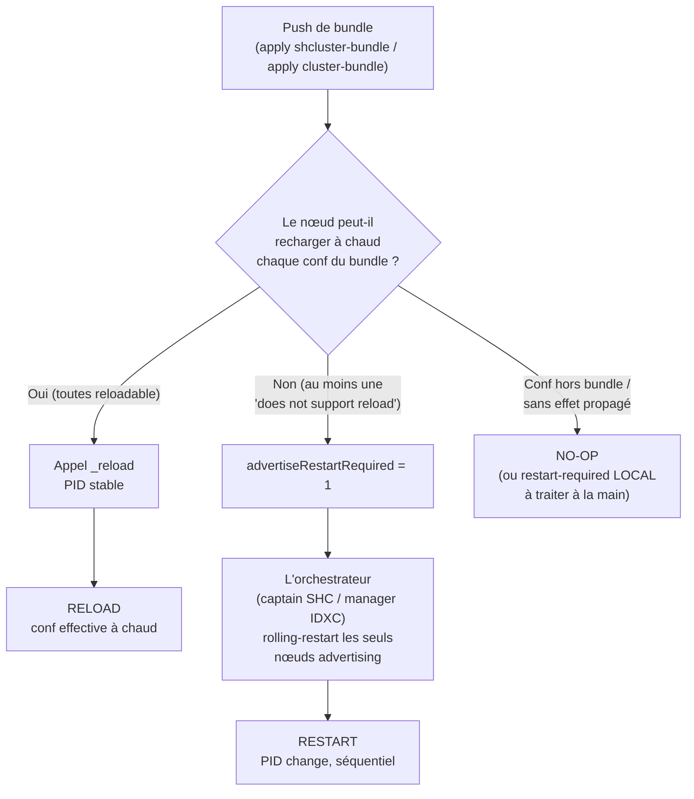

# Déclencheurs de rolling restart — SHC & cluster d'indexers

Quelles modifications de configuration (et quelles actions d'administration)
**déclenchent un rolling restart** d'un cluster Splunk Enterprise — par
opposition à un *reload* à chaud (PID inchangé) ou à un *no-op* — sur les deux
topologies clusterisées :

- **Search Head Cluster (SHC)** : on pousse via le **deployer**
  (`apply shcluster-bundle`) ; le **captain** orchestre.
- **Cluster d'indexers (IDXC)** : on pousse via le **cluster manager**
  (`apply cluster-bundle`) ; le **manager** orchestre.

Savoir *à l'avance* si un changement imposera un restart conditionne toute
fenêtre de maintenance : un rolling restart a un coût (interruption partielle de
recherche, fixup de buckets côté indexers, réélection de captain côté SH).
**La doc vendeur classe les réglages « reloadable » / « restart required » de
façon partielle et parfois contredite par le comportement réel.** Cette fiche
décrit le mécanisme, la méthode pour le déterminer soi-même, et une table de
vérité.

> Observations empiriques relevées sur **Splunk Enterprise 9.4.x**, monosite.
> Le comportement peut différer sur d'autres versions — la **méthode** ci-dessous
> reste valable pour re-vérifier sur sa propre version.

---

## 1. Le mécanisme

La règle commune aux deux topologies : **ce n'est pas l'acte de pousser un
bundle qui déclenche un restart, mais le *contenu* du bundle.** Chaque conf est
classée « rechargeable à chaud » ou « ne supporte pas le reload » ; seules les
secondes forcent un restart. Le message affiché à l'`apply` est toujours
conditionnel (« *might* initiate a rolling restart *depending on the
configuration changes* ») — la condition est ce classement.

### 1.1 Côté SHC — le captain et `advertiseRestartRequired`

Chaque **membre** qui reçoit le bundle calcule un flag `advertiseRestartRequired`
pour ce bundle : `1` si au moins une conf « ne supporte pas le reload », `0`
sinon. Le **captain** orchestre alors un rolling restart **uniquement** pour les
membres qui advertisent `1` :

```text
SHCMaster - Starting a rolling restart of the peers. onlyRestartAdvertisingPeers=1
SHCMaster - Skipping rolling restart for peer=... advertiseRestartRequired=0
```

Une conf reloadable (savedsearch, props search-time…) est reçue, **rechargée à
chaud** via un appel `_reload`, et le captain **skippe** le restart. C'est le
pivot de toute la table de vérité SHC.

### 1.2 Côté IDXC — le manager et le reloader de conf des peers

Symétriquement, chaque **peer** passe le bundle reçu dans son
`ClusterSlaveConfigReloader` : il recharge à chaud ce qui le supporte et
**n'advertit au cluster manager que les confs non-rechargeables**. Le manager
n'orchestre alors le rolling restart **que des peers concernés**
(`onlyRestartAdvertisingPeers`). La logique « contenu, pas acte » est identique.

### 1.3 La validation de bundle ne prédit pas le restart

`validate cluster-bundle` (IDXC) vérifie la **cohérence** du bundle (syntaxe,
`btool check`), pas s'il déclenchera un restart. Un bundle valide peut être
reloadable **ou** restart-required. Ne pas confondre « validation OK » et
« reload à chaud ».

### 1.4 Flux de décision



---

## 2. Méthode pour le déterminer soi-même

Réutilisable sur n'importe quelle version. Principe : appliquer **un changement
minimal isolé**, déclencher, observer des **signaux discriminants**, classer.

### 2.1 Les signaux

| Signal | Capture | Prouve |
|---|---|---|
| **PID `splunkd`** avant/après, par nœud | `splunk status` ou `cat $SPLUNK_HOME/var/run/splunk/splunkd.pid` | **RESTART** (PID change) vs **RELOAD/NO-OP** (PID stable) — le discriminant dur |
| **Statut cluster** | SHC : `splunk show shcluster-status [--verbose]` · IDXC : `splunk show cluster-status` + `splunk show cluster-bundle-status` | cycle `RestartInProgress`, génération de bundle, `restart_required` |
| **Bannières** | `GET /services/messages` | présence d'un message « restart required » |
| **Décision dans `splunkd.log`** | `grep` ciblé : `Starting a rolling restart`, `advertiseRestartRequired`, `does not support reload`, `_reload` | le mécanisme exact (qui a déclenché, quand) |
| **Conf effective** | `splunk btool <conf> list --debug <stanza>` sur le nœud cible, avant/après | RELOAD effectif vs restart-required **en attente** (conf pas encore active) |
| **Appel `_reload`** | recherche d'un `GET\|POST .../_reload` dans `splunkd.log` | preuve dure du rechargement à chaud |

### 2.2 La boucle

```bash
# 0. PRÉ-ÉTAT : cluster sain ; snapshot des PID de tous les nœuds ; btool de la conf visée ; t0=date -u
# 1. CHANGEMENT : un seul fichier/attribut/objet (changement minimal isolé)
# 2. DÉCLENCHEUR : apply bundle / toggle / restart ciblé
# 3. OBSERVATION : capturer les signaux sur la fenêtre [t0, t0+delta]
# 4. VERDICT : classer (voir grille ci-dessous)
# 5. REMISE À PLAT : retirer le changement, re-apply, attendre cluster sain AVANT le cas suivant
```

### 2.3 Restart automatique vs « restart required » manuel — l'arbitrage clé

C'est la distinction la plus piégeuse. Règle non ambiguë :

1. Le **PID a changé tout seul** après l'apply, sans intervention → **RESTART**
   (l'orchestrateur l'a fait).
2. **PID stable + bannière « restart required » + conf non effective** (`btool`
   ne montre pas encore la valeur), et c'est seulement un **restart manuel
   ultérieur** qui rend la conf effective → **RESTART-REQUIRED (manuel)** :
   Splunk *demande* mais *ne fait pas*.

Pour les cas potentiellement « manuels », il faut **attendre puis vérifier le
PID et `btool` AVANT tout restart manuel**, sinon les deux issues sont
indiscernables.

Les 5 verdicts possibles : **RESTART** · **RELOAD** · **NO-OP** ·
**RESTART-REQUIRED (manuel)** · **BLOCKED** (l'`apply`/`validate` renvoie une
erreur, bundle non appliqué).

---

## 3. Table de vérité — SHC (push via deployer)

Comportement observé sur 9.4.x, push `apply shcluster-bundle` depuis le
deployer. Verdict du point de vue **cluster** (propagation aux membres).

| Conf / action | Verdict | Note |
|---|---|---|
| `rolling-restart shcluster-members` (commande) | RESTART | restart séquentiel orchestré, 1 membre à la fois |
| `server.conf` — `[httpServer]`, `[sslConfig]`, tier splunkd | **RESTART** | « does not support reload » → `advertiseRestartRequired=1`. Inclut rotation de cert TLS (`[sslConfig]`) |
| `savedsearches.conf`, `eventtypes.conf`, `macros.conf`, `tags`, `datamodels.conf` | RELOAD | `_reload` sur l'endpoint correspondant, PID stable |
| `props.conf` / `transforms.conf` **search-time** (`EXTRACT-`, lookup def…) | RELOAD | artefact search-time, rechargé à chaud |
| `authorize.conf` (rôles) | RELOAD | |
| `alert_actions.conf`, `outputs.conf`, dashboards XML (`data/ui/views`) | RELOAD | |
| lookup CSV (`lookups/`) | RELOAD | search-time ; `-preserve-lookups true` préserve une modif runtime contre l'écrasement par bundle |
| `authentication.conf` — bascule `authType = LDAP` | **RELOAD** | ⚠️ contre-intuitif : le provider LDAP s'initialise à chaud, **sans bannière ni restart**. La crainte « auth = restart » est infondée pour ce changement via bundle (réserve : SAML non testé) |
| `limits.conf` — `[search]` (ex. `max_searches_per_cpu`) | RELOAD | le cœur `[search]` recharge ; quelques stanzas rares peuvent être restart-required |
| `indexes.conf` sur un SH (index de summary) | RELOAD | l'`IndexWriter` initialise le nouvel index à chaud |
| `inputs.conf` — `monitor`, `tcp`, `splunktcp`, `script` (4 types) | RELOAD | ⚠️ même les ports TCP : sur un SH le listener n'est pas bindé (un SH n'est pas récepteur), la conf est répliquée + rechargée |
| `distsearch.conf` — `[distributedSearch] servers` (ajout de search peer) | **RESTART** | ⚠️ « does not support reload » : touche le moteur de recherche distribuée → rolling restart forcé |
| `web.conf` — `httpport` (port web) | **non-effectif** | ⚠️ web-tier : le captain skippe le restart splunkd **et** le port ne rebinde pas → changement inefficace tant qu'aucun restart réel n'a lieu |
| App **installée** / **activée-désactivée** via bundle | RELOAD | si le contenu de l'app est reloadable ; le restart dépend du **contenu**, pas de l'acte d'installer |
| App **désinstallée** (retirée du bundle deployer) | **NO-OP (pas de purge)** | ⚠️ le push deployer est **additif** : retirer une app du staging ne la supprime pas des membres. Désinstaller réellement = acte **manuel par membre** (`rm -rf etc/apps/<app>` + reload/restart) |
| Conf locale d'un membre (`etc/system/local`, hors deployer) | NO-OP cluster + RESTART-REQUIRED **local** | le deployer ne touche pas `system/local` : pas de réplication, restart manuel du seul membre édité pour effectivité |
| Objet créé en **runtime** (REST/UI) sur un membre | réplication inter-membres (≈ RELOAD) | mécanisme **distinct** du push deployer : la réplication d'artefacts propage membre-à-membre, sans restart |

**Modulation du rolling restart SHC** : `rolling-restart shcluster-members`
n'accepte **pas** `-percent` (réservé à l'IDXC, voir §4). Les leviers SHC réels
sont `-searchable true` (draine les recherches en cours, timeout 180 s par
défaut) et `-decommission_search_jobs_wait_secs`.

> **Lecture opérationnelle SHC** : la surface restart réelle est **plus étroite**
> que ne le laisse penser la doc. L'essentiel des confs (auth LDAP, inputs, apps
> reloadables, index SH) **RELOAD**. Les vrais déclencheurs de restart :
> `server.conf` (`[httpServer]`, `[sslConfig]`) et `distsearch.conf servers`.

---

## 4. Table de vérité — cluster d'indexers (push via cluster manager)

> **Statut : comportement attendu / documenté, non encore re-prouvé sur banc
> dans la même campagne que la table SHC du §3.** À confirmer empiriquement par
> la méthode du §2 sur sa propre version avant de s'y fier en prod. Les écarts
> doc ↔ réel sont fréquents (cf. §3) — traiter chaque ligne comme une hypothèse.

Push `apply cluster-bundle` depuis le cluster manager. Verdict du point de vue
**cluster** (propagation aux peers).

| Conf / action | Verdict attendu | Note |
|---|---|---|
| `rolling-restart cluster-peers` (commande) | RESTART | baseline ; supporte `-percent_peers_to_restart` |
| `props.conf` / `transforms.conf` **index-time** (`LINE_BREAKER`, `SHOULD_LINEMERGE`, `TIME_FORMAT`, `TZ`, `SEDCMD`, `TRANSFORMS-`, routing d'index, `WRITE_META`) | **RESTART** | la chaîne de parsing index-time est rejouée au restart |
| `props.conf` / `transforms.conf` **search-time** | RELOAD | utilité limitée côté peer (le search-time joue surtout côté SH) |
| `indexes.conf` — **ajout** d'un index | RELOAD | en 9.x (historiquement restart sur versions anciennes) |
| `indexes.conf` — attribut « à chaud » (`maxTotalDataSizeMB`, `frozenTimePeriodInSecs`) | RELOAD | par attribut |
| `indexes.conf` — attribut structurant (`homePath`/`coldPath`, `repFactor`, `datatype`) | RESTART | |
| `indexes.conf` — **suppression** d'un index | **RESTART + buckets non purgés** | ⚠️ retirer un index du bundle ne supprime pas ses buckets sur disque ; purge à traiter à part |
| `server.conf` — `[clustering]` et autres stanzas splunkd-tier (`[general]`, `[license]`) | RESTART | par stanza |
| `limits.conf` | **RESTART** (selon stanza) | ⚠️ **opposé du SHC** : côté indexer, plusieurs stanzas `limits.conf` sont restart-required |
| `authentication.conf` / `authorize.conf` | **RESTART** probable côté peer | ⚠️ **opposé du SHC** (où LDAP RELOAD) ; à re-prouver |
| Certificat TLS (`server.conf [sslConfig]`, inputs SSL) | RESTART | rotation de cert |
| `inputs.conf` réception (port d'écoute, `[splunktcp-ssl]`, `requireClientCert`) | RESTART probable | ⚠️ **contraste SHC** : un peer **est** récepteur, le listener est réellement bindé → changer le récepteur/TLS rebinde au restart. Tester les deux sens (activation/désactivation SSL) |
| `outputs.conf` (forward to others) | RELOAD probable | |
| App installée / activée / désactivée via bundle | RESTART probable | dépend du contenu (comme SHC) |
| App **désinstallée** (retirée du bundle manager) | **purge autoritative** | ⚠️ **opposé du SHC** : le bundle manager est **autoritatif** — retirer une app du bundle la **purge** des peers (≠ push deployer additif) |
| Conf déclarant un reload endpoint custom (`app.conf [triggers] reload.<conf>`) | RELOAD | rend une conf normalement restart-required rechargeable à chaud |
| Conf locale d'un peer (hors bundle) | RESTART-REQUIRED **local** | restart manuel du seul peer, jamais rolling |
| Re-push d'un bundle identique (sans diff) | NO-OP | aucune nouvelle génération de bundle |
| `validate cluster-bundle` sur bundle invalide (`btool check` KO) | BLOCKED | aucun peer touché |

**Modulation du rolling restart IDXC** : `rolling-restart cluster-peers`
accepte `-percent_peers_to_restart <n>` pour redémarrer les peers par lots (ce
flag **n'existe pas** pour le SHC). Le **searchable rolling restart**
(`-searchable true`) qui préserve la continuité de recherche **nécessite plus de
2 peers** (avec 2 peers ou moins, pas assez de redondance pour drainer). Voir
aussi le **mode maintenance** (`enable maintenance-mode`) qui suspend le fixup de
buckets pendant un restart.

---

## 5. Pièges et contrastes les plus utiles

- **Index-time ≠ « toujours restart ».** Côté indexer, `props`/`transforms`
  **index-time** sont bien restart-required (la chaîne de parsing est rejouée au
  restart), mais ce n'est pas une fatalité universelle : sur SHC les mêmes confs
  search-time RELOAD, et côté indexer en 9.4.x certains ajouts (nouvel index)
  RELOAD.
- **Mêmes confs, comportement OPPOSÉ selon la topologie.** `limits.conf` et
  `authentication.conf` sont **rechargés à chaud côté SHC** mais **restart côté
  indexer**. Toujours raisonner *par topologie*, jamais « cette conf = restart »
  dans l'absolu.
- **Désinstallation d'app : additif vs autoritatif.** Retirer une app du bundle
  **deployer SHC** ne la purge pas des membres (push **additif** → désinstallation
  manuelle par nœud). Retirer une app du bundle **manager IDXC** la **purge**
  des peers (bundle **autoritatif**). Piège silencieux côté SHC : on croit avoir
  désinstallé, l'app est toujours là.
- **Suppression d'index = restart MAIS buckets non purgés.** Retirer un index du
  bundle indexer déclenche un restart, mais les **buckets restent sur disque** :
  la purge des données est une opération distincte.
- **`-percent_peers_to_restart` n'est pas un flag SHC.** Il n'existe que pour
  `rolling-restart cluster-peers` (IDXC). Côté SHC, la modulation passe par
  `-searchable` / `-decommission_search_jobs_wait_secs`.
- **Searchable rolling restart : il faut > 2 peers.** Avec 2 peers ou moins, pas
  assez de redondance pour drainer et préserver la recherche pendant le cycle.
- **`web.conf httpport` côté SHC : changement non effectif.** Web-tier : le
  captain skippe le restart splunkd et le port ne rebinde pas — il faudrait un
  restart splunkd réel pour qu'il prenne effet.
- **`validate cluster-bundle` ne prédit pas le restart** (§1.3) : il valide la
  cohérence, pas le déclenchement.

---

## Voir aussi

- [Cheat-sheet admin Splunk](../../cheat-sheets/splunk-admin.md) — commandes,
  `btool`, pièges courants.
- [Patrons de CI/CD pour déploiement Splunk](./cicd-deployment-patterns.md) —
  pipeline de livraison de bundles.
- [Cycle de vie d'un évènement](./cycle-de-vie-evenement.md) — où jouent
  parsing index-time et search-time.
